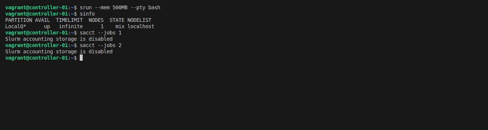

# Single Node Slurm Setup


SLURM (Simple Linux Utility for Resource Management) is a powerful open-source workload manager commonly used in high-performance computing (HPC) environments. While it is typically deployed across multi-node clusters, setting up SLURM on a single node can be highly beneficial for testing, development, or running lightweight workloads. This guide will help you understand the fundamental concepts of how a scheduler operates and provide a step-by-step walkthrough to configure SLURM with full functionality on a single-node setup.

<!-- truncate -->

**How to Set Up a Fully Functional SLURM Cluster on a Single Node (with Proper Resource Constraints)**
SLURM is a powerful job scheduler widely used in HPC environments, but configuring it properly—especially on a single-node cluster—can be tricky. Many tutorials cover the basics, like installing SLURM and running jobs, but they often overlook a critical aspect: cgroups (control groups).

Without proper cgroup configuration, SLURM may fail to enforce CPU and memory constraints, allowing jobs to consume more resources than allocated. This can lead to performance degradation, system crashes, or unexpected behavior.

In this guide, I’ll walk you through setting up a fully functional SLURM cluster on a single node, ensuring that CPU and memory limits are properly enforced using cgroups. Whether you're setting up a test environment or a lightweight HPC system, this tutorial will help you avoid common pitfalls and ensure that SLURM effectively manages resources as expected.

Let’s dive in

:::info
- This architecture is designed for a single node running Ubuntu 20.04.
- It supports all standard Slurm features.
- The setup is manual to help you understand how Slurm works. Note that users can utilize resources without submitting jobs, so this configuration is not recommended for production environments.
:::

## **Install `slurmd` and `slurmctld`**

Install the required software:

```bash
sudo apt-get update -y && sudo apt-get install -y slurmd slurmctld
```

Verify the installation:

```bash
# Locate slurmd and slurmctld
which slurmd
# Output: /usr/sbin/slurmd
which slurmctld
# Output: /usr/sbin/slurmctld
```

## **Prepare `slurm.conf`**

:::info
- This configuration applies to all nodes.
:::

Create the `slurm.conf` file:

```bash
cat <<EOF > slurm.conf
# slurm.conf for a single-node Slurm cluster with accounting
ClusterName=localcluster
SlurmctldHost=localhost
MpiDefault=none
ProctrackType=proctrack/linuxproc
ReturnToService=2
SlurmctldPidFile=/run/slurmctld.pid
SlurmctldPort=6817
SlurmdPidFile=/run/slurmd.pid
SlurmdPort=6818
SlurmdSpoolDir=/var/lib/slurm-llnl/slurmd
SlurmUser=slurm
StateSaveLocation=/var/lib/slurm-llnl/slurmctld
SwitchType=switch/none
TaskPlugin=task/none

# TIMERS
InactiveLimit=0
KillWait=30
MinJobAge=300
SlurmctldTimeout=120
SlurmdTimeout=300
Waittime=0

# SCHEDULING
SchedulerType=sched/backfill
SelectType=select/cons_tres
SelectTypeParameters=CR_Core

# ACCOUNTING (slurmdbd, not enabled now)
AccountingStorageType=accounting_storage/none
JobAcctGatherType=jobacct_gather/none
JobAcctGatherFrequency=30

# LOGGING
SlurmctldDebug=info
SlurmctldLogFile=/var/log/slurm-llnl/slurmctld.log
SlurmdDebug=info
SlurmdLogFile=/var/log/slurm-llnl/slurmd.log

# COMPUTE NODES (Single-node configuration)
NodeName=localhost CPUs=2 Sockets=1 CoresPerSocket=2 ThreadsPerCore=1 RealMemory=1024 State=UNKNOWN

# PARTITION CONFIGURATION
PartitionName=LocalQ Nodes=ALL Default=YES MaxTime=INFINITE State=UP
EOF
```

Move the file to the correct location:

```bash
sudo mv slurm.conf /etc/slurm-llnl/slurm.conf
```

## **Start Basic Slurm Services**

Start the `slurmd` service:

```bash
# Start the service
sudo service slurmd start
# Check its status
sudo service slurmd status
```

<figure markdown="span">
    
</figure>

Start the `slurmctld` service:

```bash
# Start the service
sudo service slurmctld start
# Check its status
sudo service slurmctld status
```

<figure markdown="span">
    
</figure>

Submit a small job (adjust CPUs and memory as needed):

```bash
srun --mem 500MB -c 1 --pty bash
# Check details of submitted jobs
squeue -o "%i %P %u %T %M %l %D %C %m %R %Z %N" | column -t
```

Before submitting the job, memory usage is less than 200MB:

<figure markdown="span">
    
</figure>

Allocate 100MB of memory repeatedly:

```bash
declare -a mem
i=0

while :; do
    mem[$i]=$(head -c 100M </dev/zero | tr '\000' 'x') 
    ((i++))
    echo "Allocated: $((i * 100)) MB"
done
```

After allocating 1GB, the job is not killed due to missing control group (cgroup) configuration:

<figure markdown="span">
    
</figure>

## **Limit Resources Using cgroups**

Create a `cgroup.conf` file to restrict resource usage:

```bash
cat <<EOF >cgroup.conf
CgroupAutomount=yes
CgroupMountpoint=/sys/fs/cgroup
ConstrainCores=yes
ConstrainRAMSpace=yes
ConstrainDevices=yes
ConstrainSwapSpace=yes
MaxSwapPercent=5
MemorySwappiness=0
EOF
```

Move the file to the correct directory:

```bash
sudo mv cgroup.conf /etc/slurm-llnl/cgroup.conf
```

Update `slurm.conf` to enable cgroup plugins:

```bash
sudo sed -i -e "s|ProctrackType=proctrack/linuxproc|ProctrackType=proctrack/cgroup|" \
            -e "s|TaskPlugin=task/none|TaskPlugin=task/cgroup|" /etc/slurm-llnl/slurm.conf
```

Enable cgroup in GRUB and reboot:

```bash
sudo sed -i 's/^GRUB_CMDLINE_LINUX="/GRUB_CMDLINE_LINUX="cgroup_enable=memory swapaccount=1 /' /etc/default/grub
sudo update-grub
sudo reboot
```

Restart Slurm services:

```bash
sudo service slurmctld restart
sudo service slurmd restart
```

Rerun the memory allocation job. This time, the job will be killed when it exceeds the memory limit:

```bash
srun --mem 500MB -c 1 --pty bash
declare -a mem
i=0

while :; do
    mem[$i]=$(head -c 100M </dev/zero | tr '\000' 'x') 
    ((i++))
    echo "Allocated: $((i * 100)) MB"
done
```

<figure markdown="span">
    
</figure>

## **Enable Slurm Accounting**

Accounting allows monitoring of jobs, resource allocation, and permissions.

<figure markdown="span">
    
</figure>

### Install `slurmdbd`

```bash
sudo apt-get install slurmdbd mariadb-server -y
```

### Configure `slurmdbd.conf`

:::info
- Enables the accounting plugin to store account information.
- Maps Linux users to Slurm accounts. Users cannot submit jobs without being added.
- Useful for monitoring jobs and optimizing resource usage.
:::

Create the `slurmdbd.conf` file:

```bash
cat <<EOF >slurmdbd.conf
PidFile=/run/slurmdbd.pid
LogFile=/var/log/slurm/slurmdbd.log
DebugLevel=error
DbdHost=localhost
DbdPort=6819

# DB connection data
StorageType=accounting_storage/mysql
StorageHost=localhost
StoragePort=3306
StorageUser=slurm
StoragePass=slurm
StorageLoc=slurm_acct_db
SlurmUser=slurm
EOF
```

Move the file to the correct location:

```bash
sudo mv slurmdbd.conf /etc/slurm-llnl/slurmdbd.conf
```

### Create the Database

Create the database and user:

```bash
sudo service mysql start
sudo mysql -e "CREATE DATABASE slurm_acct_db;" && \
sudo mysql -e "CREATE USER 'slurm'@'localhost' IDENTIFIED BY 'slurm';" && \
sudo mysql -e "GRANT ALL PRIVILEGES ON slurm_acct_db.* TO 'slurm'@'localhost';" && \
sudo mysql -e "FLUSH PRIVILEGES;"
```

Verify the database and user:

```bash
sudo mysql -e "SHOW DATABASES;" 
sudo mysql -e "SELECT User, Host FROM mysql.user;"
sudo mysql -e "SHOW GRANTS FOR 'slurm'@'localhost';"
```

<figure markdown="span">
    
</figure>

### Start `slurmdbd` Service

```bash
sudo service slurmdbd start
```

Update `slurm.conf` to enable accounting:

```bash
sudo sed -i -e "s|AccountingStorageType=accounting_storage/none|AccountingStorageType=accounting_storage/slurmdbd\nAccountingStorageEnforce=associations,limits,qos\nAccountingStorageHost=localhost\nAccountingStoragePort=6819|" /etc/slurm-llnl/slurm.conf 
sudo sed -i -e "s|JobAcctGatherType=jobacct_gather/none|JobAcctGatherType=jobacct_gather/cgroup|" /etc/slurm-llnl/slurm.conf
sudo systemctl restart slurmctl slurmd
```

Add Linux users to Slurm accounting:

```bash
sudo sacctmgr -i add cluster localcluster
sudo sacctmgr -i --quiet add account $USER Cluster=localcluster
sudo sacctmgr -i --quiet add user $USER account=$USER DefaultAccount=root
sudo systemctl restart slurmctl slurmd
```

<figure markdown="span">
    
</figure>

### Submit a Job and View Metrics

Submit a job:

```bash
srun --mem 500MB -c 1 --pty bash
```

<figure markdown="span">
    
</figure>

## **Conclusion**

:::info
- Slurm is widely used in academic and industrial settings for orchestrating distributed jobs across multiple nodes.
- While Slurm is relatively easy to set up, critical steps like resource limits and accounting are often overlooked.
- Slurm integrates seamlessly with distributed computing frameworks like Spark, Ray, Dask, and Flink, enabling efficient resource utilization for local development.
:::

