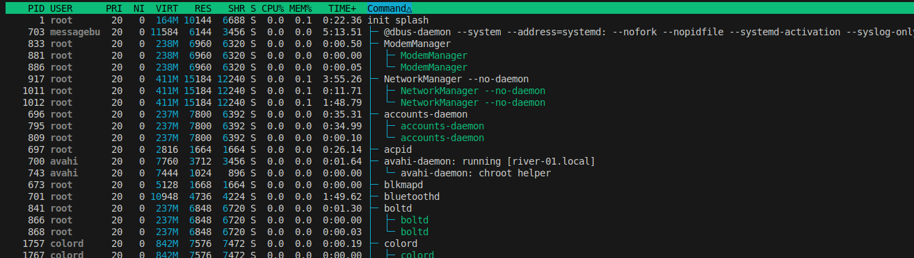
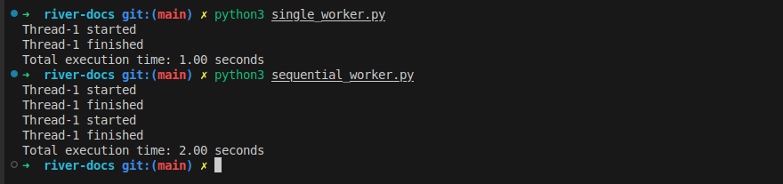
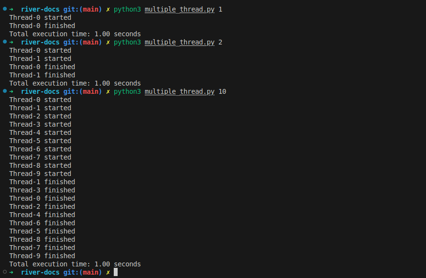
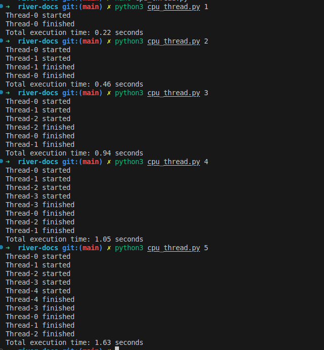

Modern computers are designed to handle multitasking, enabling you to run multiple programs simultaneously. But have you ever wondered how computers manage this complexity? 

In programming, Python is one of the most popular languages, and it supports multitasking through multiple processes and threads. However, Python has a unique feature that might lead to inefficient usage if not understood properly. Let’s dive in and explore.

  
**Figure 1:** A system monitor displaying process IDs (PIDs), user ownership, and resource consumption (e.g., memory and CPU).

<!-- truncate -->

## What Is a Process in Computing?

A process is an instance of a program being executed by a computer. It includes the program's code, data, and allocated system resources. Each process operates **independently** in its own memory space and can spawn multiple threads for concurrent execution. 

The operating system is responsible for managing processes, enabling them to communicate, **schedule CPU time**, and **share resources** efficiently.


## Thread in python
In Python, a thread runs within a single process and is managed by that process. A single process can run multiple threads, and these threads share computing
resources such as CPU and memory. However, due to Python’s Global Interpreter Lock (GIL), threads are restricted to executing on a single CPU core at a time, 
even if multiple CPU cores are available. 
:::info
What, why and how python requires GIL ?
+ The Global Interpreter Lock (GIL) is a mechanism in CPython that ensures only one thread executes Python bytecode at a time, even on multi-core processors.
+ It prevents race conditions in memory management but limits true parallel execution for CPU-bound tasks. To achieve real parallelism, multiprocessing should be used instead of threading.
:::

## What is GIL and how thread in python work ?
:::warning
This is the proof of concept for the python3 lower than 3.13. From python 3.13, the GIL can be disabled, with evenly higher performance with cpu-bound tasks while sharing the same resource (memory,etc)
:::

The **Global Interpreter Lock (GIL)** is a mechanism in Python that manages thread execution by allowing only **one thread to run at a time**, even on multi-core processors. 
Although multiple threads can be created, they do not achieve true parallelism for CPU-bound tasks due to the GIL.

However, Python threads can still improve performance for **I/O-bound tasks** like downloading or uploading files because the CPU spends most of its time waiting for external resources.
The Python interpreter quickly **switches between threads**, saving and restoring their states, making it appear as if multiple threads are running simultaneously.
In reality, the **CPU rapidly cycles through threads**, ensuring that tasks that do not require significant computation feel like they are running in parallel.


## Simple process with thread in python
### Simple program
+ A simple function in python, create 2 files as below `single_worker.py`. Then you can duplicate the `worker` step, it is similar in real world problem when you have IO tasks likes
downloading multiple files
+ Here to make it easier, I uses `sleep` which is similar.
```bash
download_file(<file_url_1>)
download_file(<file_url_2>)
```

**single_worker.py**
```python
import time

def worker(task_id, duration):

    """Simulate work by sleeping for `duration` seconds."""
    print(f"Thread-{task_id} started")
    time.sleep(duration)
    print(f"Thread-{task_id} finished")
    print
# execute
start_time = time.time()   
worker(1,1)
end_time = time.time()
print(f"Total execution time: {end_time - start_time:.2f} seconds")
```

**sequential_worker.py**
```python
import time

def worker(task_id, duration):

    """Simulate work by sleeping for `duration` seconds."""
    print(f"Thread-{task_id} started")
    time.sleep(duration)
    print(f"Thread-{task_id} finished")
    print
# execute
start_time = time.time()   
worker(1,1)
# duplicate
worker(1,1)
end_time = time.time()
print(f"Total execution time: {end_time - start_time:.2f} seconds")
```

Run and test the time to executes
```bash
python3 single_worker.py
python3 sequential_worker.py
```



**Figure 2:** Execute the simple programs

:::info
+ For these functions, it is bad practice run them sequentially. You may automatically to use the `loop`, it reduces number of lines in script,
but it takes your times while you can do it **much more better**
:::

### Multiple threads
+ Create the file with content below, name it with `multiple_thread.py`
```python
import sys
import threading
import time

def worker(task_id, duration):
    """Simulate work by sleeping for `duration` seconds."""
    print(f"Thread-{task_id} started")
    time.sleep(duration)
    print(f"Thread-{task_id} finished")

def run_threads(num_threads, duration):
    """Create and start multiple threads."""
    threads = []
    
    start_time = time.time()
    
    for i in range(num_threads):
        thread = threading.Thread(target=worker, args=(i, duration))
        threads.append(thread)
        thread.start()
    
    for thread in threads:
        thread.join()  # Wait for all threads to finish
    
    end_time = time.time()
    print(f"Total execution time: {end_time - start_time:.2f} seconds")

if __name__ == "__main__":   
    run_threads(sys.argv[1], 1)
```
+ Run with threads
```bash
python3 multiple_thread.py <number of threads>

```


**Figure 3:** Multiple threads that you don't need to wait them sequentially


### Number of cpus and number of threads ?
+ It’s useful to see how multiple threads can improve execution time, but the performance gain does not depend on the number of CPUs.
I ran the program with 1000 threads, and the results showed that for non-CPU-bound tasks, using many threads is fine—but excessive threads should be used with caution.

+ Even with more threads, they still need to share resources like internet bandwidth, and switching between threads adds overhead.
As a result, the execution time was 1.23s instead of 1s, showing that too many threads can slow things down.

+ In general, for CPU-bound tasks, the number of threads should match the number of CPUs.
However, for I/O-bound tasks like network requests, you can experiment with more threads to maximize efficiency.
Instead of waiting 1000 seconds, the task completed in 1.23s—a significant speedup! 🚀


**Figure 3:** 1000 threads in 1.23s


### Bump! When you use threads with cpus tasks ?
It does not reduces time to execute. Because it requires process to use a cpu to compute. Overall, it should not be used in cpu-bound tasks.
Create a file with content as below, name it with `cpu_thread.py`.
:::warning
Avoid using threads for CPU-bound tasks, as they often increase execution time without providing linear performance improvements.
:::
```python
import threading
import time
import sys

def cpu_task(n):
    """Simulate a CPU-bound task by performing heavy computations."""
    print(f"Thread-{n} started")
    count = 0
    for _ in range(10**7):  # Simulate CPU-intensive work
        count += 1
    print(f"Thread-{n} finished")

def run_threads(num_threads):
    """Create and start multiple CPU-bound threads."""
    threads = []
    
    start_time = time.time()
    
    for i in range(num_threads):
        thread = threading.Thread(target=cpu_task, args=(i,))
        threads.append(thread)
        thread.start()
    
    for thread in threads:
        thread.join()  # Wait for all threads to finish
    
    end_time = time.time()
    print(f"Total execution time: {end_time - start_time:.2f} seconds")

if __name__ == "__main__":
    run_threads(int(sys.argv[1]))
```



**Figure 4:** Use threads are crazy in python with cpu bound tasks