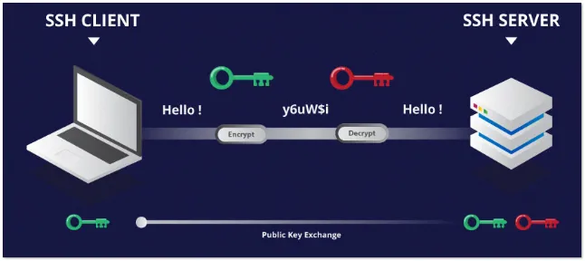
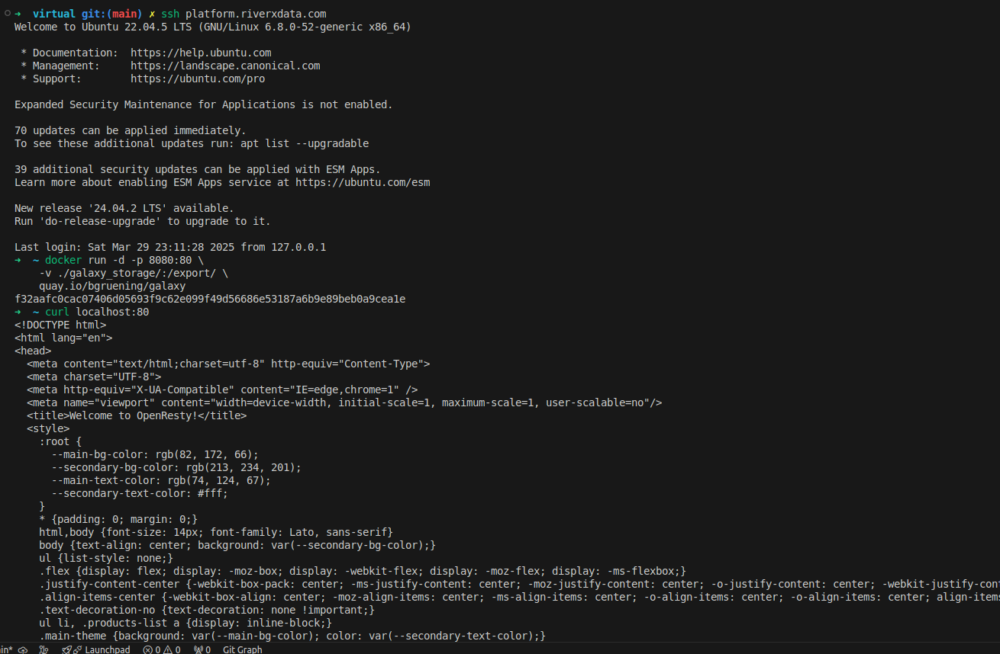
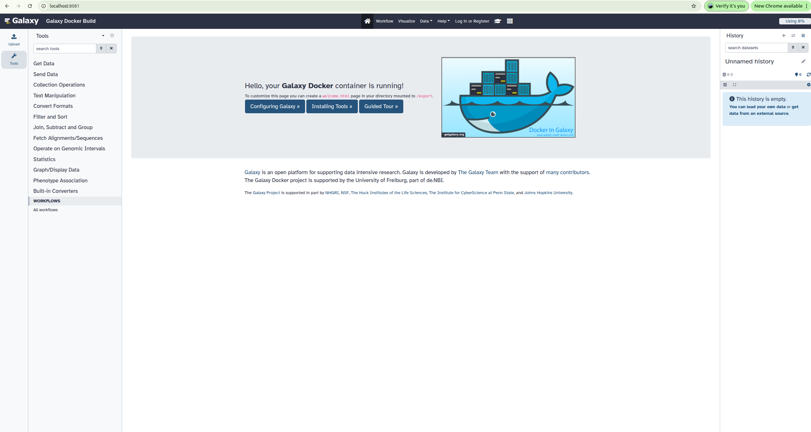

When working on a remote High-Performance Computing (HPC) cluster or a cloud server, accessing development tools locally can be challenging. 
One effective approach is to use an SSH tunnel to securely access a galaxy server-a web platform as if it were running on your local machine.



<!-- truncate -->

:::info
+ Replace with your host and port for ssh
+ Run any web on specific port, then forward this web service via ssh to access at your local machine
+ Require to install [**docker**](https://docs.docker.com/engine/install/). For more details on, please visit [**galaxy docker**](https://github.com/bgruening/docker-galaxy)
:::
## Why Use SSH Tunneling?
SSH tunneling allows you to securely forward ports from a remote server to your local system. This is useful for accessing services that are running on the remote machine without exposing them to the internet.


## Login to your remote server
```bash
ssh river@platform.riverxdata.com
```

## Run a web service
It can be accessed at localhost 8080
Run galaxy server- a web platform for bioinformatics:
```bash
docker run -d -p 8080:80 \
    -v ./galaxy_storage/:/export/ \
    quay.io/bgruening/galaxy
```

The web is now available on a remote system on the port 8080, docker bind the port of the web is running at 80 on the container.

## Test the web service
Test the web service at 8080
```bash
curl localhost -p 8080
```


**Figure 1:** Login and start galaxy server using docker on remote machine

Now you can access the galaxy at your local computer via ssh. With the local machine will access this network at port 8081 which is remoted from 8080 of the `platform.riverxdata.com`
```bash
ssh -N -L 8081:localhost:8080 platform.riverxdata.com
```

Open your web brower to see how it work

**Figure 2:** Access your web service at local machine