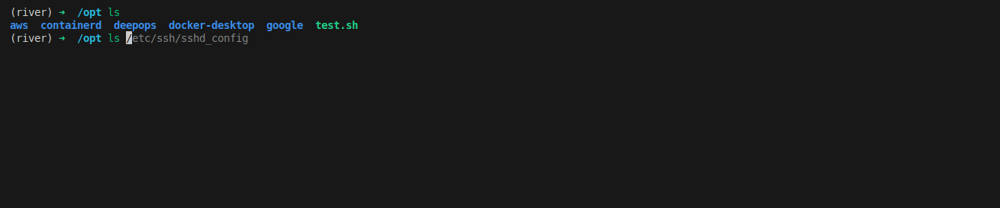
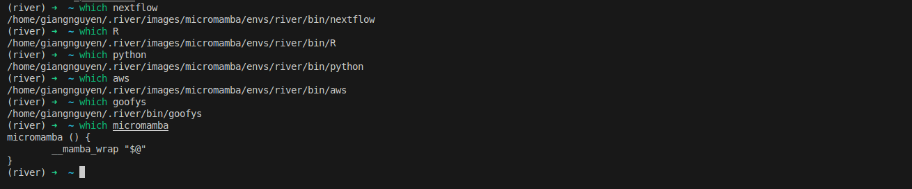

Setting up a shell environment on a remote server can be a tedious process, especially when dealing with multiple dependencies. This one also can be used for your local machine.
This guide walks you through installing **micromamba**, setting up a River environment, and configuring useful tools like **goofys** to work with cloud storage  (S3) and zsh (amazing shell)


<!-- truncate -->
## Set up variables
It will define a hard version for installing goofys, micromamba. You can adjust to update latest version 
```bash
echo "River software dependencies setup"
MICROMAMBA_VERSION=2.0.5
GOOFYS_VERSION=0.24.0
RIVER_BIN=$HOME/.river/bin
mkdir -p $RIVER_BIN
```

## Install micromamba
Micromamba is a lightweight, fast alternative to Conda for managing environments and packages. 
It is a small, standalone executable that provides the same package management features as Conda but with much lower overhead. Unlike Conda, Micromamba does not require a full Anaconda installation, making it ideal for minimal setups, CI/CD pipelines, and remote servers.

:::info
Key Features:

+ Fast and lightweight: Much smaller than Conda, with a quick installation process.
+ Standalone executable: No need for a full Conda installation.
+ Supports Conda environments: Fully compatible with Conda packages and repositories.
+ Works in remote/cloud environments: Ideal for automation and scripting
:::

Create an environmen call `river` that helps to install common software without required `sudo` permision, install based on user space:
+ Python (from Anaconda) for scripting and development.
+ R-base for statistical computing and bioinformatics applications.
+ Singularity (v3.8.6) for containerized workflows. The singularity has the image is similar to a file, it is portable, has a great integration with the host system
+ Nextflow to enable scalable and reproducible scientific workflows.
+ Zsh for a better shell experience.

AWS CLI to interact with AWS services like S3.
```bash
# Base softwares
# micromamba
export HOME=$HOME
export MICROMAMBA_EXECUTE=$HOME/.river/bin
export PATH=$HOME/.river/bin:$PATH
mkdir -p $MICROMAMBA_EXECUTE
if [ ! -f "$RIVER_BIN/micromamba"  ]; then
    echo "Installing micromamba..."
    curl -Ls https://micro.mamba.pm/api/micromamba/linux-64/$MICROMAMBA_VERSION | tar -xvj bin/micromamba
    mv bin/micromamba $RIVER_BIN/micromamba
    rm -rf bin
else
    echo "micromamba already exists at: $HOME/.river/bin"
fi
# Start up
export PATH="$HOME/.river/bin:$PATH"
export MAMBA_ROOT_PREFIX="$HOME/.river/images/micromamba"
# Create the singularity dir
mkdir -p $HOME/.river/images/singularities/images

# Create micromamba environment and install river-utils
micromamba create -n river \
    anaconda::python \
    conda-forge::r-base \
    conda-forge::singularity=3.8.6 \
    bioconda::nextflow \
    conda-forge::zsh \
    conda-forge::awscli \
    -y
```

### Activate environment
To install additional software, you can install it in the `river` environment or create a new environment. Below is an example of how to activate the `river` environment and install additional software.
It is based on conda, what you need to do is searching for your softwares. Almost are hosted on the [**conda**](https://anaconda.org/). Find the command and replace `conda` with `micromamba`.

```bash
# Activate the river environment
eval "$(micromamba shell hook --shell bash)"
micromamba activate river

# Install additional software
micromamba install -n river \
    conda-forge::htop \
    conda-forge::jq \
    conda-forge::tree \
    -y
```
### Create new environment
```bash
# Create a new environment and install Python
micromamba create -n new_env \
    anaconda::python=3.9 \
    -y

# Activate the new environment
micromamba activate new_env

# Verify Python installation
python --version
```


**Figure 1:** Micromamba helps to setup your perfect working environments on remote server

In this example:
- `new_env`: The name of the new environment.
- `python=3.9`: Specifies the version of Python to install. You can adjust the version as needed.

This allows you to create isolated environments for different projects or dependencies. It is good practice to install tools in different environemnts.
If you develop web application, install `npm`, `python`, `java`, etc on different environments

##  Goofys fuse file system for S3
Follow blog with tag goofys for more information. It is simply making a cloud storage (compatible S3) to be worked as local file system with nearly full POSIX support
```bash
# goofys
if [ ! -f "$RIVER_BIN/goofys"  ]; then
    echo "Installing goofys..."
    curl -L https://github.com/kahing/goofys/releases/download/v${GOOFYS_VERSION}/goofys -o $RIVER_BIN/goofys
    chmod +x $RIVER_BIN/goofys
else
    echo "Goofys already exists at: $HOME/.river/bin"
    goofys --help 2> /dev/null
fi
```

## Improve your shell experience
Install the zsh and related extensions. Here is the standard ones, but you can find more about **zsh**[https://ohmyz.sh/]

```bash
eval "$(micromamba shell hook --shell bash)"
micromamba activate river
sh -c "$(curl -fsSL https://raw.github.com/ohmyzsh/ohmyzsh/master/tools/install.sh)" "" --unattended

# plugins
git clone https://github.com/zsh-users/zsh-autosuggestions ${ZSH_CUSTOM:-~/.oh-my-zsh/custom}/plugins/zsh-autosuggestions
git clone https://github.com/zsh-users/zsh-syntax-highlighting.git ${ZSH_CUSTOM:-~/.oh-my-zsh/custom}/plugins/zsh-syntax-highlighting

# Update .zshrc
echo "Updating .zshrc..."
sed -i "s|plugins=(git)|plugins=(\n    git\n    docker\n    docker-compose\n    history\n    rsync\n    safe-paste\n    zsh-autosuggestions\n    zsh-syntax-highlighting\n)\n|" ~/.zshrc
source ~/.zshrc
```

Now you can see how it improve your experiences;
+ Your systax is highlighted to show it correctly work
+ Your history can be quickly reused
  


**Figure 2:** zsh improves your shell experiences

## Activate all by `.river.sh`
Create the file called `.river.sh` then you can activate all standard setup

```bash
# Create .river.sh for environment variables
cat <<EOF > $HOME/.river.sh
export HOME=${HOME}
export HOME_TOOLS=\${HOME}/.river/bin
export MAMBA_ROOT_PREFIX=\${HOME}/.river/images/micromamba
export SINGULARITY_CACHE_DIR=\${HOME}/.river/images/singularities
export NXF_SINGULARITY_CACHEDIR=\$SINGULARITY_CACHE_DIR/images
export PATH=\${HOME_TOOLS}:\$PATH
eval "\$(micromamba shell hook -s posix)"
micromamba activate -n river
zsh 
source ~/.zshrc
EOF
```

You can activate absolutely when you are login by `~/.bashrc`
```bash
source ~/.river.sh
```
