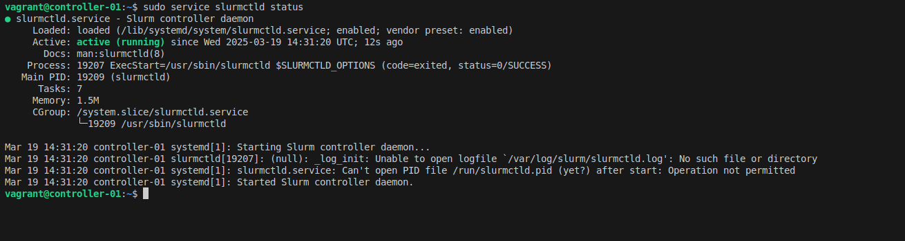
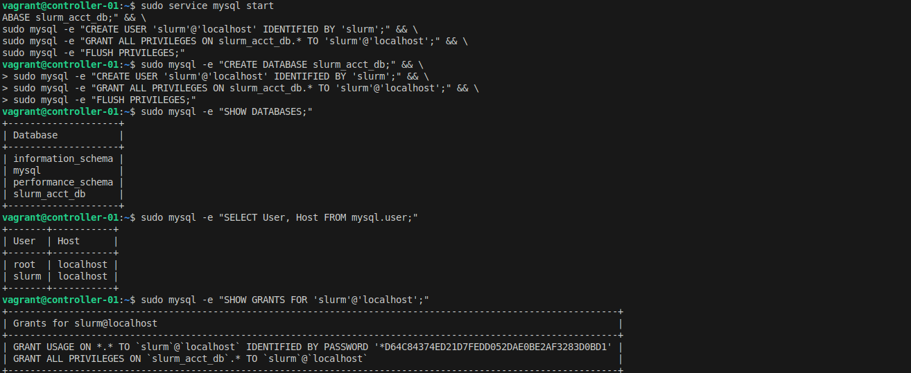

Building a High-Performance Computing (HPC) cluster can seem daunting, but with the right approach, you can create a robust system for managing computational workloads. This is **Part 1** of a 3-part series where we'll build a complete Slurm cluster from scratch.

In this first post, we'll cover the fundamentals by setting up a single-node Slurm cluster and understanding the core concepts.

<!--truncate-->

## Series Overview

- **Part 1 (This Post)**: Introduction, Architecture, and Single Node Setup
- **[Part 2](/blog/how-to-build-slurm-hpc-part-2)**: Scaling to Production with Ansible
- **[Part 3](/blog/how-to-build-slurm-hpc-part-3)**: Administration and Best Practices

## Why Slurm?

When it comes to job scheduling in HPC environments, several options exist including PBS, Grid Engine, and IBM's LSF. However, Slurm (Simple Linux Utility for Resource Management) stands out for several compelling reasons:

- **Open Source**: Free to use with a large, active community
- **Scalability**: Designed to scale from small clusters to the world's largest supercomputers
- **Flexibility**: Fine-grained control over job scheduling, resource allocation, and priority settings
- **Integration**: Works seamlessly with MPI, distributed computing frameworks (Spark, Ray, Dask), and monitoring tools
- **Performance**: Optimized for high throughput with minimal overhead

## Understanding Slurm Architecture

Before diving into the implementation, it's crucial to understand the key components of a Slurm cluster:

<figure markdown="span">
    
</figure>
source: https://www.marquette.edu/high-performance-computing/architecture.php

### Core Components

1. **slurmctld (Controller Daemon)**: The brain of the cluster, running on the controller node. It handles job scheduling, resource tracking, and communicates with compute nodes.

2. **slurmd (Node Daemon)**: Runs on compute nodes to execute jobs and report status back to the controller.

3. **slurmdbd (Database Daemon)**: Optional but recommended for storing job accounting data, resource usage tracking, and fair-share scheduling.

### Node Types

| Node Type  | Services                | Purpose                              |
| ---------- | ----------------------- | ------------------------------------ |
| Controller | slurmctld               | Manages job scheduling and resources |
| Compute    | slurmd                  | Executes submitted jobs              |
| Login      | Slurm clients           | User access point for job submission |
| Database   | slurmdbd, MySQL/MariaDB | Stores accounting data               |

<figure markdown="span">
    
</figure>
source: https://www.schedmd.com/

For a deeper understanding of Slurm architecture, check our [Slurm Architecture documentation](/docs/resources/high-performance-computing/slurm-architecture).

## Single Node Setup - Understanding the Fundamentals

Starting with a single-node setup helps you understand how Slurm works before scaling up. This approach is perfect for learning and local development.

<div align="center">
    <figure markdown="span">
        
    </figure>
</div>

:::info
This setup runs on Ubuntu 20.04 and includes all standard Slurm features. Note that this configuration is for learning purposes - for production environments, you'll want the multi-node setup covered in Part 2.
:::

### Basic Installation

First, install the required Slurm components:

```bash
sudo apt-get update -y && sudo apt-get install -y slurmd slurmctld
```

Verify the installation:

```bash
# Locate slurmd and slurmctld
which slurmd
# Output: /usr/sbin/slurmd

which slurmctld
# Output: /usr/sbin/slurmctld
```

### Configuring slurm.conf

The `slurm.conf` file is the heart of your Slurm configuration. This file must be identical across all nodes in a cluster (but for now, we just have one node).

Create your `slurm.conf`:

```bash
cat <<EOF > slurm.conf
# slurm.conf for a single-node Slurm cluster
ClusterName=localcluster
SlurmctldHost=localhost
MpiDefault=none
ProctrackType=proctrack/linuxproc
ReturnToService=2
SlurmctldPidFile=/run/slurmctld.pid
SlurmctldPort=6817
SlurmdPidFile=/run/slurmd.pid
SlurmdPort=6818
SlurmdSpoolDir=/var/lib/slurm-llnl/slurmd
SlurmUser=slurm
StateSaveLocation=/var/lib/slurm-llnl/slurmctld
SwitchType=switch/none
TaskPlugin=task/none

# TIMERS
InactiveLimit=0
KillWait=30
MinJobAge=300
SlurmctldTimeout=120
SlurmdTimeout=300
Waittime=0

# SCHEDULING
SchedulerType=sched/backfill
SelectType=select/cons_tres
SelectTypeParameters=CR_Core

# ACCOUNTING (not enabled yet)
AccountingStorageType=accounting_storage/none
JobAcctGatherType=jobacct_gather/none
JobAcctGatherFrequency=30

# LOGGING
SlurmctldDebug=info
SlurmctldLogFile=/var/log/slurm-llnl/slurmctld.log
SlurmdDebug=info
SlurmdLogFile=/var/log/slurm-llnl/slurmd.log

# COMPUTE NODES (adjust CPUs and RealMemory to match your system)
NodeName=localhost CPUs=2 Sockets=1 CoresPerSocket=2 ThreadsPerCore=1 RealMemory=1024 State=UNKNOWN

# PARTITION CONFIGURATION
PartitionName=LocalQ Nodes=ALL Default=YES MaxTime=INFINITE State=UP
EOF

sudo mv slurm.conf /etc/slurm-llnl/slurm.conf
```

### Starting Services

Start the Slurm daemons:

```bash
# Start slurmd (compute daemon)
sudo service slurmd start
sudo service slurmd status

# Start slurmctld (controller daemon)
sudo service slurmctld start
sudo service slurmctld status
```

<figure markdown="span">
    
</figure>

<figure markdown="span">
    
</figure>

Test your setup by submitting a simple interactive job:

```bash
srun --mem 500MB -c 1 --pty bash

# Check job details
squeue -o "%i %P %u %T %M %l %D %C %m %R %Z %N" | column -t
```

### Critical: Resource Limiting with cgroups

:::warning
**This is a critical step that's often overlooked!**

Without proper cgroup configuration, jobs can exceed their allocated resources, potentially causing system instability or crashes. The job scheduler will accept resource limits, but won't actually enforce them.
:::

Let's test this problem first. Submit a job requesting 500MB and try to allocate much more:

```bash
srun --mem 500MB -c 1 --pty bash

# Try to allocate 1GB of memory (exceeding the 500MB limit)
declare -a mem
i=0
while :; do
    mem[$i]=$(head -c 100M </dev/zero | tr '\000' 'x') 
    ((i++))
    echo "Allocated: $((i * 100)) MB"
done
```

Before submitting the job, memory usage is less than 200MB:

<figure markdown="span">
    
</figure>

After allocating 1GB, the job is not killed due to missing control group (cgroup) configuration:

<figure markdown="span">
    
</figure>

You'll notice the job continues running even after exceeding 500MB - that's the problem!

Now let's fix it with cgroups:

```bash
cat <<EOF > cgroup.conf
CgroupAutomount=yes
CgroupMountpoint=/sys/fs/cgroup
ConstrainCores=yes
ConstrainRAMSpace=yes
ConstrainDevices=yes
ConstrainSwapSpace=yes
MaxSwapPercent=5
MemorySwappiness=0
EOF

sudo mv cgroup.conf /etc/slurm-llnl/cgroup.conf
```

Update `slurm.conf` to use cgroup plugins:

```bash
sudo sed -i -e "s|ProctrackType=proctrack/linuxproc|ProctrackType=proctrack/cgroup|" \
            -e "s|TaskPlugin=task/none|TaskPlugin=task/cgroup|" /etc/slurm-llnl/slurm.conf
```

Enable cgroup in GRUB and reboot:

```bash
sudo sed -i 's/^GRUB_CMDLINE_LINUX="/GRUB_CMDLINE_LINUX="cgroup_enable=memory swapaccount=1 /' /etc/default/grub
sudo update-grub
sudo reboot
```

After reboot, restart Slurm services:

```bash
sudo service slurmctld restart
sudo service slurmd restart
```

Now test again with the same memory allocation script - this time, the job will be killed when it exceeds the limit!

<figure markdown="span">
    
</figure>

### Enabling Accounting

Job accounting is essential for:
- Tracking who is using resources
- Monitoring job completion and failures
- Enforcing resource limits per user/group
- Fair-share scheduling

<figure markdown="span">
    
</figure>

Install the required packages:

```bash
sudo apt-get install slurmdbd mariadb-server -y
```

Create the database and user:

```bash
sudo service mysql start

sudo mysql -e "CREATE DATABASE slurm_acct_db;"
sudo mysql -e "CREATE USER 'slurm'@'localhost' IDENTIFIED BY 'slurm';"
sudo mysql -e "GRANT ALL PRIVILEGES ON slurm_acct_db.* TO 'slurm'@'localhost';"
sudo mysql -e "FLUSH PRIVILEGES;"
```

Verify the database was created:

```bash
sudo mysql -e "SHOW DATABASES;" 
sudo mysql -e "SELECT User, Host FROM mysql.user;"
```

<figure markdown="span">
    
</figure>

Configure `slurmdbd`:

```bash
cat <<EOF > slurmdbd.conf
PidFile=/run/slurmdbd.pid
LogFile=/var/log/slurm/slurmdbd.log
DebugLevel=error
DbdHost=localhost
DbdPort=6819

# DB connection data
StorageType=accounting_storage/mysql
StorageHost=localhost
StoragePort=3306
StorageUser=slurm
StoragePass=slurm
StorageLoc=slurm_acct_db
SlurmUser=slurm
EOF

sudo mv slurmdbd.conf /etc/slurm-llnl/slurmdbd.conf
sudo service slurmdbd start
```

Update `slurm.conf` to enable accounting:

```bash
sudo sed -i -e "s|AccountingStorageType=accounting_storage/none|AccountingStorageType=accounting_storage/slurmdbd\nAccountingStorageEnforce=associations,limits,qos\nAccountingStorageHost=localhost\nAccountingStoragePort=6819|" /etc/slurm-llnl/slurm.conf 

sudo sed -i -e "s|JobAcctGatherType=jobacct_gather/none|JobAcctGatherType=jobacct_gather/cgroup|" /etc/slurm-llnl/slurm.conf

sudo systemctl restart slurmctld slurmd
```

Add your cluster and user to accounting:

```bash
# Add cluster
sudo sacctmgr -i add cluster localcluster

# Add account for your user
sudo sacctmgr -i add account $USER Cluster=localcluster

# Add your user to the account
sudo sacctmgr -i add user $USER account=$USER DefaultAccount=$USER

sudo systemctl restart slurmctld slurmd
```

<figure markdown="span">
    
</figure>

Now test accounting by submitting a job and viewing its details:

```bash
# Submit a test job
srun --mem 500MB -c 1 hostname

# View accounting information
sacct
```

<figure markdown="span">
    
</figure>

## Key Takeaways

In this first part of our series, we've covered:

1. **Why Slurm**: Understanding the advantages of Slurm over alternatives
2. **Architecture**: Core components (slurmctld, slurmd, slurmdbd) and their roles
3. **Basic Setup**: Installing and configuring a single-node cluster
4. **Critical cgroups**: Why resource limiting is essential (and how to enable it)
5. **Accounting**: Setting up job tracking and resource monitoring

:::info
**What's Next?**

In [Part 2](/blog/how-to-build-slurm-hpc-part-2), we'll take this knowledge and scale to a multi-node production cluster using Ansible automation. We'll add monitoring with Grafana, alerting via Slack, and shared storage with NFS.
:::

## Resources

- **Full Documentation**: [Single Node Slurm Setup](/docs/resources/high-performance-computing/how-to-build-slurm-single-node-with-full-functions)
- **Architecture Details**: [Slurm Architecture](/docs/resources/high-performance-computing/slurm-architecture)
- **HPC Overview**: [High-Performance Computing Overview](/docs/resources/high-performance-computing/high-performance-computing-overview)
- **Official Docs**: [SchedMD Slurm Documentation](https://slurm.schedmd.com/)

---

*This is Part 1 of the RiverXData series on building Slurm HPC clusters. Continue to [Part 2](/blog/how-to-build-slurm-hpc-part-2) to learn about production deployment with Ansible.*
