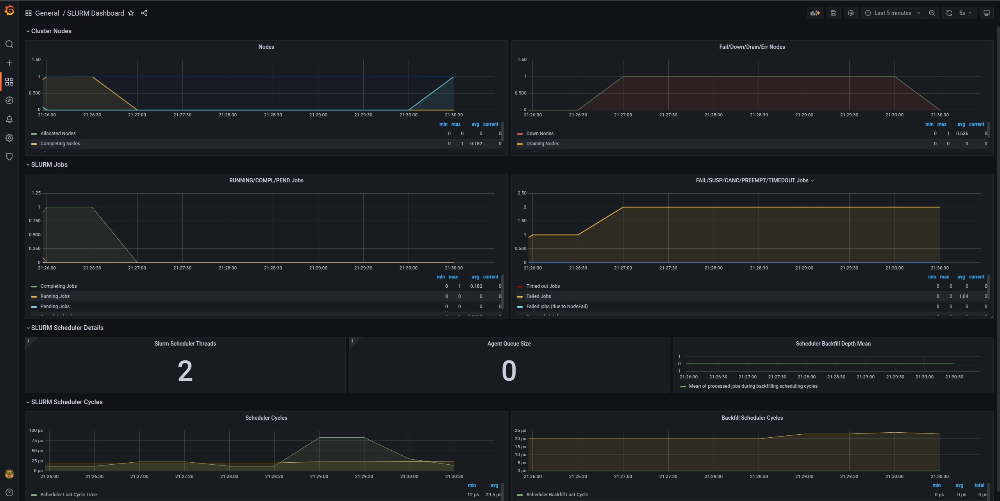

In [Part 1](/blog/how-to-build-slurm-hpc-part-1), we learned the fundamentals by building a single-node Slurm cluster. Now it's time to scale up to a production-ready, multi-node cluster with automated deployment, monitoring, and alerting.

In this post, we'll use Ansible to automate the entire deployment process, making it reproducible and maintainable.

<!--truncate-->

## Series Overview

- **[Part 1](/blog/how-to-build-slurm-hpc-part-1)**: Introduction, Architecture, and Single Node Setup
- **Part 2 (This Post)**: Scaling to Production with Ansible
- **[Part 3](/blog/how-to-build-slurm-hpc-part-3)**: Administration and Best Practices

## Why Ansible for HPC Clusters?

Moving from a single-node setup to a multi-node production cluster involves:

- Configuring multiple machines identically
- Managing dependencies and installation order
- Keeping configurations synchronized
- Handling user management across nodes
- Setting up monitoring and logging infrastructure

Doing this manually is error-prone and time-consuming. Infrastructure automation tools like Ansible, Puppet, or Terraform solve this problem. We chose **Ansible** because:

- **Agentless**: No software to install on managed nodes
- **Declarative**: Describe the desired state, not the steps
- **Idempotent**: Safe to run multiple times
- **YAML-based**: Easy to read and version control
- **Large ecosystem**: Many pre-built roles available

### What is Ansible? (Quick Primer)

If you're new to Ansible, watch this excellent 100-second introduction:

<div style={{ position: "relative", paddingBottom: "56.25%", height: 0, overflow: "hidden", maxWidth: "100%", background: "#000" }}>
  <iframe 
    src="https://www.youtube.com/embed/xRMPKQweySE" 
    frameBorder="0" 
    allow="accelerometer; autoplay; clipboard-write; encrypted-media; gyroscope; picture-in-picture" 
    allowFullScreen
    style={{ position: "absolute", top: 0, left: 0, width: "100%", height: "100%" }}
  />
</div>

## Production Cluster Architecture

Our production setup includes these components:

<figure markdown="span">
    
</figure>
Source: https://cs.phenikaa-uni.edu.vn/vi/post/gioi-thieu/co-so-vat-chat/he-thong-tinh-toan-hieu-nang-cao-phenikaa-hpc

### Head Node (Controller + Login)

The head node manages the cluster and provides user access:

- **slurmctld**: Job scheduling and resource management
- **slurmdbd**: Accounting database
- **NFS Server**: Shares directories to compute nodes
- **Prometheus**: Metrics collection
- **Grafana**: Monitoring dashboards
- **Alertmanager**: Slack notifications

### Compute Nodes

Worker nodes that execute jobs:

- **slurmd**: Job execution daemon
- **NFS Client**: Mounts shared storage
- **Node Exporter**: Exposes system metrics
- **Slurm Exporter**: Exposes Slurm-specific metrics

### Shared Storage (NFS)

NFS provides unified file system access across all nodes:

<figure markdown="span">
    
</figure>
Source: https://thuanbui.me/cai-dat-nfs-server-va-nfs-client-tren-ubuntu-22-04/

- `/home`: User home directories (fast SSD/NVMe storage)
- `/mnt/data`: Large datasets (high-capacity HDD)

### Monitoring Stack

Complete observability for your cluster:

<figure markdown="span">
    
</figure>
Source: https://swsmith.cc/posts/grafana-slurm.html

- **Prometheus**: Time-series metrics database
- **Grafana**: Beautiful dashboards for visualization
- **Alertmanager**: Sends alerts to Slack when issues occur
- **Node Exporter**: System-level metrics (CPU, memory, disk)
- **Slurm Exporter**: Slurm-specific metrics (jobs, partitions, nodes)

## Setting Up the RiverXData Slurm Cluster

We've created a comprehensive Ansible playbook that automates everything. Let's get started!

<figure markdown="span">
    
</figure>

### Prerequisites

- Multiple Ubuntu 20.04 or 24.04 machines (or VMs)
- SSH access to all nodes
- Sudo privileges on all nodes
- A Slack workspace (for alerts)

### Step 1: Clone the Repository

```bash
git clone https://github.com/riverxdata/river-slurm.git -b 1.0.0
cd river-slurm
```

### Step 2: Install Ansible and Dependencies

```bash
# Ubuntu 24.04, without Vagrant
bash scripts/setup.sh 24.04 false

# For Ubuntu 20.04
bash scripts/setup.sh 20.04 false

# For developers: Install with Vagrant support
bash scripts/setup.sh 24.04 true
```

This script installs:
- Ansible and required Python packages
- Community Ansible collections
- Galaxy roles (geerlingguy.docker, etc.)

### Step 3: Set Up Slack Alerts

:::info
In production environments, even small teams benefit from proactive monitoring. Slack is perfect for this - you'll get notifications when nodes go down, jobs fail, or resources run low.
:::

#### Create a Slack App

1. Go to [Slack API](https://api.slack.com/apps) and create a new app
2. Choose "From scratch"
3. Name it (e.g., "Slurm Cluster Monitor")
4. Select your workspace

<figure markdown="span">
    
</figure>

#### Enable Incoming Webhooks

1. Navigate to "Incoming Webhooks" in your app settings
2. Activate incoming webhooks
3. Click "Add New Webhook to Workspace"
4. Select the channel for notifications (e.g., `#cluster-alerts`)
5. Copy the webhook URL

<figure markdown="span">
    
</figure>

<figure markdown="span">
    
</figure>

<figure markdown="span">
    
</figure>

#### Test Your Webhook

```bash
curl -X POST -H 'Content-type: application/json' \
  --data '{"text":"Hello from Slurm cluster!"}' \
  https://hooks.slack.com/services/YOUR/WEBHOOK/URL
```

You should see the message appear in your Slack channel!

### Step 4: Configure Your Inventory

Create `inventories/hosts` (or copy from `inventories/hosts.example`):

```ini
[slurm_master]
controller-01 ansible_host=192.168.58.10

[slurm_worker]
worker-01 ansible_host=192.168.58.11
worker-02 ansible_host=192.168.58.12

[slurm:children]
slurm_master
slurm_worker

[all:vars]
ansible_user=your_username
slurm_password=secure_munge_password
slurm_account_db_pass=secure_db_password
slack_api_url=https://hooks.slack.com/services/YOUR/WEBHOOK/URL
slack_channel=#cluster-alerts
admin_user=admin
admin_password=secure_grafana_password
```

:::warning
**Security Best Practice**: Use [Ansible Vault](https://docs.ansible.com/ansible/latest/user_guide/vault.html) to encrypt sensitive variables like passwords and API keys.

```bash
# Create encrypted vault
ansible-vault create inventories/vault.yml

# Or encrypt existing file
ansible-vault encrypt inventories/hosts
```
:::

#### Optional Parameters

```ini
default_password=temporary_user_password  # Forces change on first login
users=alice,bob,charlie                   # Comma-separated list
```

### Step 5: Deploy the Cluster

Now for the magic moment - deploy your entire cluster with one command!

```bash
# If you have passwordless sudo configured
ansible-playbook -i inventories/hosts river_cluster.yml

# If you need to enter sudo password
ansible-playbook -i inventories/hosts river_cluster.yml --ask-become-pass
```

What this playbook does:

1. **Prepares all nodes**:
   - Updates packages
   - Installs dependencies
   - Configures firewalls

2. **Sets up the controller**:
   - Installs slurmctld and slurmdbd
   - Configures MariaDB for accounting
   - Sets up NFS server
   - Installs monitoring stack

3. **Configures compute nodes**:
   - Installs slurmd
   - Mounts NFS shares
   - Configures metrics exporters

4. **Deploys monitoring**:
   - Prometheus for metrics collection
   - Grafana with pre-configured dashboards
   - Alertmanager with Slack integration

5. **Synchronizes configurations**:
   - Copies slurm.conf to all nodes
   - Sets up Munge authentication
   - Configures log aggregation

### Step 6: Add Users

```bash
ansible-playbook -i inventories/hosts river_users.yml
```

This creates Linux users on all nodes with:
- Synchronized UID/GID across nodes
- Home directories on shared NFS
- Slurm accounting associations

:::info
**Note on User Management**: For production, consider integrating with LDAP or Active Directory. However, NIS and LDAP setup can be complex on Ubuntu. Our Ansible approach provides a simpler alternative that works well for small to medium clusters.
:::

### Step 7: Verify the Setup

SSH into the controller node and run:

```bash
# Check cluster status
sinfo

# Expected output:
# PARTITION AVAIL  TIMELIMIT  NODES  STATE NODELIST
# compute*     up   infinite      2   idle worker-01,worker-02

# View job queue
squeue

# Submit a test job
srun --nodes=1 --ntasks=1 hostname

# Check accounting
sacct

# View cluster configuration
scontrol show config | head -20
```

### Step 8: Access Grafana Dashboards

Grafana runs on the controller node at port 3000. To access it securely from your local machine:

```bash
# Create SSH tunnel
ssh -N -L 3001:localhost:3000 your_user@controller_ip

# Now open in browser: http://localhost:3001
# Login: admin / your_grafana_password
```

You'll see pre-configured dashboards showing:

#### Node Metrics Dashboard
- CPU usage per node
- Memory utilization
- Disk I/O
- Network traffic
- System load

<figure markdown="span">
    
</figure>

#### Slurm Metrics Dashboard
- Active jobs
- Job queue length
- Node states (idle, allocated, down)
- CPU allocation
- Memory usage
- Job completion rates

<figure markdown="span">
    
</figure>

### What About Alerts?

Alertmanager is configured to send Slack notifications for:

- **Node down**: When a compute node becomes unresponsive
- **Node resumed**: When a node comes back online
- **High CPU usage**: Sustained high CPU across cluster
- **High memory usage**: Memory pressure warnings
- **Disk space low**: Storage running out

Example alert in Slack when a node goes down:

<figure markdown="span">
    
</figure>

For detailed information, check the Grafana dashboard:

<figure markdown="span">
    
</figure>

## Testing Your Cluster

Let's run some tests to ensure everything works:

### Test 1: Simple Job

```bash
srun hostname
```

### Test 2: Multi-node Job

```bash
srun --nodes=2 --ntasks=2 hostname
```

### Test 3: Interactive Session

```bash
srun --nodes=1 --cpus-per-task=2 --mem=2G --pty bash

# Inside the session
hostname
nproc
free -h
exit
```

### Test 4: Batch Job

Create `test_job.sh`:

```bash
#!/bin/bash
#SBATCH --job-name=test
#SBATCH --output=test_%j.out
#SBATCH --error=test_%j.err
#SBATCH --nodes=1
#SBATCH --ntasks=1
#SBATCH --cpus-per-task=2
#SBATCH --mem=1G
#SBATCH --time=00:05:00

echo "Job started at $(date)"
echo "Running on node: $(hostname)"
echo "CPUs allocated: $SLURM_CPUS_PER_TASK"
echo "Memory allocated: $SLURM_MEM_PER_NODE MB"

# Do some work
sleep 60

echo "Job finished at $(date)"
```

Submit it:

```bash
sbatch test_job.sh

# Check status
squeue

# When done, view output
cat test_*.out
```

### Test 5: Resource Limits

```bash
# Submit job requesting more resources than available
srun --mem=999999 --pty bash

# Should fail with:
# srun: error: Unable to allocate resources: Requested node configuration is not available
```

### Test 6: Accounting

```bash
# View your jobs
sacct

# Detailed accounting info
sacct --format=JobID,JobName,User,State,Start,End,Elapsed,CPUTime,MaxRSS

# Cluster usage summary
sreport cluster utilization
```

## Architecture Diagram

Here's what you've built:

```
┌─────────────────────────────────────────────┐
│           Users SSH to Controller           │
└─────────────────┬───────────────────────────┘
                  │
    ┌─────────────▼────────────────┐
    │   Controller Node (Head)     │
    │  ┌────────────────────────┐  │
    │  │ slurmctld              │  │  Job Scheduling
    │  │ slurmdbd + MariaDB     │  │  Accounting
    │  │ NFS Server             │  │  Shared Storage
    │  │ Prometheus + Grafana   │  │  Monitoring
    │  │ Alertmanager           │  │  Alerts
    │  └────────────────────────┘  │
    └────┬──────────────────┬──────┘
         │                  │
    ┌────▼─────┐       ┌───▼──────┐
    │ worker-01│       │ worker-02│
    │ ┌──────┐ │       │ ┌──────┐ │
    │ │slurmd│ │       │ │slurmd│ │
    │ │NFS ↑ │ │       │ │NFS ↑ │ │
    │ └──────┘ │       │ └──────┘ │
    └──────────┘       └──────────┘
```

## For Developers: Local Testing with Vagrant

If you want to test the deployment locally using VMs:

```bash
# Install Vagrant with libvirt provider
bash scripts/setup.sh 24.04 true

# Create local VMs and deploy cluster
vagrant up

# SSH to controller
vagrant ssh controller-01

# Destroy VMs when done
vagrant destroy -f
```

## Key Takeaways

In this post, we've covered:

1. **Why Automation**: The benefits of using Ansible for cluster management
2. **Production Architecture**: Multi-node setup with monitoring and alerting
3. **Slack Integration**: Proactive monitoring with notifications
4. **Automated Deployment**: One command to deploy the entire cluster
5. **Verification**: Testing your cluster thoroughly

:::info
**What's Next?**

In [Part 3](/blog/how-to-build-slurm-hpc-part-3), we'll cover daily administration tasks, troubleshooting, security best practices, and advanced resource management.
:::

## Resources

- **GitHub Repository**: [RiverXData Slurm Ansible](https://github.com/riverxdata/river-slurm)
- **Deployment Docs**: [Scalable Slurm Deployment](/docs/resources/high-performance-computing/how-to-build-slurm-scalable-using-ansible/deployment)
- **Architecture Overview**: [Slurm Architecture](/docs/resources/high-performance-computing/how-to-build-slurm-scalable-using-ansible/overview)
- **Ansible Documentation**: [docs.ansible.com](https://docs.ansible.com/)

## Contact

Questions about the deployment? Reach out at: nttg8100@gmail.com

---

*This is Part 2 of the RiverXData series on building Slurm HPC clusters. Continue to [Part 3](/blog/how-to-build-slurm-hpc-part-3) for administration and best practices.*
