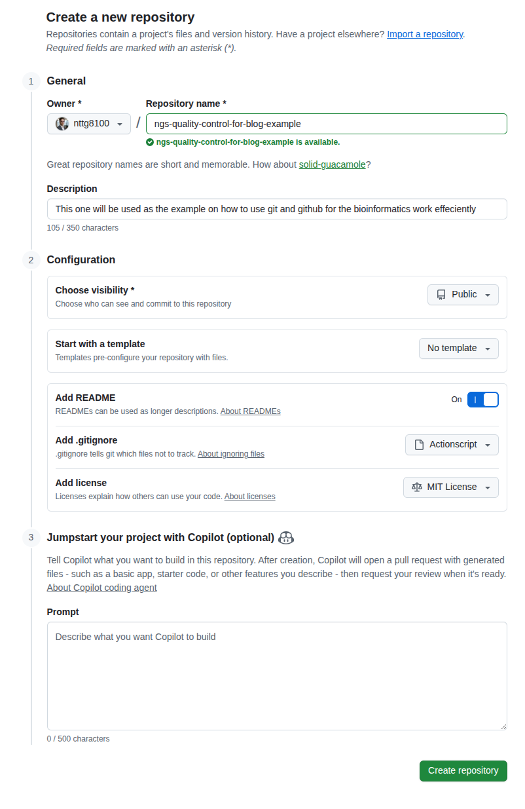
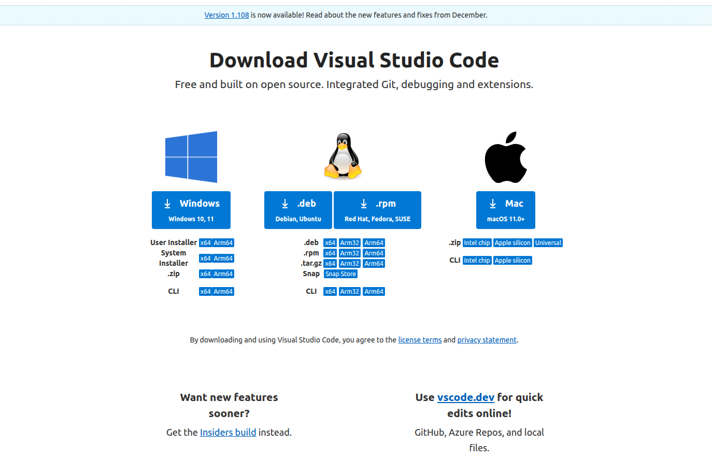
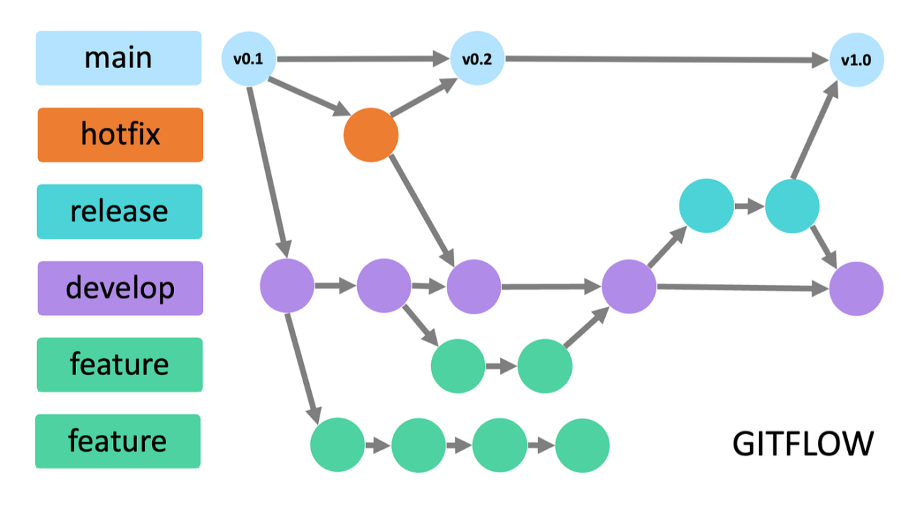
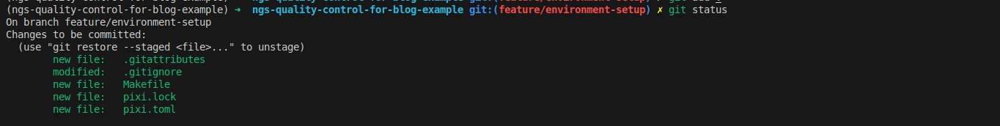
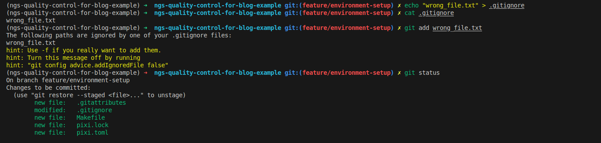
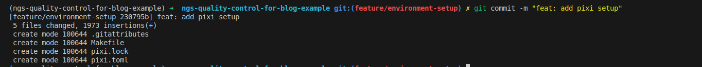
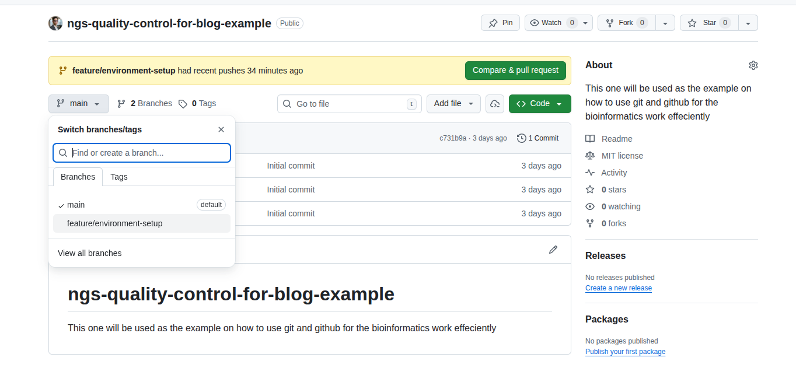
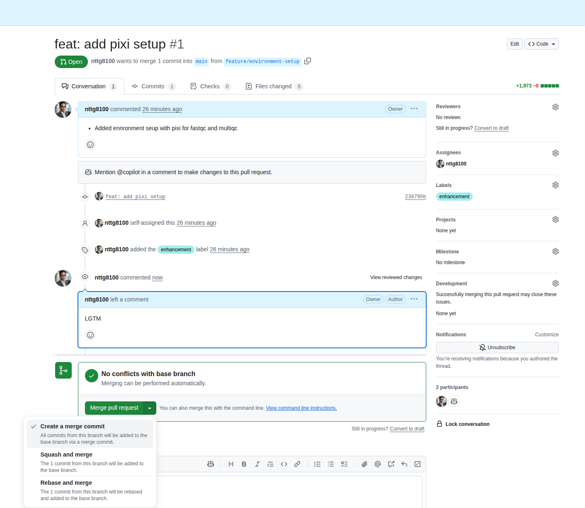

In Part 1 (this post), we explore the history of Git, its integration with GitHub, and basic hands-on tutorials. Part 2 (coming soon) will cover real-world bioinformatics examples and advanced workflows with best practices.

This part focuses on practical applications, including NGS quality control using multiqc and fastqc.

<!--truncate-->

- **Part 1 (This Post)**: History, basics, GitHub integration, and hands-on tutorials
- **Part 2 (Coming Soon)**: Real-world bioinformatics examples and advanced workflows with best practices

Here I provide a real-world example of how to create a simple repository that enables reproducible work for NGS short read data quality control. I'll explain each step using a GitHub repository.

## Create a Repository

As the creator, you are the admin of the repository. You can configure permissions to control who can read or modify it. Here are some common setup tips:

:::tip
+ **Visibility**: If you want to share your work with the community, use `public`. Otherwise, use `private`
+ **Add README**: A README file helps others understand how your repository is structured. Beyond the standard `README.md` for general users, consider adding `README.developer.md` for developer-specific information
+ **.gitignore**: This file specifies which files or folders should not be pushed to GitHub
+ **License**: This determines how others can use your work. For example, MIT allows free usage, while other licenses may require purchase for commercial use
:::



## Clone

Cloning creates a copy of your repository on your local computer. When working in a team, each member has their own local copy. GitHub serves as a central location, similar to Google Drive, that allows you to sync your source code.

GitHub provides SSH protocol authentication for downloading resources, but it doesn't work like a remote server with shell access.

:::info
+ After creating a repository, clone it to start working
+ You'll need to authenticate with GitHub on your local computer or HPC first. I recommend using SSH keys
+ Click the green "Code" button, select the "SSH" tab, copy the URL, and use it to clone the repository
:::


For authentication, follow the official GitHub documentation: https://docs.github.com/en/authentication/connecting-to-github-with-ssh/adding-a-new-ssh-key-to-your-github-account

:::tip
+ This site also has documentation on connecting to remote servers using SSH: [**SSH setup**](../../docs/5.resources/1.administration/2.ssh-remote-server.md)
+ You can stop after creating the key pair
:::

Add your public key to GitHub by navigating to `Settings` → `SSH` section


Now test your connection to GitHub:

```bash
ssh git@github.com
# PTY allocation request failed on channel 0
# Hi nttg8100! You've successfully authenticated, but GitHub does not provide shell access.
# Connection to github.com closed.
```

You're ready to clone. Open your terminal, navigate to your working directory, and clone the repository:

:::tip
+ To clone a specific branch or tag, add `-b <branch-name>`
:::

```bash
# clone (equivalent to: git clone git@github.com:nttg8100/ngs-quality-control-for-blog-example.git -b main)
git clone git@github.com:nttg8100/ngs-quality-control-for-blog-example.git
cd ngs-quality-control-for-blog-example
```

Open the code with your editor. Here I use Visual Studio Code:

:::info
Download and install Visual Studio Code: https://code.visualstudio.com/download
:::



## Your Code Editor

In your terminal, you can open the entire repository (which is just a folder). Simply use your mouse to select the terminal icon in the footer.

:::tip
+ Now you can select any file you want to edit—everything is a text file
:::

```bash
code .
```


Now follow these steps to establish good version control practices.

## Branching Strategy



A branching strategy is a workflow that helps teams manage codebase changes in a structured way. Git branches allow you to work on new features, bug fixes, or experiments without affecting the main codebase.

**Common branching strategies:**

- **Main (or `master`) branch:**
  The stable branch that always contains production-ready code

- **Feature branches:**
  Create a new branch for each feature or task (e.g., `feature/quality-control`). This keeps development isolated until the feature is complete

- **Development branch:**
  Some teams use a `develop` branch as an integration branch for features before merging into `main`

- **Hotfix/bugfix branches:**
  For urgent fixes, create a branch from `main` (e.g., `hotfix/fix-typo`) and merge back after testing

**Typical workflow:**
1. Create a new branch from `main` for your feature or fix
2. Work on your changes and commit them to your branch
3. Open a pull request (PR) to merge your branch into `main` (or `develop`)
4. Review, test, and merge the PR

This approach:
- Keeps the `main` branch stable
- Makes collaboration easier
- Helps track changes and review code before merging

Now let's create a new branch. Our goal is to set up easy installation of fastqc and multiqc. We'll write a bash script for analysis later. For simplicity, we'll develop feature branches and merge them directly to main, which works well for small projects like this.

```bash
# Create and switch to a new branch from main
git switch -c feature/environment-setup
```

## New Branch: Environment Setup

Instead of conda, I prefer to install pixi, then install multiqc and fastqc. Create a Makefile for installation—you can either edit a new `Makefile` manually or generate it with bash.

:::info
A Makefile is a special file used by the make build automation tool. It defines rules and instructions for building and managing projects, especially in languages like C/C++. However, it can be used for any project, including Node.js, React, and TypeScript, to automate repetitive tasks.

**Key Concepts:**
- **Targets**: What you want to build (e.g., a file or a label for a task)
- **Dependencies**: Files or targets that must be up-to-date before the target can be built
- **Recipes**: Shell commands to run to build the target
:::

```bash
cat << EOF >> Makefile
${HOME}/.pixi/bin/pixi:
  mkdir -p ${HOME}/.pixi/bin
  curl -sSL https://pixi.dev/install.sh | sh
EOF

# Verify the newly created file content
cat Makefile
```

:::tip
**Pro Tip:**
When writing your `Makefile`, use `.PHONY` targets for commands that don't produce files with the same name. This prevents conflicts and ensures your commands always run as expected. Keep installation steps modular—separate environment setup, tool installation, and analysis scripts into different targets for clarity and reusability.
:::

```bash
# Install pixi
make ~/.pixi/bin/pixi

# Initialize pixi in your current repository
pixi init --channel conda-forge --channel bioconda

# Install multiqc and fastqc
pixi add fastqc multiqc

# Activate the pixi shell
pixi shell

# Verify tools are installed
which fastqc
which multiqc
# /home/giangnguyen/Documents/dev/docs/ngs-quality-control-for-blog-example/.pixi/envs/default/bin/fastqc
# /home/giangnguyen/Documents/dev/docs/ngs-quality-control-for-blog-example/.pixi/envs/default/bin/multiqc
```

## Common Git Commands

:::warning
You can check git history to see who made changes—useful for accountability when needed
:::

Check your current status to see uncommitted files. Use command line to add files to your commit:

```bash
git status
```


Add files to commit and review changes:

```bash
# Add files one by one
git add .gitignore
git add .gitattributes
git add Makefile
git add pixi.lock
git add pixi.toml

# Or add all files/folders in the current repository
git add .

# Verify staged files
git status
```



Sometimes you might accidentally stage the wrong files. Remove them from the current commit:

```bash
# Create a wrong file
touch wrong_file.txt
git add wrong_file.txt

# Restore it to unstaged status
git restore --staged wrong_file.txt
```


If you need files locally but don't want to commit them, add them to .gitignore. This prevents them from being committed even when using `git add .`. .gitignore can ignore both files and folders.

:::tip
+ For better control, create .gitignore in the specific folder/subfolder where unwanted files/folders are located
+ Common .gitignore patterns: environment folders (`.env`, `.pixi`), `node_modules`, data folders (`data`), `*.tar.gz`, cache folders (`__pycache__`)
+ To ignore an entire folder but keep specific files, use `!<filename>` to keep only needed files
```
folder
!folder/file.txt
```
:::

```bash
# Add to gitignore
echo "wrong_file.txt" > .gitignore

# View the file
cat .gitignore

# Try to add the file again—it won't be staged now and will show a warning
git add wrong_file.txt

# Check status
git status
```



Now create a commit with all your staged files:

```bash
git commit -m "feat: add pixi setup"
```



Push your changes to GitHub, the remote server that tracks your development progress:

```bash
# Push to remote
git push origin feature/environment-setup

# View your remote origin to confirm where updates are pushed
# This shows I cloned using the SSH credential
git config --get remote.origin.url
# git@github.com:nttg8100/ngs-quality-control-for-blog-example.git
```


## Check Updates on GitHub

Visit your GitHub repository to see the new branch. In this example:
https://github.com/nttg8100/ngs-quality-control-for-blog-example



Now let's move on to remote collaboration with your team.

## Pull Request

A Pull Request (PR) compares your changes with the target branch. GitHub provides a concise PR interface that shows what's been added or removed. You can review your own PR, use Copilot, or have teammates review. They can comment on your PR to suggest improvements or identify issues.

**Best practices for creating a Pull Request:**
+ **Keep PRs Small**: Focus on a single feature or fix. Small PRs are easier to review and merge
+ **Clear Description**: Write a concise summary of what the PR does, why it's needed, and any relevant context
+ **Reference Issues**: Link related issues or tickets (e.g., Closes #123)
+ **Self-Review**: Check your code for errors, style, and unnecessary changes before submitting
+ **Add Tests**: Include or update tests to cover your changes
+ **Follow Conventions**: Stick to your team's coding and commit message guidelines

To create a PR, select the "Pull requests" tab, click "New pull request", then select your current branch and target branch. We'll continue with our current branch:


The PR is now created:


## Review

**Best practices for reviewing a Pull Request:**
+ **Understand the Context**: Read the PR description and related issues
+ **Check for Clarity**: Ensure code is readable, well-structured, and commented where necessary
+ **Test Locally**: Run the code if possible to verify it works as intended
+ **Suggest Improvements**: Be constructive and specific in your feedback
+ **Check for Side Effects**: Make sure changes don't break existing functionality
+ **Be Respectful**: Keep feedback positive and focused on the code, not the person

Click on "File changes" to start your review. You can comment on specific lines of changed files. In the end, comment on whether changes should be modified or merged. Here I'm the PR creator, so GitHub disables self-approval. In best practice, another person should review your work. `LGTM` (Looks Good To Me) indicates approval and allows merging your changes into the target branch.

:::tip
+ Request PR review from teammates
+ PR must be approved before merging
:::


## Merge

Although your PR is ready to merge without approval in this example, you should configure branch protection rules in your repository settings:
https://docs.github.com/en/repositories/configuring-branches-and-merges-in-your-repository/configuring-pull-request-merges

When merging a pull request on GitHub, you can choose from several strategies. Each has advantages depending on your workflow:

| Strategy             | Description                                                                                   | Use Case                                   |
| -------------------- | --------------------------------------------------------------------------------------------- | ------------------------------------------ |
| **Merge Commit**     | Combines all commits from the feature branch into the target branch, preserving full history. | Default; keeps detailed commit history.    |
| **Squash and Merge** | Combines all changes from the feature branch into a single commit on the target branch.       | Clean, concise history for small features. |
| **Rebase and Merge** | Reapplies your branch's commits on top of the target branch, creating a linear history.       | Linear history, avoids merge commits.      |



When working with a large team, using a merge commit directly integrates your branch into the target branch. This works well if the target branch hasn't changed significantly since you started. For example, if you branched off `main` when it only had `feature A` and `feature B`, and you're adding `feature C`, merging is straightforward.

However, if other team members have merged new features (e.g., `feature C1`) into `main` that modify the same files you're working on, you may encounter conflicts. In such cases, it's best to use rebase to update your branch with the latest changes from the target branch before merging. If your branch contains many small, incremental commits, consider using squash and merge to combine them into a single, clean commit for a tidier history.


Now the main branch shows the update from your PR:


## Rebase

When working in a team, the `main` branch (or your target branch) may receive updates from other contributors while you're developing your feature branch. To keep your branch up-to-date and avoid conflicts later, regularly update your branch with the latest changes from `main`. This is where `rebase` is useful.

**Use case:**
Suppose you started working on a feature branch (`feature/testing-rebase`) based on an older version of `main`. Meanwhile, new commits have been added to `main` by others. Rebasing allows you to "replay" your changes on top of the latest `main`, resulting in a linear and clean history.

**How to update your feature branch after `main` is updated:**

```bash
# Make sure you're on your feature branch
git checkout feature/testing-rebase

# Fetch the latest changes from the remote repository
git fetch origin

# Rebase your branch onto the updated main branch
git rebase origin/main
```

During the rebase, if there are conflicts, Git will pause and let you resolve them. After fixing conflicts, continue the rebase:

```bash
git add <resolved-files>
git rebase --continue
```

If you want to abort the rebase at any point:

```bash
git rebase --abort
```

**Why use rebase?**
- Keeps your branch history clean and linear
- Makes it easier to review and merge changes
- Reduces the chance of complex merge conflicts later

**Tip:**
After rebasing and before pushing, you may need to force-push your branch since the commit history has changed:

```bash
git push --force-with-lease
```

Use force-push with care, especially on shared branches.


*This concludes Part 1 of the RiverXData series on version control in bioinformatics. Stay tuned for Part 2!*
