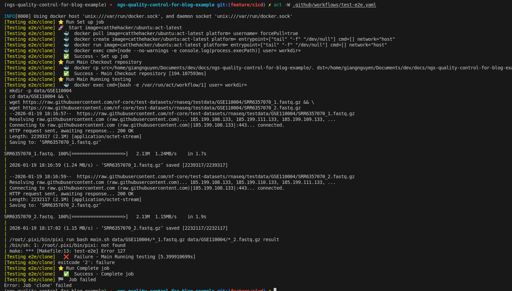
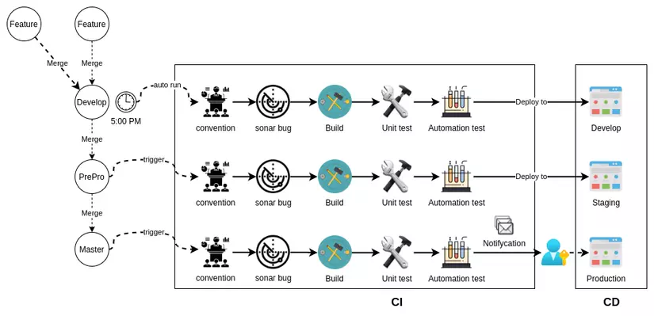
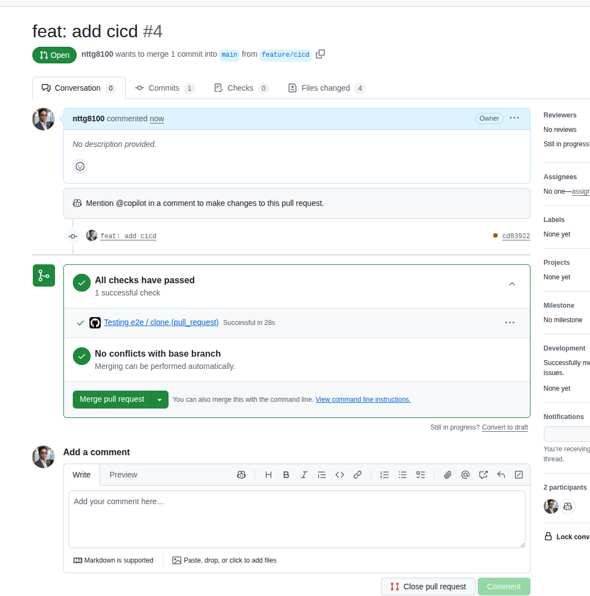

Welcome to Part 2 of our series on version control in bioinformatics. In [Part 1](/blog/2026/01/15/how-to-version-control-git-bioinformatics-part-1), we introduced Git fundamentals, branching strategies, and collaborative workflows. In this post, we'll dive into how Continuous Integration and Continuous Deployment (CI/CD) can transform your bioinformatics projects. If these concepts are new to you, don't worry—this guide will walk you through managing your bioinformatics repository to ensure your work is easily reproducible on any machine. Whether your server is wiped or you need to spin up a new virtual machine, you'll be able to quickly rerun your pipeline. With CI/CD, every code update can automatically trigger tests on a small dataset to verify everything works before scaling up, ensuring that new changes don't break your results or workflows.

<!--truncate-->
- **Part 1**: History, basics, GitHub integration, and hands-on tutorials
- **Part 2 (This Post)**: Local testing, CI/CD implementation, automated testing, and reproducible pipelines

:::info
In this tutorial, we will:
+ Add code to download data
+ Write scripts to use FastQC and MultiQC
:::

## Git commands
This tutorial is fully committed via a GitHub repository. You can clone and checkout to specific branches to see how it is developed and committed.
First, clone the repository, then:
+ Learn how to view commit history (branches are referenced by their names)
+ Learn how to checkout to a specific commit
+ Learn how to see the difference between the current commit and a specific commit

:::tip
+ To quit the git prompt, type `q`
+ Create your own repository for a more practical approach
+ Check the differences in files, then copy them to your own repository to follow the tutorial
:::

```bash
# clone
git clone git@github.com:nttg8100/ngs-quality-control-for-blog-example.git
cd ngs-quality-control-for-blog-example

# checkout to branch for the relevant tutorial step, e.g. feature/add-data
git checkout feature/add-data
```

### How to show commit log
Git provides commands to view the history and check the difference between two commits.
```bash
git log
```
It will show details as below:
```bash
commit ca29351295a4148bda73b6bf76a42cc7b834d1b6 (HEAD -> feature/add-data, origin/feature/add-data)
Author: Thanh-Giang (River) Tan Nguyen <nttg8100@gmail.com>
Date:   Mon Jan 19 23:34:58 2026 +0700

    feat: add makefile to get data

commit 70d584a726fb5418274448a4f51ca07d94b104be (origin/main, origin/HEAD, main, feature/testing-rebase)
Merge: c731b9a 230795b
Author: Thanh Giang Nguyen Tan <64969412+nttg8100@users.noreply.github.com>
Date:   Sat Jan 17 16:42:11 2026 +0700

    Merge pull request #1 from nttg8100/feature/environment-setup
    
    feat: add pixi setup

commit 230795b7b8b03087ef7ee938d333161c9fcc0731 (origin/feature/environment-setup)
Author: Thanh-Giang (River) Tan Nguyen <nttg8100@gmail.com>
Date:   Sat Jan 17 15:05:28 2026 +0700

    feat: add pixi setup

commit c731b9a80dfb22936bfcf94442bdf9b488a90d3c (feature/tesing-rebase)
Author: Thanh Giang Nguyen Tan <64969412+nttg8100@users.noreply.github.com>
Date:   Wed Jan 14 23:09:30 2026 +0700
```

To see more precisely what you need:
```bash
git log --oneline
```

The one-line format is good enough:
```bash
ca29351 (HEAD -> feature/add-data, origin/feature/add-data) feat: add makefile to get data
70d584a (origin/main, origin/HEAD, main, feature/testing-rebase) Merge pull request #1 from nttg8100/feature/environment-setup
230795b (origin/feature/environment-setup) feat: add pixi setup
c731b9a (feature/tesing-rebase) Initial commit
```

Now you can see what I did on the repository. Following this tutorial, you can change to a specific commit to track it.

### How to checkout to specific commit
You can simply use the commit hash. For example, if I want to see all files from commit `230795b` which is on the branch `feature/testing-rebase`:
```bash
git checkout 230795b
```
Now your code editor will show the files with content related to this commit.


### How to view the difference between two commits or your current state
If you have made changes to your files but have not committed them yet:
```bash
git diff
```

I made a change and have not committed it here:
```bash
diff --git a/Makefile b/Makefile
index ae08113..c2e5b87 100644
--- a/Makefile
+++ b/Makefile
@@ -10,4 +10,6 @@ data/GSE110004:
        wget https://raw.githubusercontent.com/nf-core/test-datasets/rnaseq/testdata/GSE110004/SRR6357070_2.fastq.gz
 
 clean:
-       rm -rf data/GSE110004
\ No newline at end of file
+       rm -rf data/GSE110004
+
+Change here
\ No newline at end of file
```

If you want to compare between two branches/commits:
```bash
git diff ca29351..70d584a
```

The changes between the above commits:
```bash
diff --git a/.gitignore b/.gitignore
index cfca1e8..1c3ecb3 100644
--- a/.gitignore
+++ b/.gitignore
@@ -19,5 +19,3 @@ bin-release/
 # pixi environments
 .pixi/*
 !.pixi/config.toml
-data
-
diff --git a/Makefile b/Makefile
index ae08113..bcaa6d7 100644
--- a/Makefile
+++ b/Makefile
@@ -1,13 +1,3 @@
 ${HOME}/.pixi/bin/pixi:
        mkdir -p ${HOME}/.pixi/bin
-       curl -sSL https://pixi.dev/install.sh | sh
-
-
-data/GSE110004:
-       mkdir -p data/GSE110004
-       cd data/GSE110004 && \
-       wget https://raw.githubusercontent.com/nf-core/test-datasets/rnaseq/testdata/GSE110004/SRR6357070_1.fastq.gz && \
-       wget https://raw.githubusercontent.com/nf-core/test-datasets/rnaseq/testdata/GSE110004/SRR6357070_2.fastq.gz
-
-clean:
-       rm -rf data/GSE110004
\ No newline at end of file
+       curl -sSL https://pixi.dev/install.sh | sh
\ No newline at end of file
```
### How to roll back
If you checkout a specific commit and add a few changes to test according to the tutorial, `git` requires you to commit your changes.
You can simply roll back to the original version:
```bash
git checkout -- .
```

Sometimes you want to get files from another branch. You can use:
```bash
git checkout <branch name> <relative file path>
# ex: git checkout main .gitignore
```

## Add data
We need to create a new branch from updated main
```bash
git checkout main
git pull origin main
git switch -c feature/add-data
```

Now we'll add a few target setups to the Makefile to automate data download and cleanup tasks for your pipeline:

- **`data/GSE110004` target**: Downloads example FASTQ files from a public test dataset into the `data/GSE110004` directory. This ensures everyone working on the project uses the same input data, improving reproducibility.
- **`clean` target**: Removes the downloaded data directory, making it easy to reset your environment or save disk space.

This approach helps standardize data management and makes it easier for collaborators (and CI/CD systems) to set up and test the pipeline with minimal manual steps.

Update your `Makefile` with the following:

```bash
${HOME}/.pixi/bin/pixi:
        mkdir -p ${HOME}/.pixi/bin
        curl -sSL https://pixi.dev/install.sh | sh

data:
  mkdir -p data/GSE110004
  wget -O data/GSE110004/SRR6351937_1.fastq.gz https://ftp.sra.ebi.ac.uk/vol1/fastq/SRR635/007/SRR6351937/SRR6351937_1.fastq.gz
  wget -O data/GSE110004/SRR6351937_2.fastq.gz https://ftp.sra.ebi.ac.uk/vol1/fastq/SRR635/007/SRR6351937/SRR6351937_2.fastq.gz

clean:
  rm -rf data
```

Following tutorial 1, you can commit, push, create a PR, and merge to main:
```bash
git commit -m "feat: add makefile to get data"
git push origin feature/add-data
```

## Add workflow
Create new branch
```bash
git checkout main
git pull
git switch -c feature/workflow
```
### Add workflow main.sh script and testing
Here I create a simple bash script that will run using command lines with inputs as arguments.
```bash
# create workflow file using bash script, this runs for only paired reads of 1 sample
cat << EOF >> main.sh
#!/bin/bash

# Usage: ./main.sh <read1.fastq.gz> <read2.fastq.gz> <output_folder>

set -e

if [ "\$#" -ne 3 ]; then
    echo "Usage: $0 <read1.fastq.gz> <read2.fastq.gz> <output_folder>"
    exit 1
fi

READ1="\$1"
READ2="\$2"
OUTDIR="\$3"

mkdir -p "\$OUTDIR"

echo "Running FastQC on \$READ1 and \$READ2..."
fastqc "\$READ1" "\$READ2" -o "\$OUTDIR"

echo "Running MultiQC in \$OUTDIR..."
multiqc "\$OUTDIR" -o "\$OUTDIR"

echo "All done. Results are in \$OUTDIR"
EOF

# chmod to be executed
chmod +x main.sh

# get help script
bash main.sh
# Usage: zsh <read1.fastq.gz> <read2.fastq.gz> <output_folder>

# test it with your data
# activate pixi 
pixi shell
# run interactively
bash main.sh data/GSE110004/*_1.fastq.gz data/GSE110004/*_2.fastq.gz result

# run with pixi directly
pixi run bash main.sh data/GSE110004/*_1.fastq.gz data/GSE110004/*_2.fastq.gz result
```


### Use Makefile to add tests
Now we can quickly run tests after updating the `Makefile`:
```Makefile
.PHONY: install-pixi test-e2e clean
${HOME}/.pixi/bin/pixi:
	mkdir -p ${HOME}/.pixi/bin
	curl -sSL https://pixi.dev/install.sh | sh

data/GSE110004:
	mkdir -p data/GSE110004
	cd data/GSE110004 && \
	wget https://raw.githubusercontent.com/nf-core/test-datasets/rnaseq/testdata/GSE110004/SRR6357070_1.fastq.gz && \
	wget https://raw.githubusercontent.com/nf-core/test-datasets/rnaseq/testdata/GSE110004/SRR6357070_2.fastq.gz

test-e2e: data/GSE110004
	${HOME}/.pixi/bin/pixi run bash main.sh data/GSE110004/*_1.fastq.gz data/GSE110004/*_2.fastq.gz result

clean:
	rm -rf data/GSE110004
```


Quickly run the test:
```bash
make test-e2e
```

Update your `.gitignore` to avoid committing the results:
```bash
# Build and Release Folders
bin-debug/
bin-release/
[Oo]bj/
[Bb]in/

# Other files and folders
.settings/

# Executables
*.swf
*.air
*.ipa
*.apk

# Project files, i.e. `.project`, `.actionScriptProperties` and `.flexProperties`
# should NOT be excluded as they contain compiler settings and other important
# information for Eclipse / Flash Builder.
# pixi environments
.pixi/*
!.pixi/config.toml
data
result
```

Following tutorial 1, you can commit, push, create a PR, and merge to main:
```bash
git add .
git commit -m "feat: add workflow"
git push origin feature/workflow 
```

Then, in your repository root folder, run these commands to get the data:
:::tip
+ Currently, a few make target commands are simple and can be run directly, but in the future, it would be better to update them with more commands
+ Ex: `make clean` can be used to delete more files/folders
:::
```bash
git checkout 
# download data
make data
# test that data is downloaded
ls -lah  data/GSE110004
# total 4.3M
# drwxrwxr-x 2 giangnguyen giangnguyen 4.0K Jan 19 01:00 .
# drwxrwxr-x 3 giangnguyen giangnguyen 4.0K Jan 19 01:00 ..
# -rw-rw-r-- 1 giangnguyen giangnguyen 2.2M Jan 19 01:00 SRR6357070_1.fastq.gz
# -rw-rw-r-- 1 giangnguyen giangnguyen 2.2M Jan 19 01:00 SRR6357070_2.fastq.gz

# delete data folder
make clean
```
## Configure testing
So far, everything has been done locally. However, when you add new features—for example, adding `trimmomatic` to trim the FastQC files—you need to run the tests again to ensure they can be executed without errors. This is the simplest testing practice for developing bioinformatics projects.

GitHub provides GitHub Actions to help with this:
:::info
+ For more detailed examples on GitHub Actions, follow the official documentation: https://docs.github.com/en/actions/get-started/quickstart
+ Here, we introduce how it works and how we can apply it simply
:::


### Create GitHub Action files
Create a new branch for CI/CD:
```bash
git checkout main
git pull
git switch -c feature/cicd
```
Configure the workflow:
```bash
mkdir -p .github/workflows
# create workflow file
cat << EOF >> .github/workflows/test-e2e.yaml
name: Testing e2e

on:
  push:
    branches: [ main ]
  pull_request:
    branches: [ main ]

jobs:
  clone:
    runs-on: ubuntu-latest
    steps:
      - name: Checkout repository
        uses: actions/checkout@v4

      - name: Running testing
        run: |
          make test-e2e
EOF
```

What it does: 
+ Runs workflow named Testing e2e
+ Triggers on pull requests to main
+ Triggers on push or merge into main
+ Starts a job on ubuntu-latest runner
+ Clones the repository using actions/checkout
+ Runs end-to-end tests via make test-e2e
+ Passes if tests succeed
+ Fails if tests return a non-zero exit code

### Running GitHub Actions locally
If we only run tests when creating a PR or pushing to `main`, you may make mistakes and create many commits just to trigger testing. Here, we can use `act`, a local command line tool that can help:
:::info
+ For more details on how to use `act`: https://nektosact.com
+ Install Docker on your local machine first
:::

```bash
# install
pixi add act
# run e2e test locally, it will run this on your local machine
act -W .github/workflows/test-e2e.yaml
```


:::warning
+ As you can see, it failed because pixi is not installed. This is because the `make test-e2e` target does not trigger pixi installation
+ Also, there is a wrong URL for installing pixi: `https://pixi.dev/install.sh` should be replaced with `https://pixi.sh/install.sh`
+ You should add pixi installation as a dependency for `test-e2e`
:::

Update dependencies of `test-e2e` in the `Makefile`:
```bash
.PHONY: test-e2e clean
${HOME}/.pixi/bin/pixi:
	mkdir -p ${HOME}/.pixi/bin
	curl -sSL https://pixi.sh/install.sh | sh

data/GSE110004:
	mkdir -p data/GSE110004
	cd data/GSE110004 && \
	wget https://raw.githubusercontent.com/nf-core/test-datasets/rnaseq/testdata/GSE110004/SRR6357070_1.fastq.gz && \
	wget https://raw.githubusercontent.com/nf-core/test-datasets/rnaseq/testdata/GSE110004/SRR6357070_2.fastq.gz

test-e2e: data/GSE110004 ${HOME}/.pixi/bin/pixi
	${HOME}/.pixi/bin/pixi run bash main.sh data/GSE110004/*_1.fastq.gz data/GSE110004/*_2.fastq.gz result

clean:
	rm -rf data/GSE110004
```

Now you can rerun to test successfully, as shown below:


## What is CI/CD in bioinformatics?
### What is CI/CD in software development

Reference: https://viblo.asia/p/cau-hinh-cicd-voi-github-phan-1-mot-it-ly-thuyet-Qbq5Q9NL5D8

What exactly are CI (Continuous Integration) and CD (Continuous Delivery)? These terms are commonly used in software development.
In the figure above, software can be developed with many new features, which will trigger specific jobs with actions.
For example, we can the workflow to clone the repository on a GitHub Actions instance and run tests. This approach depends on many use cases.

### How does it work in bioinformatics?
That is exactly what I showed you above. If you want to develop software, follow the standard CI/CD software development process. In contrast,
bioinformatics typically combines these tools together. This means they will run scripts (bash, Nextflow, WDL, Snakemake, etc.) to combine tools
in a workflow manner. The release is the repository itself with the scripts inside (CD), while the CI is the process we set up to run
the pipeline with testing datasets.

Now you can create a PR, which will always trigger the testing that helps you validate whether your changes may fail the pipeline.


:::tip
+ Use secrets in `Settings` to work with credentials (passwords, usernames, keys)
+ Use the Makefile to help sync the local environment with the GitHub Actions environment. This makes it easy to change the CI/CD runner
+ Use matrix strategy to run tests faster
:::

Check GitHub Actions logs for debugging:


## Review

In this tutorial, we explored how to transform a basic bioinformatics project into a reproducible, testable pipeline using Git, Makefiles, and CI/CD practices. Here are the key takeaways:

### Git Commands for Project Management
- Use `git log` and `git log --oneline` to view commit history
- Checkout to specific commits to track development progress
- Use `git diff` to compare changes between commits or branches
- Roll back to original states with `git checkout -- .`
- Copy files from other branches using `git checkout <branch> <file>`

### Makefile Automation
- Create targets for data download (`make data`) and cleanup (`make clean`)
- Add test targets (`make test-e2e`) that chain dependencies together
- Ensure reproducibility by standardizing commands across environments

### Workflow Scripts
- Create bash scripts that accept command-line arguments
- Combine tools like FastQC and MultiQC in a workflow
- Test workflows locally before pushing to remote

### CI/CD with GitHub Actions
- Create workflow files in `.github/workflows/`
- Trigger tests on push to main or pull requests
- Use the same Makefile commands in CI as in local development
- Check GitHub Actions logs for debugging failed tests

### Local Testing with `act`
- Test GitHub Actions workflows locally using `act`
- Catch issues before pushing to remote repositories
- Reduce the number of commits needed to fix CI failures

### CI/CD in Bioinformatics Context
- Unlike traditional software, bioinformatics CI/CD often focuses on pipeline validation
- The "delivery" is often the repository itself with reproducible workflows
- Testing involves running entire pipelines on test datasets
- This ensures changes don't break existing analyses

By implementing these practices, you create a robust bioinformatics project that is:
- **Reproducible**: Anyone can reproduce your results on any machine
- **Testable**: Automated tests catch errors before they reach production
- **Maintainable**: Clear history and documentation make updates easier
- **Collaborative**: CI/CD ensures all changes are validated before merging

Ready to implement CI/CD in your own bioinformatics projects? Start by adding a simple Makefile target, then gradually build up your testing and automation capabilities.