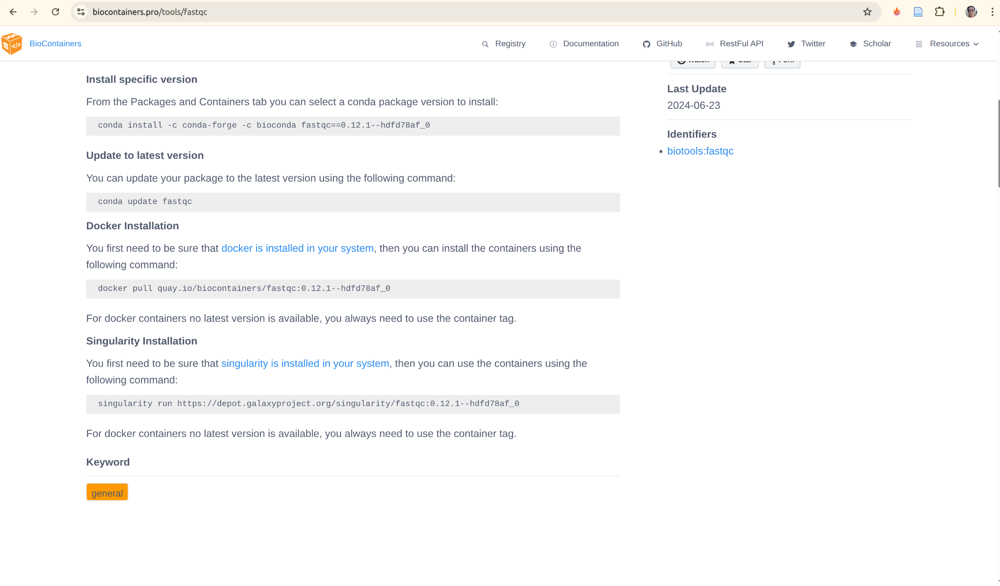

<!-- truncate -->

## Prerequisites: Get Docker Installed and Running

Before reading this blog, **you need Docker installed on your system**. This blog assumes you already have Docker up and running and covers how to effectively use containers for bioinformatics work.

### Start Here First

If Docker is not yet installed on your machine, visit the official Docker documentation:

**📦 https://docs.docker.com/get-started/get-docker/**

This guide will walk you through:
- **Installing Docker Desktop** (Mac, Windows, Linux)
- **Verifying your installation** with `docker --version`
- **Running your first container** with `docker run hello-world`
- **Understanding Docker basics** (images, containers, registries)

### What You Need to Know

After installing Docker, verify it's working:

```bash
# Check Docker version
docker --version
# Output: Docker version 24.0.0, build 12345abc

# Run a test container
docker run hello-world
# Output: Hello from Docker! This message shows that your installation appears to be working correctly.
```

### About This Blog

Once Docker is installed and working, this blog will teach you:

1. **Why containers matter** for reproducible bioinformatics
2. **How to use pre-built containers** from BioContainers and Seqera
3. **How to run containers** with your own data
4. **How to build custom containers** with Conda and Micromamba
5. **How to debug containers** in Nextflow pipelines
6. **Best practices** for efficient, reproducible workflows

### Prerequisites Checklist

Before continuing, verify you have:

- ✅ Docker installed (`docker --version` works)
- ✅ Docker daemon running (or Docker Desktop active)
- ✅ Can pull images (`docker pull hello-world` works)
- ✅ Basic familiarity with command line/terminal
- ✅ (Optional but helpful) Nextflow installed for pipeline examples

**Not ready?** Go to https://docs.docker.com/get-started/get-docker/ first, then come back here!

---

## 1. Why Manual Installation Fails: The Old Way vs. Modern Containers

Traditionally, bioinformatics labs installed software on shared servers or laptops using commands like:

```bash
sudo apt-get install samtools bwa python3
```

While this seems easy, it creates major reproducibility, portability, and maintenance headaches:

- **Manual Steps:** Each researcher (or lab) performs installs slightly differently. Written instructions, scripts, and troubleshooting steps are often lost, mixed, or outdated.
- **Not Reproducible:** No record of what was installed, which versions, or the exact order. Over time, software updates, conflicts, and broken dependencies accumulate, leading to the "works for me" problem.
- **Hard to Debug:** Version mismatches, library conflicts, and subtle errors are almost impossible to diagnose or fix once the environment drifts.
- **Not Portable:** Scripts break on macOS, Windows, or other Linux variants. HPC systems often restrict sudo/root access, making traditional installs impossible.

**Result:** Collaboration across labs, institutions, or countries becomes fragile. Reproducing results—even on your own machine—can be a challenge!

### The Modern Solution: Containers and Community Tooling

Today, bioinformatics has largely replaced manual installs with containers and environment managers:

- **BioConda:** Over 8000 bioinformatics packages can be installed reproducibly via Conda.
- **BioContainers:** Automatically generates Docker containers for each tool, available at [quay.io/biocontainers](https://quay.io/organization/biocontainers).
    ```bash
    docker pull quay.io/biocontainers/samtools:1.15.1--h1170115_0
    ```
- **Seqera/Nextflow/nf-core:** Pipelines with environment definitions (Conda, Docker, Singularity) are shared and run identically everywhere.

*Bottom line:* Containers and Conda have solved the nightmare of manual installs, making reproducible science and collaboration routine in bioinformatics.

---

## 2. Using Docker Containers for Bioinformatics Data Analysis

One of the biggest advantages of Docker is the ability to run bioinformatics tools directly—without any installation—on your own datasets. Here’s a practical example using FastQC, a widely used quality control tool for sequencing data.

### Example: Run FastQC from a Container

1. **Pull the FastQC container (only needed once):**
   ```bash
   docker pull quay.io/biocontainers/fastqc:<version>
   # Replace <version> with the specific tag, e.g. 0.11.9--hdfd78af_1
   ```

2. **Run FastQC, mounting your data folder:**
   ```bash
   docker run --rm -v "$PWD:/data" quay.io/biocontainers/fastqc:<version> fastqc /data/my_reads.fastq
   ```
   - `--rm`: Automatically remove the container after it exits.
   - `-v "$PWD:/data"`: Mount your current directory (with your FASTQ file) into the container at `/data`.
   - The container runs the FastQC executable, analyzing the file and writing results back to your folder.

**Key Benefits:**
- No software installation or dependency headaches.
- Exact version and environment guaranteed.
- Can share or rerun analysis anywhere Docker is available (Linux, Mac, Windows, cloud, HPC).

This approach works for thousands of bioinformatics containers—swap FastQC for Samtools, BWA, STAR, or other tools and run your analysis fully reproducibly and portable.

### Running Containers Interactively

Sometimes you want to run tools or explore interactively inside the container, just as if you were launching a shell. Docker makes this easy with the `-it` flags:

- `-i` keeps STDIN open (interactive input)
- `-t` allocates a pseudo-terminal (TTY)

**Example: Start an interactive shell inside the FastQC container:**

```bash
docker run --rm -it -v "$PWD:/data" quay.io/biocontainers/fastqc:<version> /bin/bash
```

Now you’re inside the container shell:

```bash
fastqc /data/my_reads.fastq
ls /data
```

**Benefits:**
- Inspect files, experiment with commands, or troubleshoot in real-time
- Explore the container environment (dependencies, installed tools)
- Still fully reproducible every time you launch

### Debugging and Inspecting a Running Docker Container

If your container is already running (perhaps as part of a pipeline or a background process), Docker lets you connect and debug interactively using `docker exec`:

1. List running containers:
   ```bash
   docker ps
   ```
   Note the CONTAINER ID in the output.

2. Start a bash shell inside the running container:
   ```bash
   docker exec -it <CONTAINER_ID> /bin/bash
   ```
   Now you can inspect files, check logs, and run additional commands inside the live container.

---

### ENTRYPOINT and Overriding Commands

Many containers run a specific tool as their default ENTRYPOINT—for example, FastQC containers launch FastQC automatically. However, you can temporarily override ENTRYPOINT and start a shell using:

```bash
docker run --rm -it --entrypoint /bin/bash quay.io/biocontainers/fastqc:<version>
```

This starts an interactive shell even if the container’s Dockerfile specifies a different default command. Useful for debugging, troubleshooting, or exploring the container environment.

**Summary:**
- Use `docker exec` to debug running containers
- Override ENTRYPOINT for interactive shells
- Enables real-time troubleshooting and inspection, making containers even more flexible for science

---

### Running Containers with Nextflow: Inspecting the Actual Docker Commands

When you run a Nextflow pipeline with Docker containers, Nextflow automatically generates and executes Docker commands for each task. Understanding these commands is useful for debugging, profiling, and understanding exactly what your pipeline is doing.

#### Where Nextflow Stores Docker Commands

Nextflow creates a work directory structure where each task has its own folder containing:
- `.command.sh` - The shell script to execute
- `.command.run` - The wrapper script that Nextflow uses to run the task
- `.command.trace` - Task execution trace
- `.exitcode` - Exit code of the task
- Output files from the task

**Directory structure:**
```
work/
├── ab/
│   ├── abc123def456.../
│   │   ├── .command.sh
│   │   ├── .command.run
│   │   ├── .command.trace
│   │   └── ... (output files)
│   └── def789ghi012.../
│       └── ...
└── fe/
    └── 949a78b06c5fd8284aeb2f87d14f7d/
        ├── .command.sh
        ├── .command.run
        └── ... (task outputs)
```

#### Viewing the Actual Docker Command

To see the exact Docker command that Nextflow executed for a specific task:

```bash
# 1. Find your task's work directory
# For example, in the pipeline output you might see:
#   vep (ensembl-vep:115.2) [fe/949a78b...]

# 2. Navigate to that directory
cd work/fe/949a78b06c5fd8284aeb2f87d14f7d/

# 3. View the command that was executed
cat .command.run
```

#### Example: Nextflow Docker Command for VEP (Variant Effect Predictor)

Here's a complete example of how Nextflow runs a Docker container:

```bash
docker rm $NXF_BOXID &>/dev/null || true
docker stop $NXF_BOXID

docker run -i \
  --cpu-shares 8192 \
  --memory 14336m \
  -e "NXF_TASK_WORKDIR" \
  -e "NXF_DEBUG=${NXF_DEBUG:=0}" \
  -v <your project working directory>:<your project working directory> \
  -w "$NXF_TASK_WORKDIR" \
  -u $(id -u):$(id -g) \
  --name $NXF_BOXID \
  community.wave.seqera.io/library/ensembl-vep:115.2--90ec797ecb088e9a \
  /bin/bash <your project working directory>/work/fe/949a78b06c5fd8284aeb2f87d14f7d/.command.run nxf_trace
```

#### Breaking Down the Docker Command

Let's understand each component:

| Component                      | Purpose                                                      |
| ------------------------------ | ------------------------------------------------------------ |
| `docker run`                   | Start a new container                                        |
| `-i`                           | Keep STDIN open (interactive)                                |
| `--cpu-shares 8192`            | Allocate CPU resources (set by Nextflow from cpus directive) |
| `--memory 14336m`              | Limit memory to 14GB (set by Nextflow from memory directive) |
| `-e NXF_TASK_WORKDIR`          | Pass Nextflow task work directory env var                    |
| `-e NXF_DEBUG=${NXF_DEBUG:=0}` | Pass debug flag                                              |
| `-v /project:/project`         | Mount project directory for input/output                     |
| `-w "$NXF_TASK_WORKDIR"`       | Set working directory inside container                       |
| `-u $(id -u):$(id -g)`         | Run as current user (file permissions)                       |
| `--name $NXF_BOXID`            | Name the container (cleanup reference)                       |
| `image:tag`                    | Container image to use                                       |
| `/bin/bash .command.run`       | Execute the task script                                      |
| `nxf_trace`                    | Nextflow tracing flag                                        |

#### Re-Running a Failed Task Manually

If a task fails in Nextflow, you can manually re-run it for debugging:

```bash
# 1. Navigate to the task work directory
cd work/fe/949a78b06c5fd8284aeb2f87d14f7d/

# 2. View the task script
cat .command.sh

# 3. View Nextflow's Docker wrapper
cat .command.run

# 4. Manually run the Docker command (copy from .command.run output)
# and inspect what went wrong
docker run -i \
  --cpu-shares 8192 \
  --memory 14336m \
  -e "NXF_TASK_WORKDIR" \
  -v <your project working directory>:<your project working directory> \
  -w "$NXF_TASK_WORKDIR" \
  -u $(id -u):$(id -g) \
  community.wave.seqera.io/library/ensembl-vep:115.2--90ec797ecb088e9a \
  /bin/bash <your project working directory>/work/fe/949a78b06c5fd8284aeb2f87d14f7d/.command.run

# 5. Check the exit code
cat .exitcode

# 6. View any error logs
cat .command.err  # (if exists)
cat .command.out  # (if exists)

# 7. If you run on HPC, (e.g SLURM ), run submit job
sbatch .command.run

# 8. You can debug manually by running container interactively
docker run -it -v $PWD:$PWD -w $PWD <your container> 

# 9. Modify .command.sh then inside your container, start to debug by running command directly
bash .command.sh
```

#### Key Nextflow Docker Features

| Feature                   | How Nextflow Uses It                                                     |
| ------------------------- | ------------------------------------------------------------------------ |
| **Resource limits**       | `--cpus` and `--memory` directives → `--cpu-shares` and `--memory` flags |
| **Volume mounts**         | Pipeline inputs/outputs → `-v` flags                                     |
| **User permissions**      | Current user → `-u $(id -u):$(id -g)`                                    |
| **Work directory**        | Task-specific directory → `-w "$NXF_TASK_WORKDIR"`                       |
| **Container cleanup**     | Automatic removal → `docker rm` commands                                 |
| **Environment variables** | Pipeline configuration → `-e` flags                                      |

#### Profiling and Optimization

By examining the actual Docker commands, you can:

1. **Check resource allocation:**
   ```bash
   grep "cpu-shares\|memory" work/*/*)/.command.run
   ```

2. **Verify mounted volumes:**
   ```bash
   grep "\-v" work/ab/abc123*/.command.run
   ```

3. **See container images being used:**
   ```bash
   grep "docker run" work/*/*)/.command.run | grep -oE "image:[^ ]+"
   ```

4. **Profile task execution:**
   ```bash
   # Check how long each task took
   for dir in work/*/*/*/.command.trace; do
       echo "Task: $(dirname $dir)"
       cat "$dir"
   done
   ```

### Summary

- Nextflow automatically generates Docker commands for each task
- Task commands are stored in `work/<task-id>/.command.run`
- You can inspect and manually re-run failed tasks
- Understanding these commands helps with debugging and optimization
- Resource limits from Nextflow directives are converted to Docker flags
- Each task runs in isolation with its own work directory

---

## 3. Efficient Docker Container Building for Bioinformatics

Building efficient Docker containers keeps your images fast to download, runs, and easy to share.

### Best Practices

- **Start with a lightweight, official base image**
  - Alpine, Debian-slim, Ubuntu LTS

- **Install only required tools**
  - Don't add extra utilities or unnecessary packages

- **Clean cache and remove temp files**
  - In the same RUN step: `rm -rf /var/lib/apt/lists/*`

- **Use multi-stage builds for large or compiled tools**
  - Build from source in a builder stage, copy binaries into a slim final image

### Minimal Example: Install a Tool

```dockerfile
FROM ubuntu:24.04
RUN apt-get update && \
    apt-get install -y --no-install-recommends samtools && \
    apt-get clean && rm -rf /var/lib/apt/lists/*
WORKDIR /data
CMD ["/bin/bash"]
```

### Multi-Stage Build Example: Build from Source

```dockerfile
FROM ubuntu:24.04 AS builder
RUN apt-get update && apt-get install -y build-essential wget
RUN wget https://github.com/samtools/samtools/releases/download/1.18/samtools-1.18.tar.bz2 && \
    tar -xjf samtools-1.18.tar.bz2 && \
    cd samtools-1.18 && \
    ./configure --prefix=/usr/local && make && make install

FROM ubuntu:24.04
RUN apt-get update && apt-get install -y --no-install-recommends libbz2-1.0 liblzma5 zlib1g
COPY --from=builder /usr/local/bin/samtools /usr/local/bin/
WORKDIR /data
CMD ["/bin/bash"]
```

### Further Optimizations
- Sort package lists alphabetically
- Use `.dockerignore` to reduce build context size
- Pin exact tool/package versions for reproducibility

---

## 4. Building Docker Images with Conda and Micromamba

Building Docker containers from Conda packages is one of the most efficient ways to create reproducible bioinformatics environments. Micromamba is a lightweight, faster alternative to Conda that's perfect for containers.

### Why Micromamba for Docker Images?

Micromamba offers significant advantages over traditional Conda:
- **Fast:** 10-100x faster dependency resolution than Conda
- **Lightweight:** Minimal footprint, perfect for containerized deployments
- **Reproducible:** Environment lock files guarantee exact versions
- **Production-ready:** Used extensively in bioinformatics pipelines
- **Small base image:** Official `mambaorg/micromamba` image is only ~150MB

### The Modern Approach: Conda.yml + Micromamba

Instead of writing complex RUN commands with inline package specifications, use a `conda.yml` environment file:

**conda.yml:**
```yaml
name: base
channels:
  - conda-forge
  - bioconda
dependencies:
  - bioconda::fastqc=0.12.1
  - bioconda::samtools=1.18
  - bioconda::bwa=0.7.17
  - conda-forge::procps-ng
```

**Dockerfile:**
```dockerfile
FROM mambaorg/micromamba:1.5.10-noble

# Copy environment file
COPY --chown=$MAMBA_USER:$MAMBA_USER conda.yml /tmp/conda.yml

# Install packages from environment file
RUN micromamba install -y -n base -f /tmp/conda.yml \
    && micromamba clean -a -y

# Export explicit lock file for reproducibility
RUN micromamba env export --name base --explicit > environment.lock \
    && echo ">> CONDA_LOCK_START" \
    && cat environment.lock \
    && echo "<< CONDA_LOCK_END"

# Set PATH
USER root
ENV PATH="$MAMBA_ROOT_PREFIX/bin:$PATH"

WORKDIR /data
CMD ["/bin/bash"]
```

### Understanding the Dockerfile

Let's break down each component:

**1. Base Image:**
```dockerfile
FROM mambaorg/micromamba:1.5.10-noble
```
- `mambaorg/micromamba` includes Micromamba pre-installed
- `1.5.10` is the version (pin for reproducibility)
- `noble` is Ubuntu 24.04 LTS variant
- Much lighter than installing Conda from scratch

**2. Copy Environment File:**
```dockerfile
COPY --chown=$MAMBA_USER:$MAMBA_USER conda.yml /tmp/conda.yml
```
- Copies your conda.yml to the container
- `$MAMBA_USER` is the non-root user (set by base image)
- Preserves proper file ownership

**3. Install with Micromamba:**
```dockerfile
RUN micromamba install -y -n base -f /tmp/conda.yml \
    && micromamba clean -a -y
```
- `-y`: Auto-confirm installation
- `-n base`: Install into the base environment
- `-f /tmp/conda.yml`: Use environment file
- `micromamba clean -a -y`: Remove cached packages (reduces image size by ~50%)

**4. Generate Lock File (for reproducibility):**
```dockerfile
RUN micromamba env export --name base --explicit > environment.lock \
    && echo ">> CONDA_LOCK_START" \
    && cat environment.lock \
    && echo "<< CONDA_LOCK_END"
```
- Exports explicit lock file with exact pinned versions and URLs
- Echo statements make lock file visible in build logs
- This file can be saved and used for exact reproducibility later

**5. Set PATH and User:**
```dockerfile
USER root
ENV PATH="$MAMBA_ROOT_PREFIX/bin:$PATH"
```
- Ensures Micromamba binaries are in PATH
- `USER root` required for some system monitoring (see procps-ng below)

### Why procps-ng is Important for Nextflow

Notice `conda-forge::procps-ng` in the dependencies. Here's why:

```yaml
dependencies:
  - conda-forge::procps-ng
```

Nextflow uses `procps-ng` tools (like `ps`, `top`) to monitor:
- CPU usage
- Memory consumption
- Process status

Without it, Nextflow cannot properly track task resource usage. Always include it in bioinformatics containers.

### Complete Multi-Tool Example

Here's a full example with multiple bioinformatics tools:

**conda.yml:**
```yaml
name: base
channels:
  - conda-forge
  - bioconda
dependencies:
  - bioconda::fastqc=0.12.1
  - bioconda::samtools=1.18
  - bioconda::bwa=0.7.17
  - bioconda::bcftools=1.18
  - bioconda::picard=3.0.0
  - conda-forge::procps-ng
  - conda-forge::parallel
```

**Dockerfile:**
```dockerfile
FROM mambaorg/micromamba:1.5.10-noble

COPY --chown=$MAMBA_USER:$MAMBA_USER conda.yml /tmp/conda.yml

RUN micromamba install -y -n base -f /tmp/conda.yml \
    && micromamba install -y -n base conda-forge::procps-ng \
    && micromamba env export --name base --explicit > environment.lock \
    && echo ">> CONDA_LOCK_START" \
    && cat environment.lock \
    && echo "<< CONDA_LOCK_END" \
    && micromamba clean -a -y

USER root
ENV PATH="$MAMBA_ROOT_PREFIX/bin:$PATH"

WORKDIR /data
CMD ["/bin/bash"]
```

### Building and Using Your Container

**1. Build the image:**
```bash
docker build -t myregistry.com/bioinformatics/biotools:1.0 .
```

**2. Test it locally:**
```bash
docker run --rm -v "$PWD:/data" myregistry.com/bioinformatics/biotools:1.0 \
    fastqc /data/sample.fastq
```

**3. Push to registry:**
```bash
docker push myregistry.com/bioinformatics/biotools:1.0
```

**4. Use in Nextflow:**
```groovy
process FASTQC {
    tag "${meta.id}"
    label 'process_medium'

    conda "${moduleDir}/environment.yml"
    container "${ workflow.containerEngine == 'singularity' && !task.ext.singularity_pull_docker_container ?
        'https://depot.galaxyproject.org/singularity/fastqc:0.12.1--hdfd78af_0' :
        'biocontainers/fastqc:0.12.1--hdfd78af_0' }"

    input:
    tuple val(meta), path(reads)

    output:
    tuple val(meta), path("*.html"), emit: html
    tuple val(meta), path("*.zip") , emit: zip
    path  "versions.yml"           , emit: versions

    when:
    task.ext.when == null || task.ext.when

    script:
    def args          = task.ext.args ?: ''
    def prefix        = task.ext.prefix ?: "${meta.id}"
    // Make list of old name and new name pairs to use for renaming in the bash while loop
    def old_new_pairs = reads instanceof Path || reads.size() == 1 ? [[ reads, "${prefix}.${reads.extension}" ]] : reads.withIndex().collect { entry, index -> [ entry, "${prefix}_${index + 1}.${entry.extension}" ] }
    def rename_to     = old_new_pairs*.join(' ').join(' ')
    def renamed_files = old_new_pairs.collect{ _old_name, new_name -> new_name }.join(' ')

    // The total amount of allocated RAM by FastQC is equal to the number of threads defined (--threads) time the amount of RAM defined (--memory)
    // https://github.com/s-andrews/FastQC/blob/1faeea0412093224d7f6a07f777fad60a5650795/fastqc#L211-L222
    // Dividing the task.memory by task.cpu allows to stick to requested amount of RAM in the label
    def memory_in_mb = task.memory ? task.memory.toUnit('MB') / task.cpus : null
    // FastQC memory value allowed range (100 - 10000)
    def fastqc_memory = memory_in_mb > 10000 ? 10000 : (memory_in_mb < 100 ? 100 : memory_in_mb)

    """
    printf "%s %s\\n" ${rename_to} | while read old_name new_name; do
        [ -f "\${new_name}" ] || ln -s \$old_name \$new_name
    done

    fastqc \\
        ${args} \\
        --threads ${task.cpus} \\
        --memory ${fastqc_memory} \\
        ${renamed_files}

    cat <<-END_VERSIONS > versions.yml
    "${task.process}":
        fastqc: \$( fastqc --version | sed '/FastQC v/!d; s/.*v//' )
    END_VERSIONS
    """

    stub:
    def prefix = task.ext.prefix ?: "${meta.id}"
    """
    touch ${prefix}.html
    touch ${prefix}.zip

    cat <<-END_VERSIONS > versions.yml
    "${task.process}":
        fastqc: \$( fastqc --version | sed '/FastQC v/!d; s/.*v//' )
    END_VERSIONS
    """
}
```

### Advantages of This Approach

| Feature             | conda.yml + Micromamba  | Traditional Conda Dockerfile |
| ------------------- | ----------------------- | ---------------------------- |
| **Build speed**     | Very fast (10-100x)     | Slow                         |
| **Image size**      | ~200MB for tools        | ~1-2GB                       |
| **Reproducibility** | Explicit lock file      | Dependency drift possible    |
| **Version pinning** | Easy in YAML            | Inline in Dockerfile         |
| **Readability**     | Clear, readable YAML    | Complex RUN statements       |
| **Channel support** | Multiple channels       | Limited                      |
| **Maintenance**     | Update conda.yml easily | Rebuild entire Dockerfile    |

### Saving and Sharing Explicit Lock Files

The generated `environment.lock` file is extremely valuable. Save it in your project:

```bash
# Extract from build output and save
docker build . 2>&1 | grep -A 1000 "CONDA_LOCK_START" | grep -B 1000 "CONDA_LOCK_END" > environment.lock
```

Later, reproduce the exact environment:
```bash
# Rebuild from locked versions
micromamba install -y -n base --file environment.lock
```

### Pixi: The Next Generation Tool for Conda-Based Containers

Pixi is an emerging tool that combines the best aspects of Conda, Mamba, and lock file management into a single, ultra-fast solution. It's gaining traction in bioinformatics for building reproducible containers.

**Why Pixi?**
- **Fastest:** Even faster than Micromamba for dependency resolution
- **Automatic lock files:** Lock files are created automatically, no manual export needed
- **Single-step reproducibility:** One tool handles everything from installation to reproducibility
- **Cross-platform:** Works seamlessly across different architectures and systems
- **Modern approach:** Designed from scratch with containerization in mind

**Example Dockerfile with Pixi:**

```dockerfile
ARG PIXI_VERSION=0.63.2
ARG BASE_IMAGE=debian:bookworm-slim

FROM --platform=linux/amd64 ubuntu:24.04 AS builder
ARG PIXI_VERSION
RUN apt-get update && apt-get install -y curl
RUN curl -Ls \
    "https://github.com/prefix-dev/pixi/releases/download/v${PIXI_VERSION}/pixi-$(uname -m)-unknown-linux-musl" \
    -o /pixi && chmod +x /pixi
RUN /pixi --version

FROM --platform=linux/amd64 $BASE_IMAGE

# Add appuser with UID 1000
RUN useradd -u 1000 -m -s /bin/bash appuser
USER appuser
WORKDIR /home/appuser

# Copy pixi from builder
COPY --from=builder --chown=appuser:appuser --chmod=0555 /pixi /usr/local/bin/pixi

# Set up pixi with conda channels
ENV PATH="/home/appuser/.pixi/bin:${PATH}"
RUN pixi config set default-channels '["conda-forge", "bioconda"]' --global

# Install tools using pixi
RUN pixi global install fastqc=0.12.1 samtools=1.18 bwa=0.7.17

# Clean cache
RUN pixi clean cache -y

WORKDIR /data
CMD ["/bin/bash"]
```

**Key Pixi Features in the Dockerfile:**
- **Multi-stage build:** Builder stage compiles Pixi, final stage is lean
- **User management:** Non-root appuser for security
- **Global channel setup:** Pre-configures conda-forge and bioconda channels
- **Direct package installation:** `pixi global install` installs and locks versions automatically
- **Automatic lock file:** Lock file is generated implicitly, ensuring reproducibility
- **Cache cleaning:** `pixi clean cache -y` removes temporary files

**Comparing Container Tools:**

| Feature              | Conda           | Micromamba     | Pixi         |
| -------------------- | --------------- | -------------- | ------------ |
| **Speed**            | Slow (baseline) | 10-100x faster | 100x+ faster |
| **Lock file**        | Manual export   | Manual export  | Automatic    |
| **Image size**       | Large           | Small          | Small        |
| **Reproducibility**  | Good            | Excellent      | Excellent    |
| **Complexity**       | High            | Medium         | Low          |
| **Learning curve**   | Steep           | Medium         | Low          |
| **Production-ready** | Yes             | Yes            | Emerging     |

**Summary:**
- Use `conda.yml` with Micromamba for established, proven workflows
- Use Pixi for cutting-edge projects requiring maximum speed and simplicity
- Always include `procps-ng` for Nextflow compatibility (regardless of tool)
- Generate/maintain explicit lock files for reproducibility
- Pin exact versions to prevent dependency drift
- Multi-channel support (conda-forge + bioconda) handles complex dependencies

---

## 5. Finding Pre-Built Containers: Before Building from Scratch

Before you spend time building Docker images from scratch, check if your tool already exists in a public container registry. Most bioinformatics tools have pre-built, maintained containers ready to use. This is the **fastest and easiest approach** when available.

### The Container Search Strategy

Always follow this order:
1. **Check BioContainers** (https://biocontainers.pro/registry) - Most comprehensive bioinformatics registry
2. **Check Seqera Containers** (https://seqera.io/containers/) - Multi-tool combinations, modern builds
3. **Build yourself** - Only if tool doesn't exist

### 1. BioContainers (Primary Source)

**BioContainers** automatically builds and maintains Docker containers for every bioconda package. This is the most comprehensive source for bioinformatics tools.

**URL:** https://biocontainers.pro/registry

**How to find and use a tool:**

```bash
# Search for FastQC
docker search quay.io/biocontainers/fastqc

# Pull a specific version
docker pull quay.io/biocontainers/fastqc:0.12.1--hdfd78af_1

# Run the tool
docker run --rm -v "$PWD:/data" quay.io/biocontainers/fastqc:0.12.1--hdfd78af_1 \
    fastqc /data/sample.fastq
```



**Advantages:**
- ✅ Automatically updated when bioconda packages update
- ✅ Single-tool containers (clean, minimal)
- ✅ Stable and widely tested
- ✅ Available for most bioinformatics tools (~10,000+)
- ✅ Free and publicly accessible

**Limitations:**
- One tool per image (no multi-tool combinations)
- Must manually orchestrate multiple containers for pipelines

**Example with multiple tools in a workflow:**

```bash
# Align reads with BWA
docker run --rm -v "$PWD:/data" quay.io/biocontainers/bwa:0.7.17--h5bf99c6_8 \
    bwa mem /data/ref.fa /data/reads.fq > /data/aligned.sam

# Sort BAM with Samtools
docker run --rm -v "$PWD:/data" quay.io/biocontainers/samtools:1.18--hd87286a_0 \
    samtools sort /data/aligned.sam > /data/aligned.bam
```

### 2. Seqera Containers (Also support Multi-Tool Option)

**Seqera Containers** provides a registry of pre-built containers that often combine multiple tools, perfect for complex workflows.

**URL:** https://seqera.io/containers/

**How to find and use containers:**

1. Visit https://seqera.io/containers/
2. Search for your tool(s)
3. Add multiple tools if needed (e.g., `fastqc` + `samtools` together)
4. Select your architecture (linux/amd64 or linux/arm64)
5. Get the container reference

**Example:**
```bash
# Pull a multi-tool container
docker pull wave.seqera.io/library/fastqc:0.12.1-samtools_1.18

# Or use in Nextflow
process analyzeReads {
    container 'wave.seqera.io/library/fastqc:0.12.1-samtools_1.18'
    script:
    '''
    fastqc input.fastq
    samtools view input.bam
    '''
}
```


**Advantages:**
- ✅ Combines multiple tools in one image
- ✅ Modern infrastructure
- ✅ Web interface for easy discovery
- ✅ Automatic lock file generation
- ✅ Multi-architecture support

**Limitations:**
- Fewer pre-built combinations than BioContainers
- Relies on Seqera infrastructure

### 3. When to Build from Scratch

Only build your own container if:

1. **Tool doesn't exist** in any public registry
2. **Version not available** and you need an older/newer version
3. **Custom modifications** required (additional dependencies, scripts)
4. **Performance optimizations** needed for specific hardware

**Example scenario:**
```bash
# Check if tool exists
docker pull quay.io/biocontainers/myraretool:latest  # ❌ Not found

# Check Seqera Containers
# Visit https://seqera.io/containers/ - (tool not found)

# → NOW you build it yourself using Section 4 approach
docker build -t myregistry.com/myraretool:1.0 .
docker push myregistry.com/myraretool:1.0
```

### Quick Reference: Where to Find Each Tool

| Tool Type                                               | Primary Location                         | Alternative                   | Fallback       |
| ------------------------------------------------------- | ---------------------------------------- | ----------------------------- | -------------- |
| **Common bioinformatics** (FastQC, SAMtools, BWA, etc.) | https://biocontainers.pro/registry       | https://seqera.io/containers/ | Build yourself |
| **R/Bioconductor packages**                             | https://biocontainers.pro/registry       | https://seqera.io/containers/ | Build yourself |
| **Python bioinformatics**                               | https://biocontainers.pro/registry       | https://seqera.io/containers/ | Build yourself |
| **Specialized tools**                                   | https://biocontainers.pro/registry first | GitHub releases               | Build yourself |

### Practical Workflow: Search → Pull → Use

```bash
#!/bin/bash
# 1. Search for tool in BioContainers
TOOL="fastqc"
VERSION="0.12.1"
echo "Searching for $TOOL:$VERSION in BioContainers..."
docker pull quay.io/biocontainers/$TOOL:$VERSION--* 2>/dev/null && \
    echo "✓ Found in BioContainers!" && \
    exit 0

# 2. Try Seqera Containers
echo "Trying Seqera Containers..."
# (Check https://seqera.io/containers/ manually or via API)

# 3. Build yourself
echo "✗ Not found in public registries. Building from scratch..."
# Use Section 4 approach with Micromamba or Pixi
docker build -t myregistry.com/$TOOL:$VERSION .
```

### Best Practices for Using Pre-Built Containers

1. **Pin exact versions:**
   ```bash
   ✓ Good: docker pull quay.io/biocontainers/samtools:1.18--hd87286a_0
   ✗ Bad:  docker pull quay.io/biocontainers/samtools:latest
   ```

2. **Check build hash in Nextflow:**
   ```groovy
   process myTask {
       // Include digest for reproducibility
       container 'quay.io/biocontainers/samtools:1.18--hd87286a_0@sha256:abc123...'
       script: 'samtools view input.bam'
   }
   ```

3. **Keep local cache for offline work:**
   ```bash
   docker pull quay.io/biocontainers/samtools:1.18--hd87286a_0
   docker tag quay.io/biocontainers/samtools:1.18--hd87286a_0 \
       myregistry.com/samtools:1.18
   docker push myregistry.com/samtools:1.18
   ```

### Summary: Container Registry Decision Tree

```
Do you need a bioinformatics tool in a container?
│
├─→ Search https://biocontainers.pro/registry (BioContainers)
│   ├─→ Found? Use it ✓
│   └─→ Not found?
│       │
│       ├─→ Search https://seqera.io/containers/ (Seqera Containers)
│       │   ├─→ Found? Use it ✓
│       │   └─→ Not found?
│       │       │
│       │       └─→ Build using Section 4
│       │           (Micromamba or Pixi) ✓
```

**Key Takeaway:**
- **Check existing registries first** - saves time and uses community-maintained containers
- **BioContainers (https://biocontainers.pro/registry) is your first stop** - most comprehensive bioinformatics registry
- **Seqera (https://seqera.io/containers/) for multi-tool combinations** - modern approach for complex workflows
- **Build yourself only as last resort** - but you now have the tools (Section 4) to do it well
