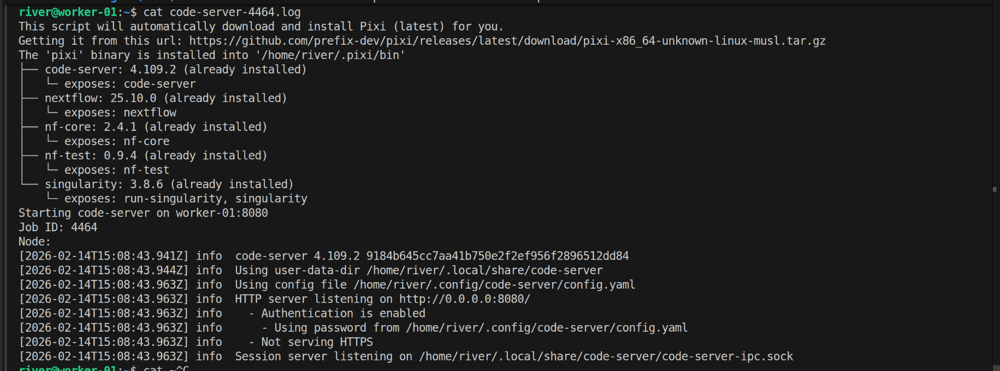

Setting up a robust development environment for Nextflow training across local and HPC systems requires a unified solution. Code-server provides a browser-based VS Code interface accessible from any machine, making it perfect for teams collaborating on Nextflow workflows. This guide walks you through configuring a complete Nextflow training environment with code-server, Singularity containers, and Pixi-managed tools.

For a comprehensive introduction to Pixi and package management, see our [Pixi new-conda era](/blog/pixi-is-new-conda-based-era).

<!-- truncate -->

## 1. Install Code-Server with Pixi

Code-server brings VS Code to your browser, allowing seamless development on HPC systems without local installation. We'll install it using Pixi for clean dependency management.

### 1.1. What is Code-Server?

Code-server runs VS Code in your browser, giving you the familiar IDE interface while working on remote systems. This is ideal for:
- HPC cluster environments
- Shared computing resources
- Working from multiple machines
- Team collaboration on training projects

### 1.2. Understanding Pixi

Pixi is a powerful package manager that simplifies installation of tools like Nextflow and Singularity. For detailed information on Pixi setup and usage, refer to our comprehensive [Pixi- New conda era](/blog/pixi-is-new-conda-based-era).

In this guide, we'll use Pixi to manage code-server, Nextflow, Singularity, and nf-core tools directly within a SLURM job.

### 1.3. Launch Code-Server as a SLURM Job

Submit code-server as a SLURM batch job. This ensures proper resource allocation and allows the job to run persistently on a compute node.

Create a SLURM job script that installs and starts code-server:

```bash
# Create sbatch script
cat > ~/code-server-job.sh << 'EOF'
#!/bin/bash
#SBATCH --job-name=code-server
#SBATCH --time=24:00:00
#SBATCH --cpus-per-task=2
#SBATCH --mem=4GB
#SBATCH --output=%x-%j.log

# Install Pixi (one time per node)
curl -fsSL https://pixi.sh/install.sh | bash
export PATH="$HOME/.pixi/bin:$PATH"

# Install code-server and all tools using Pixi
pixi global install code-server open-jdk nextflow singularity nf-core nf-test

# Create code-server configuration directory
mkdir -p ~/.config/code-server

# Create configuration file
cat > ~/.config/code-server/config.yaml << 'CONFIGEOF'
bind-addr: 127.0.0.1:8080
auth: password
password: your-secure-password
cert: false
CONFIGEOF

# Start code-server
echo "Starting code-server on $HOSTNAME:8080"
echo "Job ID: $SLURM_JOB_ID"
echo "Node: $SLURM_NODENAME"

code-server --bind-addr 0.0.0.0:8080
EOF

# Make script executable
chmod +x ~/code-server-job.sh

# Submit the job
sbatch ~/code-server-job.sh
```

Check the job status and find which node it's running on:

```bash
# Check running jobs
squeue -u $USER

# You should see output like:
# JOBID PARTITION     NAME     USER ST       TIME  NODES NODELIST(REASON)
# 12345       gpu code-serv    user  R       0:15      1 compute-node-05

# Check the log file for connection details
cat code-server-12345.log
```


## 2. Access Code-Server from Local Machine via SSH Tunnel

Code-server is now running on a compute node through your SLURM job. You need to create an SSH tunnel from your local machine through the login node to reach the compute node running code-server.

### 2.1. Find Your Code-Server Job Node

First, identify which compute node your code-server job is running on:

```bash
# SSH into HPC login node
ssh user@hpc.server.edu

# Check your running jobs
squeue -u $USER

# Output example:
# JOBID PARTITION     NAME     USER ST       TIME  NODES NODELIST(REASON)
# 12345      multi code-serv    user  R       5:30      1 worker-01

# Note the node name (worker-01 in this example)

# Verify code-server is running
ssh worker-01 'curl http://localhost:8080' 2>/dev/null | head -5
```

### 2.2. Create SSH Tunnel from Your Local Machine

Now set up port forwarding from your local machine through the login node to the compute node running code-server:

```bash
# Replace worker-01 with your actual node name
# This creates a tunnel: local:8080 → login node → worker-01:8080
ssh -L 8080:worker-01:8080 user@hpc.server.edu

# Keep this terminal open while using code-server
# Open browser and navigate to: http://localhost:8080
# Enter password: your-secure-password (from sbatch script)
```

**Important:** The tunnel command format is:
```bash
ssh -L local_port:compute_node:remote_port user@login_node
```

Where:
- `local_port`: Port on your local machine (8080)
- `compute_node`: The node name from `squeue` (e.g., worker-01)
- `remote_port`: Port code-server listens on (8080)
- `login_node`: Your HPC login node (hpc.server.edu)

### 2.3. Background Tunnel (Optional)

For a persistent tunnel that doesn't require keeping a terminal open:

```bash
# Run tunnel in background
ssh -L 8080:worker-01:8080 user@hpc.server.edu -N -f

# To close the tunnel later
killall ssh
```

### 2.4. SSH Config Convenience Setup
For easier repeated access, add your HPC to `~/.ssh/config` on your local machine:

```
Host hpc-dev
    HostName hpc.server.edu
    User your_username
    LocalForward 8080 localhost:8080
    ServerAliveInterval 60
    ServerAliveCountMax 3
```

Then connect with:

```bash
ssh hpc-dev
# Port 8080 is now forwarded to your HPC's code-server
```

**Note:** This SSH config method forwards to `localhost:8080` on the login node. For the SLURM compute node setup, use the direct command instead with the compute node hostname.

### 2.5. Access Code-Server

With the tunnel active, open your browser and navigate to:

```
http://localhost:8080
```

Enter your password (from code-server config) and verify it's working. You should see the VS Code welcome screen.


## 3. Install Code-Server Extensions and Verify Tools

Now that code-server is accessible from your local machine via the tunnel, install the necessary extensions and verify the pre-installed tools.

### 3.1. Verify Tools Installation

First, verify that all tools were successfully installed in the code-server job:

```bash
# In the code-server terminal (access via http://localhost:8080)
# Check installed tools

nextflow -v
singularity --version
nf-core --version
nf-test --version
```

If any tools are missing, you can install them directly in the terminal:

```bash
# Install any missing tools
pixi global install nextflow singularity nf-core nf-test
```

### 3.2. Install Code-Server Extensions in Browser
Now install VS Code extensions directly in code-server to enhance your development experience:

1. Open the Extensions marketplace (Ctrl+Shift+X or Cmd+Shift+X) or the left side bar for extensions, search for **nf-core-entensionpack** where it is the collection of extensions that you need to have better experiences with nextflow develoment process.


2. Check install:
   - **nf-core-entensionpack** : All of needed extensions for nextflow trainning


### 3.3. Testing Your Settings

With tools and extensions installed, test your setup:

```bash
# In the code-server terminal, run a simple test
nextflow run hello-world.nf
```


## 4. Best Practices and Tips

For regular training sessions, streamline your workflow with these helpful scripts and practices.

### 4.1. Persistent Code-Server Setup

For regular training, create an alias or script to streamline job submission:

```bash
# Add to ~/.bashrc
alias submit-code-server='sbatch ~/code-server-job.sh && sleep 5 && squeue -u $USER | grep code-server'

# Now you can easily submit with:
submit-code-server
```

### 4.2. Create a Submission Helper Script

Create a script that automatically sets up the tunnel:

```bash
# Save as ~/tunnel-to-code-server.sh on your LOCAL machine
#!/bin/bash

# SSH to HPC and check code-server job
NODE=$(ssh user@hpc.server.edu "squeue -u \$USER --format=%N --noheader | grep compute" | head -1)

if [ -z "$NODE" ]; then
    echo "No compute node found. Submit code-server job first!"
    exit 1
fi

echo "Found code-server on node: $NODE"
echo "Creating tunnel to http://localhost:8080"
echo "Press Ctrl+C to close tunnel"

ssh -L 8080:$NODE:8080 user@hpc.server.edu
```

Make it executable and use it:

```bash
chmod +x ~/tunnel-to-code-server.sh
~/tunnel-to-code-server.sh
```

### 4.3. Security Considerations

- Always use a strong, unique password in `config.yaml`
- Only forward port 8080 over SSH (never expose to the internet)
- Rotate passwords regularly for training accounts
- Consider setting SLURM job time limits appropriately (24 hours in the example)
- Cancel unused code-server jobs to free resources

### 4.4. Resource Allocation

The example SLURM script allocates:
- **2 CPUs**: Sufficient for code-server and light development
- **4GB RAM**: Comfortable for code-server and terminal work
- **24 hours**: Full day of work

Adjust these for your needs:

```bash
# For heavier computation (running larger workflows)
#SBATCH --cpus-per-task=4
#SBATCH --mem=8GB

# For shorter sessions (testing)
#SBATCH --time=4:00:00

# To use GPU (if available)
#SBATCH --gres=gpu:1
```

## 5. Recap and Key Takeaways

### What We've Accomplished

You now have a complete, production-ready Nextflow training environment with:

**Infrastructure:**
- ✅ Code-server running as a persistent SLURM job on HPC compute nodes
- ✅ SSH tunneling for secure remote access from your local machine
- ✅ Browser-based VS Code interface accessible anywhere

**Tools & Frameworks:**
- ✅ Nextflow workflow engine with SLURM integration
- ✅ Singularity for HPC-compatible containerized workflows
- ✅ nf-core pipeline framework for professional pipeline development
- ✅ nf-test for pipeline validation and testing

**Configuration:**
- ✅ Pre-configured Nextflow with Singularity support
- ✅ SLURM execution profiles for scalable job submission
- ✅ Security-hardened code-server with password authentication

### Key Takeaways

1. **Single sbatch Script Deployment**: All tools (Pixi, code-server, Nextflow, Singularity, nf-core, nf-test) are installed in one SLURM job, eliminating complex setup procedures

2. **SSH Tunnel Access**: Multi-hop SSH tunneling (`local → login node → compute node`) provides secure access to code-server from your local machine without exposing the HPC system

3. **Persistent Development Environment**: Code-server runs as a managed SLURM job, providing persistent access that survives network disconnections

4. **Browser-Based IDE**: VS Code in the browser works on any device (laptop, tablet, etc.) with no local installation required

5. **SLURM Integration**: Nextflow is configured to submit individual workflow tasks to SLURM, enabling scalable pipeline execution across HPC resources

6. **Production-Ready Training**: The setup is suitable for team training, reproducible research, and production Nextflow workflows

### Quick Reference Workflow

```bash
# Step 1: Submit code-server job (one time)
sbatch ~/code-server-job.sh

# Step 2: Find compute node
squeue -u $USER

# Step 3: Create SSH tunnel (from local machine)
ssh -L 8080:worker-01:8080 user@hpc.server.edu

# Step 4: Access in browser
http://localhost:8080

# Step 5: Run workflows
nextflow run main.nf -profile singularity
```

### Next Steps

1. **Customize the sbatch script** for your HPC environment (queue names, account info, etc.)
2. **Test the setup** with a simple `nf-core` workflow
3. **Create training pipelines** using `nf-core create`
4. **Invite trainees** to use the same environment
5. **Monitor resources** using SLURM commands (`squeue`, `sacct`, `sinfo`)

### Troubleshooting Tips

- If code-server won't start, check the log file: `cat code-server-*.log`
- If SSH tunnel fails, verify the compute node is accessible: `ssh user@hpc.server.edu ssh worker-01 hostname`
- If tools are missing, reinstall via: `pixi global install nextflow singularity nf-core nf-test`
- For persistent tunnel, use the helper script provided in section 4.2