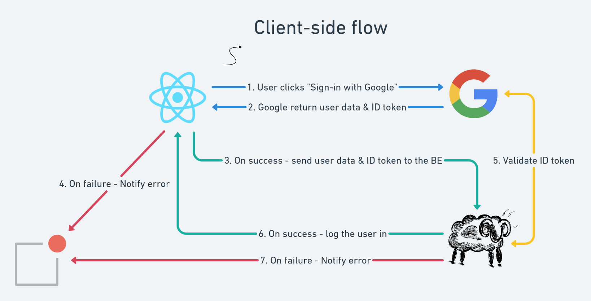

Authentication is the process for identifying the user. Login via Google allows the RIVER platform to get the basic user information, later authorize them with token for specific permission.

The platform implements OAuth 2.0 authentication via Google's authorization service, utilizing a client-side flow to enable seamless user authentication through their Google account credentials. The implementation is based on the [OAuth 2.0 integration pattern](https://www.hacksoft.io/blog/google-oauth2-with-django-react-part-2), adapted to leverage **BlackSheep** as the backend framework and **Vite.js** for frontend development.

