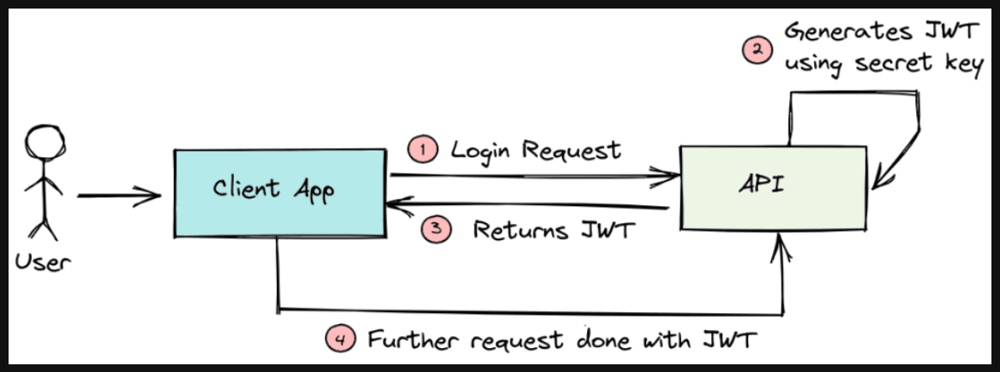

Authorization is the process that determines what resources and actions an authenticated user can access. The platform implements JWT-based authorization with a secure cookie and Redis storage mechanism.

## Authorization Flow

After successful authentication, the server issues two tokens:
- **Access Token**: Short-lived JWT stored in an HTTP-only cookie for API requests
- **Refresh Token**: Longer-lived token stored in Redis for token renewal

## Implementation Details

The platform uses **cookie-based JWT** to enhance security by preventing XSS attacks. Access tokens are stored in secure, HTTP-only cookies that cannot be accessed by client-side JavaScript. When tokens expire, the refresh token (stored in Redis with the user's session) is used to issue new access tokens without requiring re-authentication.

Redis serves as the session store, enabling fast token validation and revocation capabilities across distributed systems.
