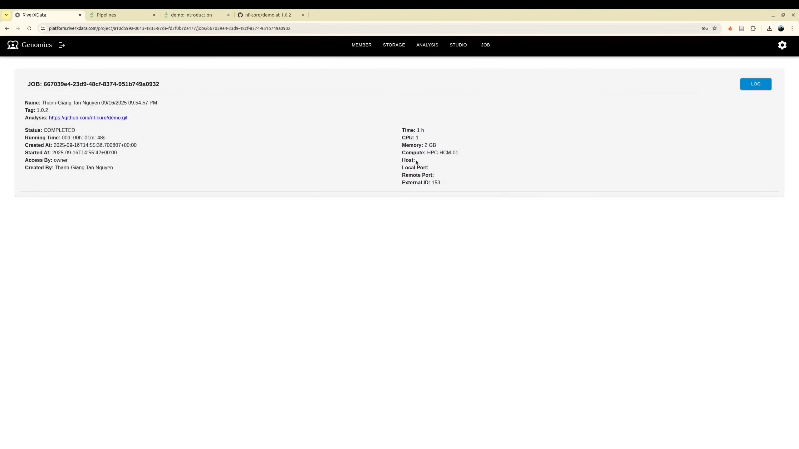

The project is created by the administrator. They are the user who created the credentials for **storage (Compatible-S3)**
Below the project is the storage bucket, where members can access, share and manage data. Users from different institution can run the jobs using their own
computing resource (HPC) from their institution while the data can be centralized at cloud.

Under the project, there are linked section:
+ **Member**: It helps to manage the users with relative role based access control (RBAC)
+ **Storage**: S3 bucket stores the data. For a running job, the project storaged with be **mounted** to ralative job working directory
+ **Studio**: The interactive jobs monitoring
+ **Job**: The non-interactive jobs monitoring
+ **Analysis** is the item linked to the list of tools. Currently, all tools can be viewed by all authorized users. However, only the users with authorized **Github credential** token
can launch the job from the repository.
