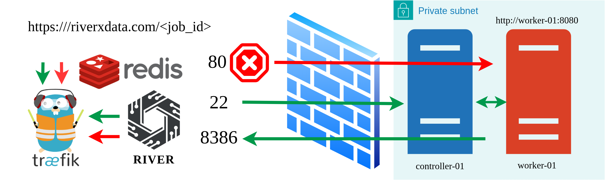
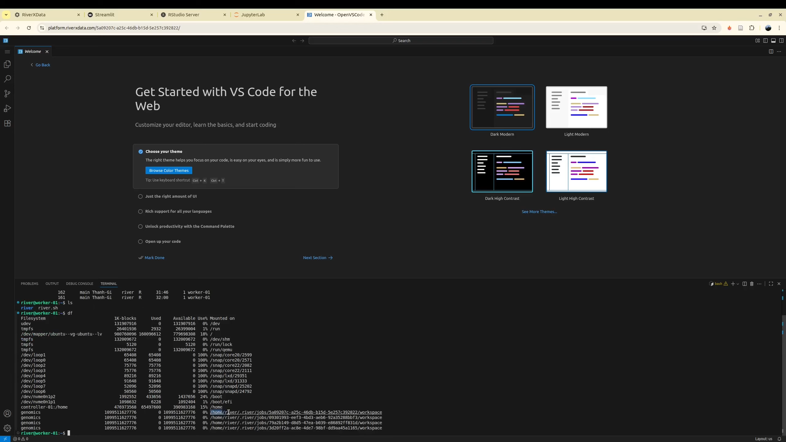

For many data platform, it is usually configured with tools that can help the user to directly working with computing resource (AWS EC2, HPC).
Currently, we support HPC. Using previous **HPC Credentail** which is the SSH key-pairing to connect the the HPC.

Typically, launching a web application on a remote server requires manual configuration of **secure** authentication. The conventional approach involves users logging into the remote machine via terminal with username and password credentials, adding their private key, and establishing an SSH tunnel to access web applications such as JupyterLab. This enables users to access the application interface on their local machine—for instance, an application running on **http://worker-01:8080** (where **worker-01** is a worker node in the HPC cluster) can be accessed locally at **http://localhost:8386** after tunneling.

The RIVER platform streamlines this process by leveraging SSH credentials to establish a secure connection between HPC-hosted web applications and the RIVER platform web server. The platform implements a reverse proxy architecture using Traefik, which masks the actual running ports and provides unified access through URLs in the format **https://riverxdata.com/job-id**.

Authentication is managed through OAuth2 Google integration. Upon login, the system generates access and refresh tokens stored in cookies, ensuring that only authorized users can access protected resources. The reverse proxy middleware validates these tokens for each request. Successfully authenticated users gain access to their web applications on the remote HPC, while unauthorized access attempts result in a 404 error page, maintaining security and access control.

## Studio Applications
Studio applications are web-based development environments (JupyterLab, RStudio, VSCode Server) that provide direct access to the user's workspace on remote HPC infrastructure. These applications are exclusively accessible to the user who initiated the job, ensuring secure, isolated development environments. Studio applications are particularly valuable for developing and testing computational workflows that require direct HPC access, as well as for debugging job execution issues.

## Non-Studio Interactive Applications
Non-studio interactive applications are standalone web applications that require computational resources but do not necessitate direct access to remote HPC storage or filesystems. These applications can be built using various technology stacks (Streamlit, Shiny, etc.) and typically serve as analytical dashboards designed for non-technical users. A common workflow involves data harmonization and publication to project-level storage (S3 buckets), enabling users to launch interactive dashboards for data exploration and analysis without requiring HPC access on HPC directly.

