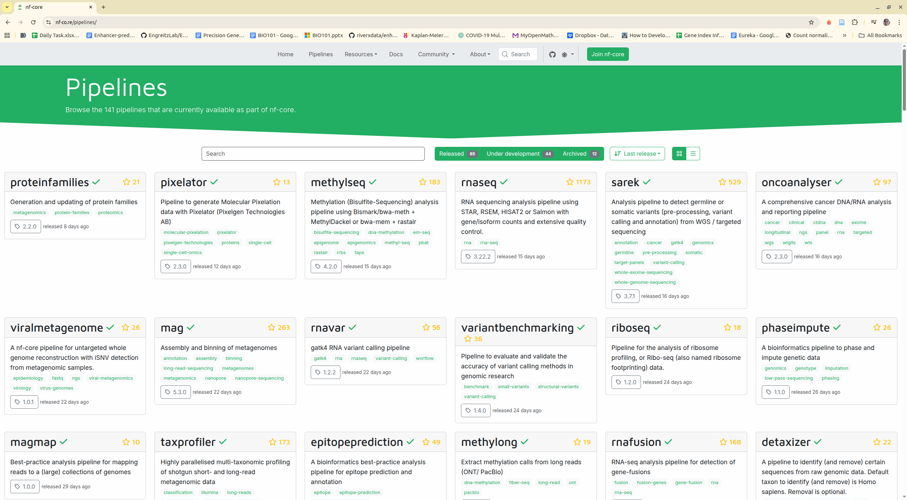

Non interactive jobs usually are the comand line tools or workflows with ingested parameters from the user interface. For the nf-core formatted tools/workflows, user do not need to add any additional configuration. They can be run on the platform directly. While the non nf-core format, they need to be configured with `params.json` to define the parameters and `river/main.sh` to define how a tool can be run.

We mainly supports nf-core for non-interactive analysis