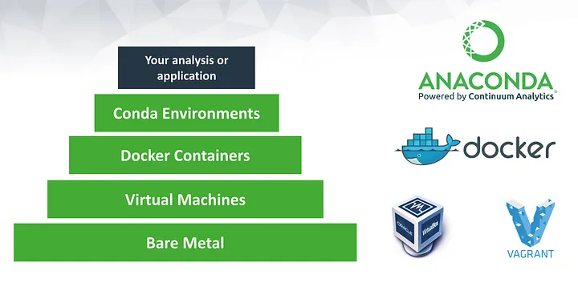

# Environment
:::info
+ Effective environment management is crucial for ensuring consistency, reproducibility, and efficiency in software development and data analysis workflows. 
+ By properly managing dependencies, configurations, and runtime environments, teams can minimize conflicts, reduce errors, and enhance collaboration. 
+ This is especially important in scientific computing, where reproducibility and stability are key factors.
:::

<figure markdown="span">
  
</figure>

Common practices for specific tasks include:
- Docker for containerization.
- Singularity for HPC clusters.
- Conda for managing bioinformatics tools.
- Terraform + Ansible for infrastructure.
- GitHub Actions or GitLab CI/CD for automated deployments.

Ensuring a consistent environment across development, staging, and production requires a combination of **containerization, infrastructure as code (IaC), and environment management**.

For deeper understanding, follow these blogs and documentation:
+ ⌨️ https://www.freecodecamp.org/news/docker-vs-vm-key-differences-you-should-know/

---

## 1. Containerization & Orchestration
:::tip
It allows the installed softwares can be portable, run on any devices. It commonly uses in production
Visual Studio Code provides a cool feature called [**devcontainers**](https://code.visualstudio.com/docs/devcontainers/containers) that allows to use the VSCode feature inside container to develop

:::

:::warning
If a user with docker group that can take the root permissions. Do not add users if they are not the admin. It can be used docker-rootless instead
:::

- **[Docker](https://www.docker.com/)** – Packages applications and dependencies into containers for consistency.
- **[Singularity/Apptainer](https://github.com/apptainer/singularity)** - Singularity/Apptainer is container designed for ease-of-use on shared systems and in high performance computing (HPC) environments
- **[Podman](https://podman.io/)** – Rootless alternative to Docker with improved security.
- **[Kubernetes (K8s)](https://kubernetes.io/)** – Manages and orchestrates containers across environments.
- **[Docker Compose](https://docs.docker.com/compose/)** – Defines multi-container applications, useful for local and staging environments.

✅ **Best for:** Microservices, scalable applications, and DevOps teams.

---

## 2. Environment Management
:::info
Good for developing environment. It can be installed via the containers, then, install requires software

:::
- **[Conda/Micromamba](https://docs.conda.io/en/latest/)** – Ideal for managing Python and bioinformatics dependencies.
- **[Pyenv](https://github.com/pyenv/pyenv)** – Manages multiple Python versions easily.
- **[Poetry](https://python-poetry.org/)** – Dependency and environment management for Python.

✅ **Best for:** Python projects, package isolation, and scientific computing.

---

## 3. Infrastructure as Code (IaC)
:::warning
RiverXData uses SLURM to allocate and scale resource. To set up a standard SLURM cluster, please follow [this](https://github.com/riverxdata/river-slurm) to set up using **Ansible**

:::
- **[Ansible](https://www.ansible.com/)** – Automates software provisioning and configuration.
- **[Terraform](https://www.terraform.io/)** – Manages infrastructure (servers, networks, cloud services).
- **[Puppet](https://puppet.com/)** / **[Chef](https://www.chef.io/)** – Configuration management tools for infrastructure automation.

✅ **Best for:** Cloud infrastructure, large-scale deployments, and automating provisioning.

---

## 4. Configuration & Secrets Management

- **[dotenv (.env files)](https://github.com/motdotla/dotenv)** – Manages environment variables for different environments.
- **[HashiCorp Vault](https://www.vaultproject.io/)** – Securely stores and manages secrets and credentials.
- **[AWS Parameter Store](https://docs.aws.amazon.com/systems-manager/latest/userguide/systems-manager-parameter-store.html)** – Cloud-based secrets management.

✅ **Best for:** Managing sensitive configuration variables across environments.

---

## 5. Versioning & CI/CD Pipelines

- **[GitHub Actions](https://github.com/features/actions)** / **[GitLab CI/CD](https://docs.gitlab.com/ee/ci/)** – Automates deployment workflows.
- **[Jenkins](https://www.jenkins.io/)** – Open-source and highly customizable CI/CD tool.
- **[ArgoCD](https://argo-cd.readthedocs.io/en/stable/)** – GitOps-based Kubernetes deployment.
- **[FluxCD](https://fluxcd.io/)** – Automates Kubernetes deployments via Git.

✅ **Best for:** Automating deployment, testing, and ensuring consistency between environments.