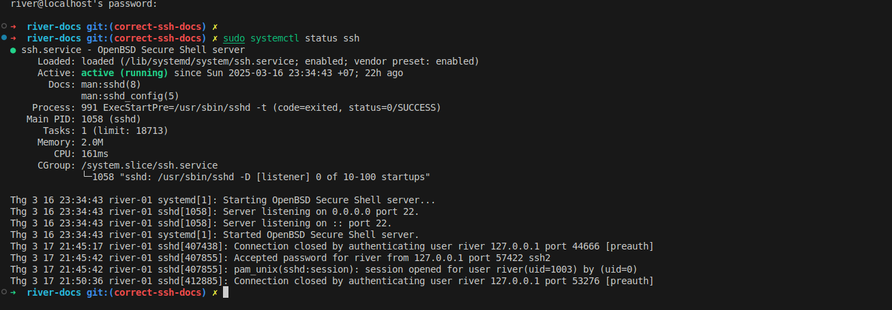
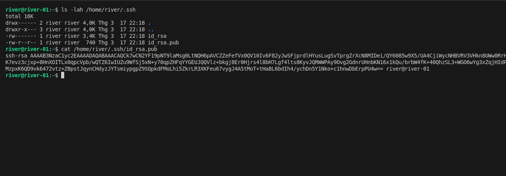
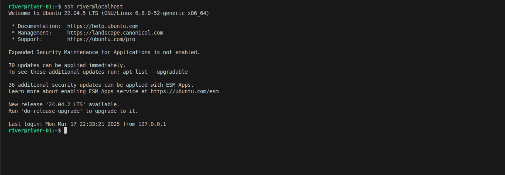
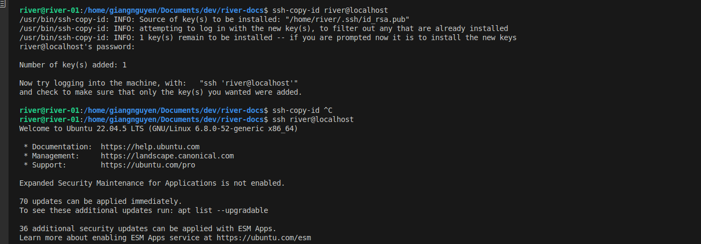

# Remote Server Using SSH
What is SSH ?
<div style={{ position: "relative", paddingBottom: "56.25%", height: 0, overflow: "hidden", maxWidth: "100%", background: "#000" }}>
  <iframe 
     src="https://www.youtube.com/embed/5JvLV2-ngCI" 
    frameBorder="0" 
    allow="accelerometer; autoplay; clipboard-write; encrypted-media; gyroscope; picture-in-picture" 
    allowFullScreen
    style={{ position: "absolute", top: 0, left: 0, width: "100%", height: "100%" }}
  />
</div>

## **Why Use a Remote Server or Cluster Instead of a Laptop?**
The server or cluster (the combinations of multiple servers (nodes)) that will allow to scheduled and executed parrallel tasks, sharing the resources via network.
Running computational workloads on a remote server or cluster is essential for performance, scalability, and reliability.

<figure markdown="span">
  
</figure>

---
## **Remote Server: Setup openssh-server service**
To allow access from a client (your local laptop) to the remote server, you need to install the SSH server and client.

For Debian-based OS, use the following software via the SSH protocol, ensuring all data is encrypted and decrypted:

- **`openssh-server`**: Install this on the remote machine. It stores authorized user information (passwords and public keys). When a client attempts to connect, it verifies the credentials to allow authorized users access.
- **`openssh-client`**: Install this on your local machine. It sends authorized user information (passwords and private keys). If the credentials match, the user is allowed to log in.

:::info
+ If your remote server is not on a public network (WAN), it can still be accessed within a local area network (LAN). 
+ If you have administrative permissions on your wireless router, consider using DDNS and port forwarding to allow access from outside the LAN.
+ **Testing purpose**: You can use your local machine, or a container service to install both server and client services. For your real remote server, replace it with `locahost`
:::

### 1. Install the SSH Server
For testing purpose, you can install on your local debian OS machine
```bash
docker run -it ubuntu:20.04 bash
```
On your remote server, install `openssh-server`:
```bash
sudo apt update && sudo apt install -y openssh-server
```

### 2. Enable and Start SSH Service
Check the status of the ssh service
```bash 
sudo systemctl status ssh
```
Ensure the SSH service is running and enabled at boot, then start it service now:

```bash
# enable at boot, don't need to turn this service again when you restart your remote server
sudo systemctl enable ssh
# start now
sudo systemctl start ssh
# check status
sudo systemctl status ssh
```
The result should be similared to this
<figure markdown="span">
  
</figure>

Create a test user, so you can use it later. The username will be "river", while the password will be "password2025"
```bash
sudo useradd -m -s /bin/bash river
echo 'river:password2025' | sudo chpasswd
```
:::warning
By default, the config for the `ssh-server` service is not truly safe, we can adjust later on the advanced section. Modify the `sshd_config`- the open ssh service config, 
reload it then it can be reliable for the real world application.
:::

## **Local Client:  Setup openssh-client**
### 1. Install the SSH Client**

On your local machine, install `openssh-client`. For testing, you can install on the same machine where you install `openssh-server`:
```bash
sudo apt update && sudo apt install -y openssh-client
```


### 2. Login via SSH using password
Using the above user, login to it own:
```bash
ssh river@localhost
```
It will ask for the password, just type the above password for user river
<figure markdown="span">
  
</figure>

### 3. Login via SSH using rsa key (more secure)
:::info
Login using rsa key, you do not need to type password again. This will be an alternative for password authentication.
You can login via the SSH protocal using key pair. It will look whether your local private key is a pair with your remove sever public key
:::

Change your user to river, create the key.
Press **Enter** until it finish. There are many more algorithms (just create a pair of string that are matched to each other), for more information, follow [**here**](https://goteleport.com/blog/comparing-ssh-keys/)
```bash
su river
ssh-keygen -t rsa -b 4096
```
It will create a key pair that is located on user home folder.
```bash
ls -lah /home/river/.ssh
```
<figure markdown="span">
  
</figure>

Copy your public key content, login to the remote server again to write into the key files
```bash
ssh river@localhost
```

Create a new file, on ssh server, under the `HOME` folder;
```bash
nano ~/.ssh/authorized_keys
```

Add your content of the `id_rsa.pub` to this file. If you have more public keys to access from multiple machine, just append
Logout, and then login again. You will no longer need to type password. By default, it will use your key at `~/.ssh/id_rsa` and your relative username at port 22 to authenticate.
:::info
For the first time, it will ask to continue connect, allow to make fingerprint on the remote server.
:::
```bash
ssh river@localhost
```
<figure markdown="span">
  
</figure>

### 4. Login via SSH using rsa key (more secure) automatically
:::info
Previously, it takes more efforts to add your pubkey to the remote sever manually.
Is there any automation for copying it?
:::

Using the ssh-copy-id
```bash
ssh-copy-id river@localhost
```
<figure markdown="span">
  
</figure>

### 5. If you have new device, while you already have a setup for a previous device, copying key manually
On your new device, after generating the new key, copying this key file to your existed key setup device, using `scp` to copy this to remote server
```bash
scp id_rsa.pub river@localhost:/home/river
cat id_rsa.pub >> /home/river/.ssh/authorized_keys
rm id_rsa.pub
```

## **Advanced: Set up for real world application**
:::info
By default, the ssh sever is setup with port 22 by default, and more:

- **Password Authentication Enabled**: Allows brute-force attacks where hackers try common and random passwords and usernames until they match.
  - 🔧 Fix: Use SSH keys (`PasswordAuthentication no`).

- **Root Login Allowed**: Attackers can gain full control.
  - 🔧 Fix: Disable root login (`PermitRootLogin no`).

- **Empty Passwords Allowed**: Anyone can log in if a user has no password.
  - 🔧 Fix: Disable it (`PermitEmptyPasswords no`).

- **X11 Forwarding Enabled**: Can expose your system.
  - 🔧 Fix: Disable it (`X11Forwarding no`).

- **No Login Attempt Limits**: Attackers can keep guessing passwords. Limiting attempts in a single connection requires more resources to attack your system.
  - 🔧 Fix: Set a limit (`MaxAuthTries 3`).
:::

### 1. Change the basic ssh config, reload

Using nano to edit your config file
```bash
sudo nano /etc/ssh/sshd_config
```
Install `nano` editor if you do not have it
```bash
sudo apt-get install nano -y
```

Scroll down, using up/down key, find each of these lines
```bash
PasswordAuthentication no
PermitRootLogin no
MaxAuthTries 3
PermitEmptyPasswords no
X11Forwarding no
```
Reload new config
```bash
# restart
sudo systemctl restart ssh
# check status
sudo systemctl status ssh
```

### 2. Request users to create their own key
Give the admin the pub key. Highly recommended to use **ed25519** algorithm to generate key pair
```bash
ssh-keygen -t ed25519
```

### 3. The admin helps to copy keys
On the remote machine, the admin copying the user pub key and put to the remote server. Of course, the admin has been added his/her own pubkey.
```bash
# example: scp id_rsa.pub <admin username>@localhost:/<admin userhome>
scp id_rsa.pub admin@localhost:/home/admin
ssh admin@localhost
```

After login, manually do it. The the user can login using key pair after that.
```bash
# chane to root to not need type password as sudo permission 
sudo su
mkdir -p /home/river/.ssh
cat id_rsa.pub >> /home/river/.ssh/authorized_keys
chmod 700 /home/river/.ssh
chmod 600 /home/river/.ssh/authorized_keys
chown -R river:river /home/river/.ssh
rm id_rsa.pub
```

### 4. Why Not Other Setups ?
Besides SSH key authentication, there are other security measures like **Fail2Ban** and **2FA**, but they are **not necessary** in this setup for the following reasons:  
#### 🔹 **Fail2Ban**  
Fail2Ban is useful for blocking brute-force attacks on SSH. However, it is **not needed** in this setup because:  
- **Password authentication is already disabled**, so brute-force attacks are **not possible**.  
- SSH keys **do not allow unlimited login attempts**, unlike passwords.  
- Additional protection like Fail2Ban **only adds unnecessary complexity** when SSH keys are used exclusively.  

#### 🔹 **2FA (e.g., Google Authenticator)**  
Two-Factor Authentication (2FA) provides extra security, but it is **not needed** because:  
- **SSH keys are already highly secure**, and 2FA mainly protects **password-based** logins. If we use the key to authenticate, so the 2FA is no longer needed.  
- 2FA requires **manual setup for each user**, making it **less practical** in automated or multi-user environments. The QR code should not be shared via unencrypted protocol. Unliked the public key, it is very hard for hacker to get the private key from public key.
- In case of **device loss or failure**, recovery is more complex compared to SSH key backups.

:::warning
**YOUR LOGIN VIA PASSWORD WILL BE SAFE IF YOU DON'T USE IT**
:::

### 5. Conclusion  
By using **SSH key authentication** and **disabling password login**, we eliminate brute-force risks **without** the need for additional security layers like Fail2Ban or 2FA. 🚀  


## **Basic Commands for Remote Usage**
### Check system resources:  
  ```bash
  htop   # View CPU & memory usage
  nvidia-smi  # Check GPU status (if available)
  ```

### Transfer files:  
  ```bash
  scp localfile.txt username@server_address:/path/to/destination
  ```
### SSH Tunneling**
SSH tunneling can be used to securely forward network traffic. There are two main types of tunnels: remote and local. Replace `username` and `domain` with your actual username and the domain of the server.

#### Remote Tunnel**
A remote tunnel forwards a port from the remote server to your local machine. This is useful when you want to access a service running on your local machine from the remote server.

```bash
ssh -N -R 9000:localhost:9999 username@domain
```

**Example Use Case:**
You have a Jupyter Notebook running on your remote server at port 9999, then you want to access the it at your local machine at `http://localhost:9000`

#### Local Tunnel**
A local tunnel forwards a port from your local machine to the remote server. This is useful when you want to access a service running on the remote server from your local machine.

```bash
ssh -N -L 2222:localhost:22 username@domain
```

**Example Use Case:**
Ngrok service, it will tunnel the port ssh login to a remote server using a specific port. By using this, you do not need your remote server to be a public network with specific IP.
Now you can login the local machine on remote server.
Try this to login to your localhost via the port 2222 instead of 22 on it own. By default username will match with your current user.
```bash
ssh -N -L 2222:localhost:22 localhost
```
Open a new terminal
```bash
ssh -p 2222 localhost
```
<figure markdown="span">
  
</figure>


## **Conclusion**
Using a remote server ensures **faster processing, reliable storage, and scalable computing power**, making it the best choice for resource-intensive tasks. Always follow best practices for **security and efficient resource usage**.

---
