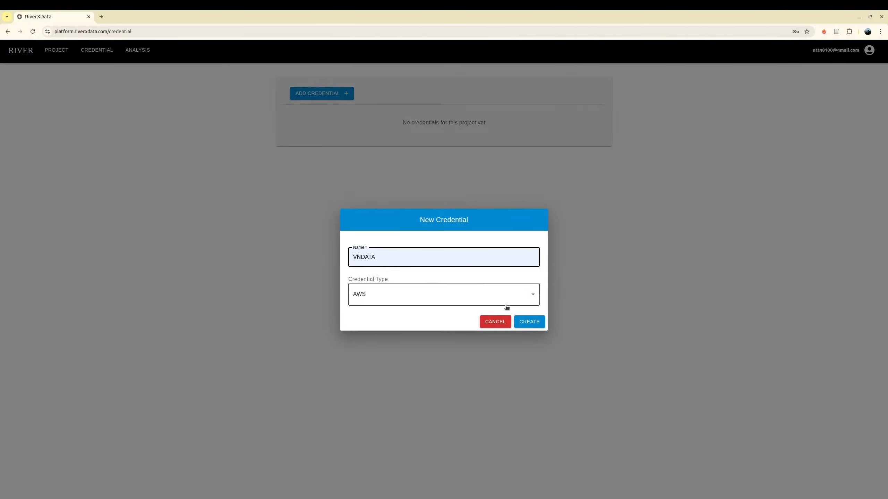

As the administrator, what you need is, how to deploy and create the project, grant the users to access the data on the relative project

## Configure S3-Compatible Storage

Upon successful authentication, access the credential management interface to establish new credentials for S3-compatible storage integration.

### Creating Storage Credentials

Configure your S3-compatible storage infrastructure using the generated credentials. The platform supports any S3 API-compliant storage provider, including Amazon Web Services (AWS), MinIO, and other enterprise cloud service providers.

This implementation leverages local storage providers to maintain stringent data sovereignty standards and ensure compliance with regional data residency regulations.

### Required Configuration Parameters

The following IAM credentials and configuration parameters are mandatory:

+ **Access Key ID**: IAM access key identifier
+ **Secret Access Key**: IAM secret access key credential
+ **Endpoint URL**: S3-compatible service endpoint address
+ **Region**: Designated storage region (e.g., `us-east-1`)
+ **Assume Role ARN** (Recommended): IAM role Amazon Resource Name for enhanced security through temporary credential delegation

### Obtaining IAM Credentials

Coordinate with your S3 storage provider to procure the necessary IAM credentials. The provider must maintain compatibility with the AWS S3 API specification.

For AWS deployments, consult the official documentation: **https://docs.aws.amazon.com/IAM/latest/UserGuide**

If your organization maintains existing data within an established bucket, reference that bucket name during project initialization.

### IAM Security Best Practices

IAM credentials serve as authentication and authorization mechanisms, functioning analogously to traditional username-password combinations for secure data access control.

**Recommended Configuration**: We strongly advise configuring IAM keys with comprehensive S3 permissions in conjunction with an Assume Role ARN. This architecture enables the platform to generate ephemeral credentials and session tokens upon job execution. These time-bound credentials provide contributor users with temporary, restricted access privileges, significantly enhancing the security posture.

**Critical Notice**: In the absence of an Assume Role ARN configuration, contributor users will inherit unrestricted permissions from the base IAM credentials, potentially introducing significant security vulnerabilities.

## Project Creation

Initialize projects using previously configured S3 credentials. If your team maintains existing data within an S3 bucket, simply configure the appropriate IAM credentials and Assume Role ARN—data migration to alternative storage is unnecessary.

The user who creates the project is automatically designated as the project administrator.

## Member Management

Additional authorized users require administrative approval to obtain project membership. The platform implements three distinct role-based access levels: **Administrator**, **Contributor**, and **Viewer**.

Users may exit projects voluntarily; however, the system enforces a policy requiring at least one administrator to remain assigned to each active project.

The adding users need to register via login using Google Oauth2 first.

