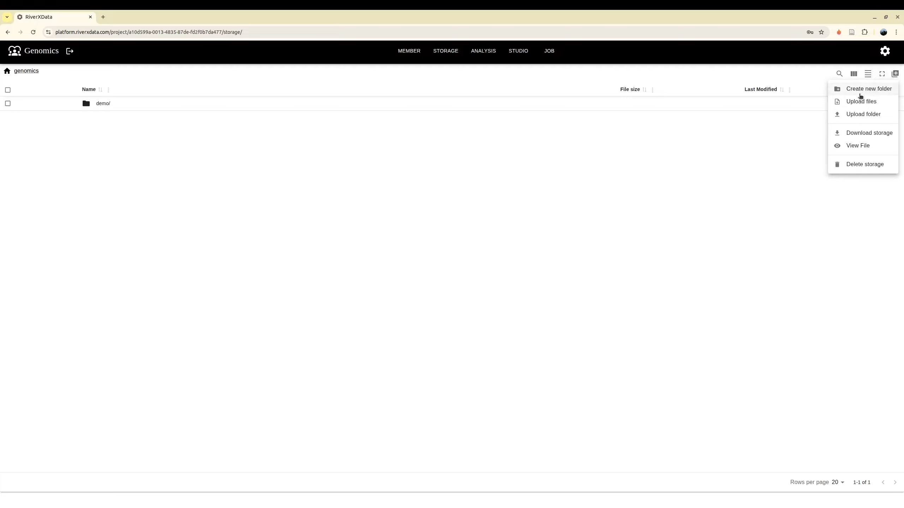
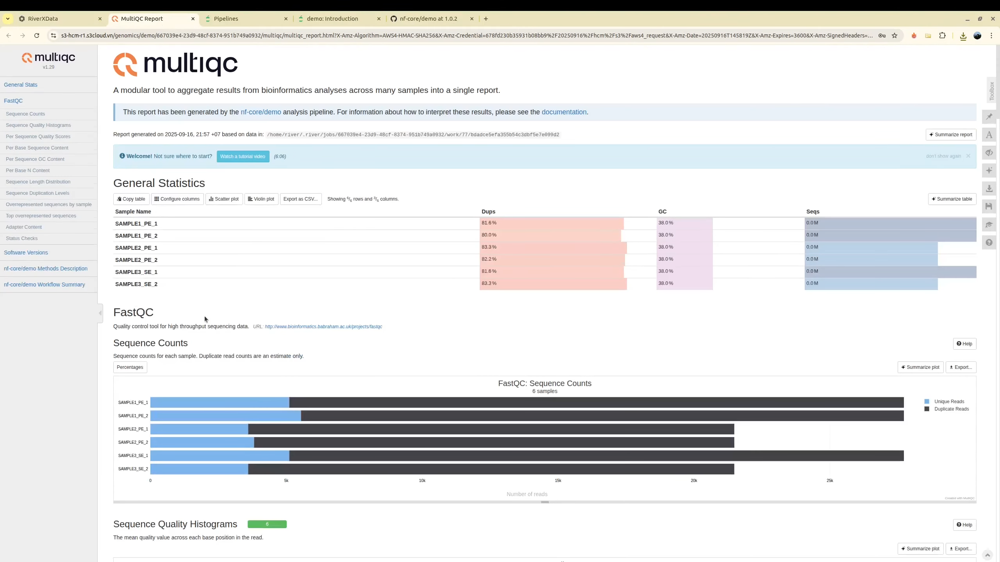
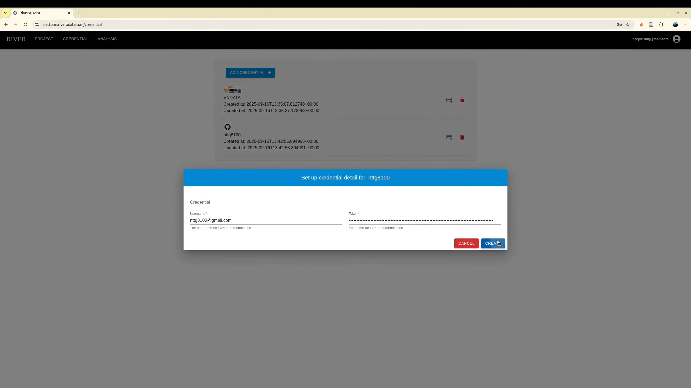
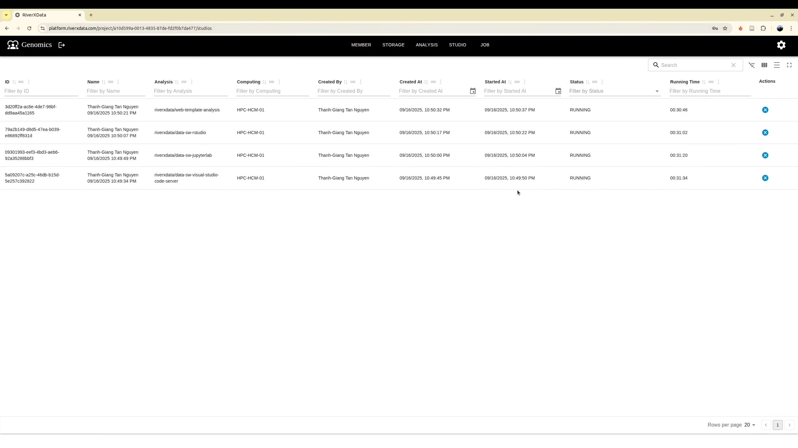

As a contributor, you are responsible for developing tools and workflows, as well as analyzing data within the platform.

After signing in to the RIVER platform using Google OAuth2, request **Contributor** access for your project. The project **administrator** will grant access using your Gmail address. Once approved, you can begin working as a **Contributor**.

## Storage
Right after you join the project, the storage is similar to **Google Drive** where you can work with files/folders. Currently, we supports:
+ Create folders
+ Upload files
+ Upload folders
+ Download file
+ View file content supports for text, image and html file format
+ Delete file/folder

:::warning
S3 is not well supported for renaming files. S3 file path is just the key of the object. We may support it in the future.
Currently, to rename, user need to download storage, upload to new destination and new folder name. Delete the old folder if needed
:::

Storage option



:::tip
It is useful that you do not need to download but you can view directly on the browser. For example, here, it allows user to view the MultiQC report running by a nextflow run
:::




## Credential
As contributor you need to add the tools with Github configuration for tools and HPC SSH configuration for computing resource.

### Adding Tools
To generate a GitHub personal access token, please refer to the official documentation: https://docs.github.com/en/authentication/keeping-your-account-and-data-secure/managing-your-personal-access-tokens




Contributors can add tools through the analysis panel after authentication. In addition to specifying the GitHub repository, two configuration options are available:

- **Allow access**: Determines whether the tool runs as a web application
- **Has base URL**: Enables **Traefik** integration for reverse proxy configuration via remote tunnel. Note that not all tools support straightforward configuration; some require custom `base_url` settings for API and WebSocket connections.

As a contributor, you typically only need to select and execute tools, as these options are generally defined by the **Developer** role. For detailed information on tool implementation and configuration, please refer to the [**Developer**](/docs/platform/Development) documentation.


### Adding HPC
Usually, if you are working for the remote HPC

The tools need to run on your HPC where you have an account to login via SSH. First, you need to create an SSH key pair for secure authentication.

#### Creating an SSH Key Pair

1. Open a terminal on your local machine
2. Generate a new SSH key pair using the following command:
    ```bash
    ssh-keygen -t ed25519 -C "your_email@example.com"
    ```
    Alternatively, if your system doesn't support Ed25519, use RSA:
    ```bash
    ssh-keygen -t rsa -b 4096 -C "your_email@example.com"
    ```
3. When prompted, specify a file location or press Enter to accept the default (`~/.ssh/id_ed25519` or `~/.ssh/id_rsa`)
4. Enter a secure passphrase when prompted (optional but recommended)

#### Adding the Public Key to Your HPC

1. Copy your public key to the HPC server:
    ```bash
    ssh-copy-id username@hpc-hostname
    ```
    Or manually copy the contents of `~/.ssh/id_ed25519.pub` (or `~/.ssh/id_rsa.pub`) to `~/.ssh/authorized_keys` on the HPC

#### Testing Your SSH Connection

Verify that you can login to your HPC without password authentication:
```bash
ssh username@hpc-hostname
```

If the connection is successful, you're ready to configure your HPC. Now use it to configure the new SSH credential with SLURM HPC


## Running Tools
On the **Analysis** panel on the project, now you can start to running the tools, RIVER will use your github credential to read the contents of the remote repository, allows it to run correctly. We encourage that the the **Developer** should public their tools with community to run on 

### Select tool
Select tool to run on the panel **Analysis**


### Specify resources and run tool
:::tip
For the job like workflows, it will trigger to submit more job automatically, you do not need to add too many resources
:::

Select the HPC to run the tool. A contributor may have more than one HPC credential. As a result, it need to be selected.
Beside, user need to specify the computing resource for job via `cpus`, `memory` and `running time`. While `tag` is retrieved from repository to ensure that you can run with your expected version. For the job with nextflow, it is for the running job only instead of the whole computing jobs.


### Monitor job status
Next, if your job is web application, you can move to the **Studio** for monitoring them. You may need to terminate them if you complete your analyze sooner than you configuration job. In addition, if you run the analysis which is not the web application, you can monitor them at **Job**. You can terminate it before it is completed.




### Log job
:::tip
For the web application, especially for the first run on your HPC, it may requires extra time to download the database from remote server. As a result it you can use the log monitoring for checking when the web application is ready to access
:::

Beside, when it is running you can observe the log to see what it is running. It is helpful for monitoring and debugging jobs


