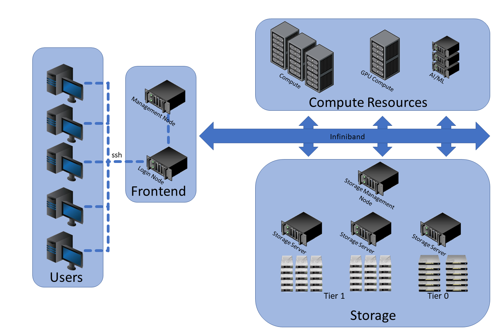

# Overview

<figure markdown="span">
    
</figure>
source: https://www.marquette.edu/high-performance-computing/architecture.php

Several job schedulers are used in HPC environments, including:

### PBS and PBS Pro

PBS (Portable Batch System) and its commercial version, PBS Pro, provide job queuing, scheduling, and resource management. They are widely used in academia and industry, offering features similar to SLURM.

### Grid Engine (SGE, Open Grid Scheduler, UGE)

Originally developed as Sun Grid Engine, this system is used for job scheduling and workload management in distributed computing environments. It is known for its ease of use and flexibility.

### LSF (IBM Spectrum LSF)

IBM's Spectrum LSF (Load Sharing Facility) is a powerful job scheduler with advanced features, including predictive scheduling, high availability, and deep integration with enterprise systems. However, it is a commercial product.

## Why Use SLURM?

SLURM is a preferred choice for many HPC environments due to its key advantages:

- **Open Source**: Unlike some alternatives, SLURM is free to use and has a large, active community contributing to its development and support.
- **Scalability**: SLURM is designed to scale efficiently from small clusters to the world's largest supercomputers.
- **Flexibility**: It allows fine-grained control over job scheduling, resource allocation, and priority settings, making it adaptable to various workloads.
- **Integration**: SLURM integrates well with other HPC tools, such as MPI (Message Passing Interface) and resource monitoring systems, ensuring smooth workflow management.
- **Performance**: SLURM is optimized for high throughput and minimal overhead, making it efficient for large-scale computing tasks.

Overall, SLURM's open-source nature, scalability, flexibility, and integration capabilities make it an excellent choice for managing HPC workloads.

This document describes the architecture of a SLURM-based High-Performance Computing (HPC) cluster. The cluster is configured with essential components, including:

- **SLURM (Simple Linux Utility for Resource Management)** for job scheduling and workload management.
- **NFS (Network File System)** for shared storage across nodes.
- **NIS-LDAP (Network Information Service - Lightweight Directory Access Protocol)** for centralized user authentication and management.
- **Compute nodes** for executing jobs.
- **Head node (Controller)** for managing job scheduling and cluster operations.

:::warning
This architecture is designed for small clusters. For large clusters, it can be designed to have multiple, independent controller and login nodes.
:::

<figure markdown="span">
    
</figure>
source: https://www.schedmd.com/
## Alternative Cluster Management Systems

### PBS and PBS Pro

PBS (Portable Batch System) and its commercial version, PBS Pro, are other popular job scheduling and workload management systems used in HPC environments. They provide similar functionalities to SLURM, such as job queuing, scheduling, and resource management.

### Why Use SLURM?

While PBS and PBS Pro are robust and widely used, SLURM offers several advantages:

- **Open Source**: SLURM is open-source software, which means it is free to use and has a large community for support and development.
- **Scalability**: SLURM is designed to scale efficiently from small clusters to the world's largest supercomputers.
- **Flexibility**: SLURM provides a high degree of flexibility in configuring and managing resources, making it suitable for a wide range of HPC workloads.
- **Integration**: SLURM integrates well with other HPC tools and technologies, providing a seamless user experience.

Overall, SLURM's open-source nature, scalability, flexibility, and integration capabilities make it a preferred choice for many HPC environments.
