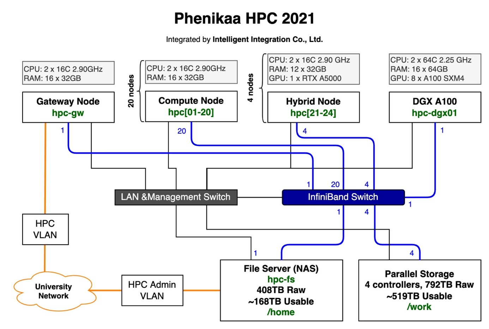

# Architecture

A typical Slurm (Simple Linux Utility for Resource Management) cluster consists of three main components:

- **slurmctld (Slurm Controller Daemon)**
- **slurmd (Slurm Daemon for Compute Nodes)**
- **slurmdbd (Slurm Database Daemon, optional but recommended for accounting)**

Each component runs on different types of nodes in the cluster.

## Node Types and Services

| Node Type           | Services Installed      | Description                                                           |
| ------------------- | ----------------------- | --------------------------------------------------------------------- |
| **Controller Node** | slurmctld               | The central management node that schedules jobs and tracks resources. |
| **Compute Nodes**   | slurmd                  | Worker nodes that execute jobs submitted to the cluster.              |
| **Login Nodes**     | Slurm client tools      | Users log in here to submit jobs and manage workloads.                |
| **Database Node**   | slurmdbd, MySQL/MariaDB | Stores job accounting and usage information if needed.                |

## Detailed Breakdown of Components

### 1. slurmctld (Slurm Controller Daemon)
- Runs on the controller node (or multiple nodes in High Availability (HA) setup).
- Responsible for scheduling, managing jobs, and tracking resources.
- Receives job submissions from users and allocates compute resources.
- Communicates with slurmd on worker nodes to execute jobs.

### 2. slurmd (Slurm Node Daemon)
- Runs on compute nodes (worker nodes).
- Receives job execution commands from slurmctld.
- Reports back job progress and node status to the controller.

### 3. slurmdbd (Slurm Database Daemon)
- Runs on a database node or the controller node (if a small cluster).
- Connects to an SQL database (MariaDB/MySQL).
- Stores job accounting data, such as completed jobs, user resource usage, and fair-share scheduling.

## Cluster Example

For a medium-sized cluster, you might set up:

- **1 Controller Node**: Runs slurmctld and optionally slurmdbd.
- **1 Database Node (optional)**: Runs slurmdbd and a database.
- **2 Login Nodes**: Allow users to connect and submit jobs.
- **Multiple Compute Nodes**: Run slurmd to execute jobs.

For small clusters, you can combine the controller and database node into a single machine. For slurm small cluster, it can be configured as below:
<figure markdown="span">
    
</figure>

Source: https://cs.phenikaa-uni.edu.vn/vi/post/gioi-thieu/co-so-vat-chat/he-thong-tinh-toan-hieu-nang-cao-phenikaa-hpc
