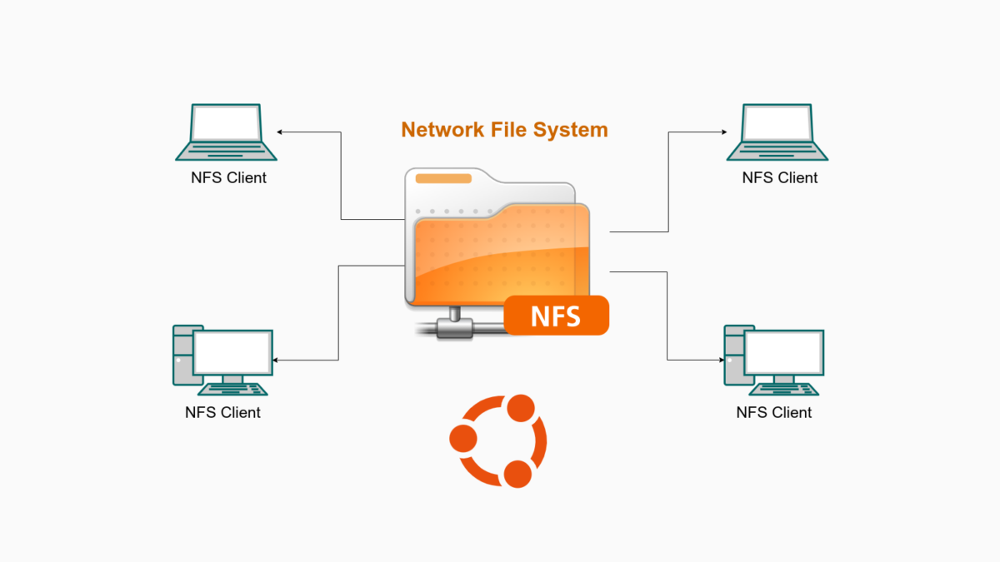
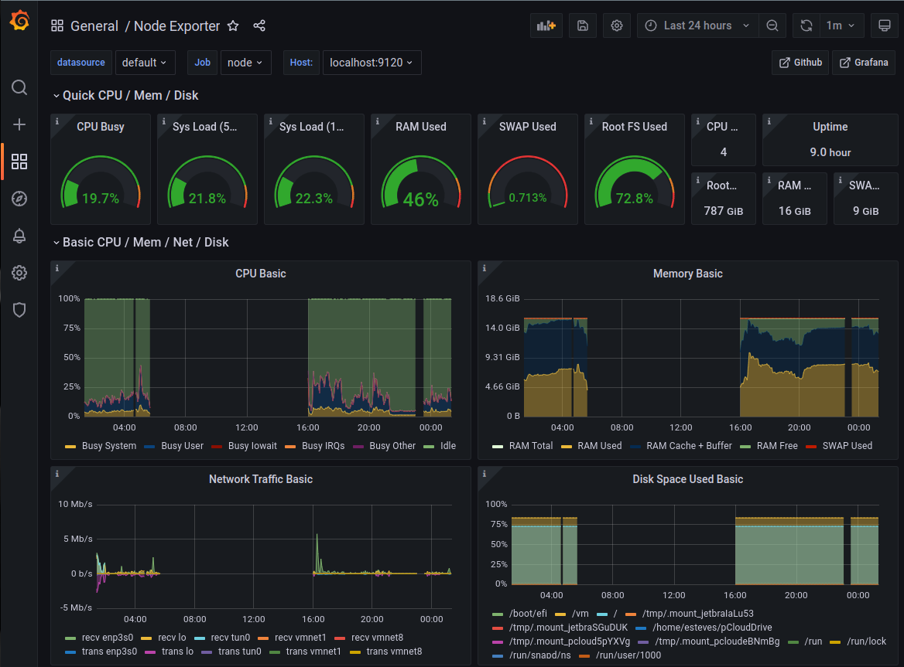

# Overview
Summary on how does the industrial scale HPC work
## 1. Head Node (Controller-Login)

The head node is responsible for managing the SLURM scheduler, job queue, and user authentication. Key services running on the head node include:

- **SLURM Controller (slurmctld)**: Centralized SLURM job manager.
- **SLURM Database (slurmdbd)**: Stores accounting and job history.
- **NFS Server**: Exposes shared directories to all compute nodes.

## 2. Compute Nodes

Compute nodes are responsible for executing jobs submitted to the SLURM scheduler. Each compute node runs:

- **SLURM Compute Daemon (slurmd)**: **Handles** job execution.
- **NFS Client**: Mounts shared storage from the NFS server.

## 3. Shared File System (NFS)
<figure markdown="span">
    
</figure>
Source: https://thuanbui.me/cai-dat-nfs-server-va-nfs-client-tren-ubuntu-22-04/

NFS provides a shared directory structure to ensure uniform access to data across nodes. Key directories:

- `/home`: User home directories with frequently and quick access (SSD NVMe)
- `/mnt/`: Possible hard drive with large storage (like HDD)
 
## 4. User Management

User authentication and identity management should be centralized using the user mangement systems like NIS/LDAP. 
However, these set up are not easy to configure. To simplify the cluster, the linux users, the slurm users will be
created using the ansible playbook with matched UID and GID.

## 5. Monitor
<figure markdown="span">
    
</figure>
Source: https://swsmith.cc/posts/grafana-slurm.html

All of the nodes need to be monitored via the `prometheus` (metrics) and `grafana` (visualization). Using the alertmanager with slack api for notifications
