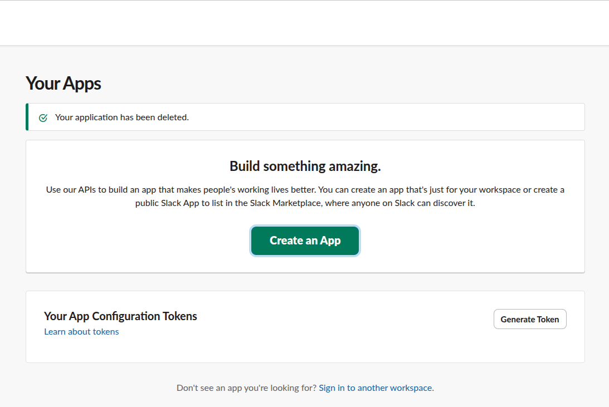
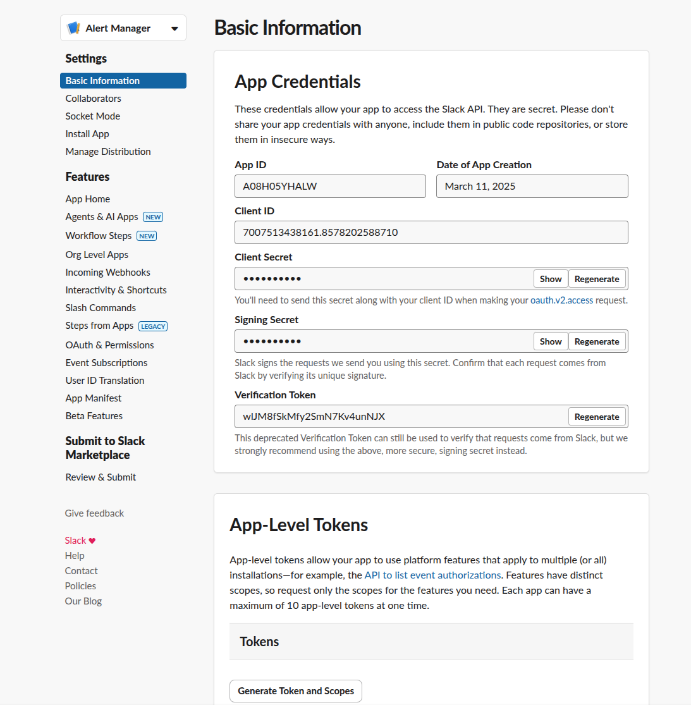
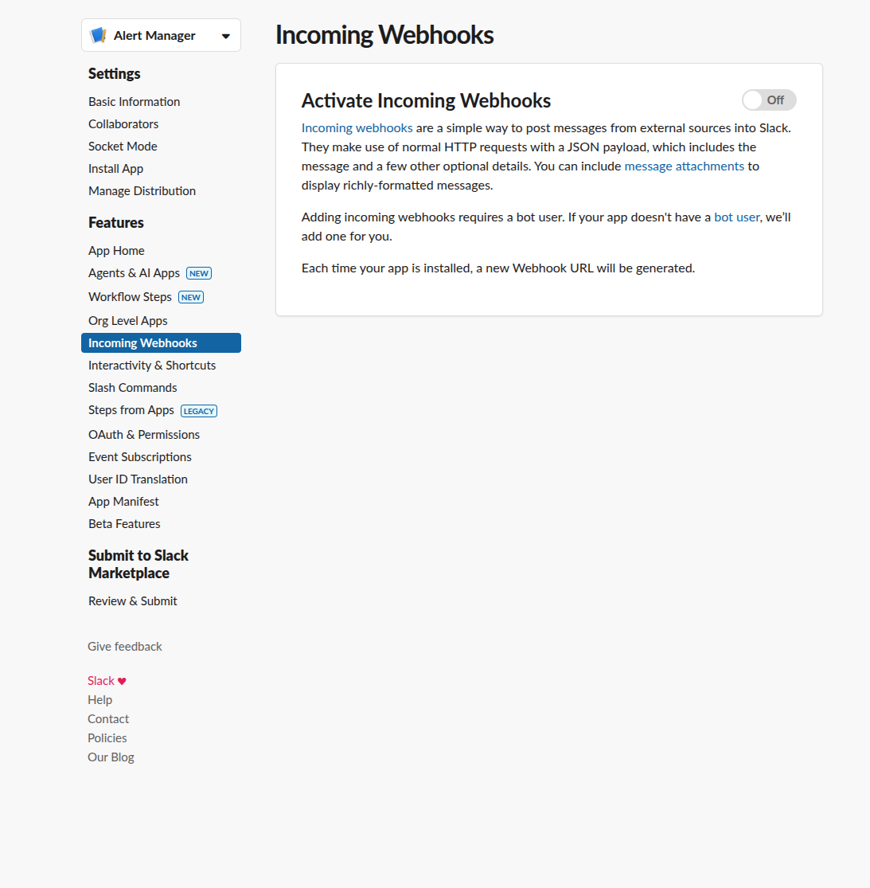
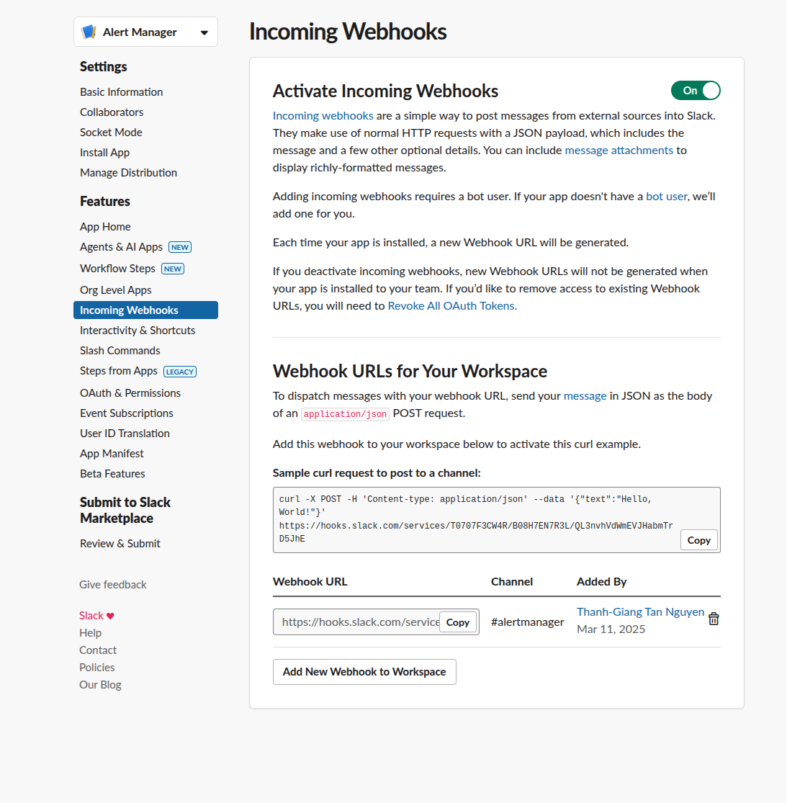
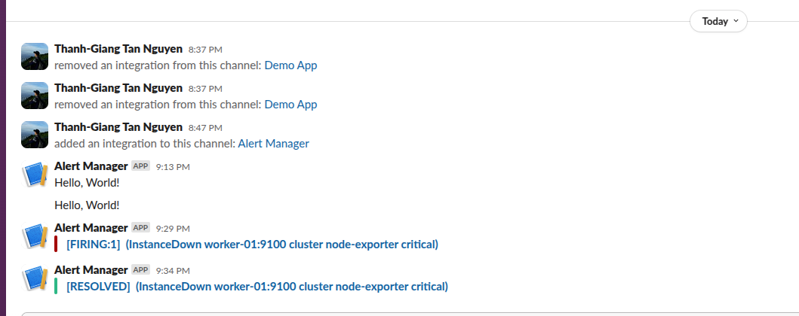
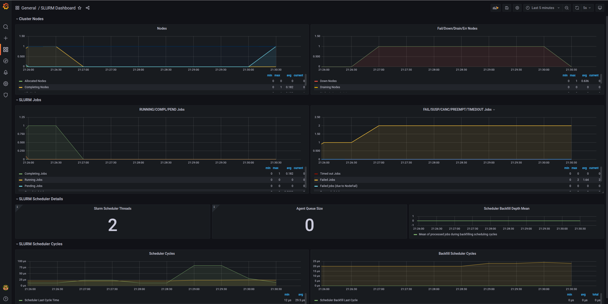
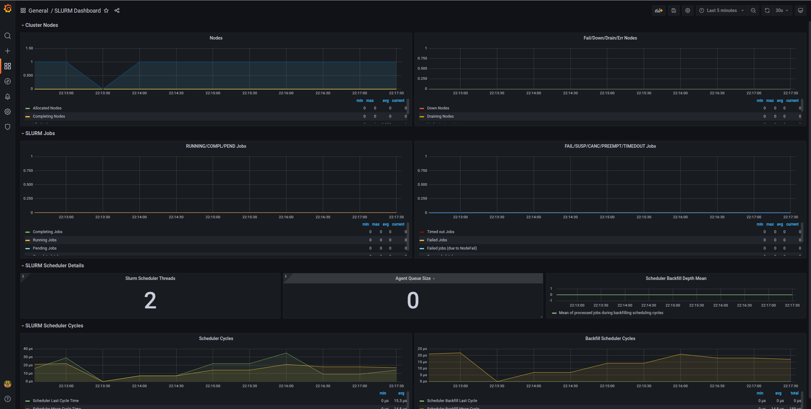
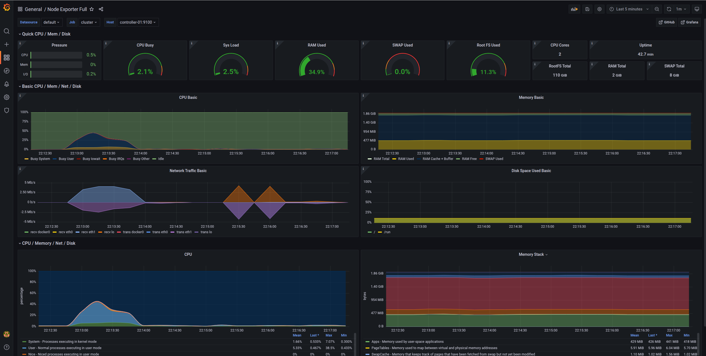

# Deployment
## 1. Ansible introduction
To understand Ansible in brief, watch this
<div style={{ position: "relative", paddingBottom: "56.25%", height: 0, overflow: "hidden", maxWidth: "100%", background: "#000" }}>
  <iframe 
    src="https://www.youtube.com/embed/xRMPKQweySE" 
    frameBorder="0" 
    allow="accelerometer; autoplay; clipboard-write; encrypted-media; gyroscope; picture-in-picture" 
    allowFullScreen
    style={{ position: "absolute", top: 0, left: 0, width: "100%", height: "100%" }}
  />
</div>

## 2. Summary
Compared with previous set up on a single node cluster, this ansible is not only set up slurm with seperated between the master and workers nodes,
but also install the 
- **Monitor Server:**
    - geerlingguy.docker: Docker container
    - Prometheus: Monitoring metrics collection
    - Alertmanager: Alerts to Slack channel with specific rules (e.g., down node)
    - Grafana: Dashboard for monitoring usage

- **Slurm HPC:**
    - **Common Roles:**
        - geerlingguy.docker (only for sudo group users)
        - alertmanager
        - grafana
        - prometheus-slurm-exporter
        - prometheus-node-exporter
    - **Specific Nodes:**
        - **Controller Node:**
            - slurm-master: Controller and login node
            - rsyslog-server: Syslog server controller
            - nfs-server: Network file system to share files across clusters
        - **Worker Nodes:**
            - slurm-worker: Computing nodes
            - rsyslog-client: Syslog client worker
            - nfs-client: Access files on the controller

To set up the cluster with many steps, IT automation tools likes Ansible, Puppet, Terraform are used to handle it automatically.
In RiverXData ecosystem, we set up the Slurm cluster using [**Ansible**](https://docs.ansible.com/), to set up the slurm cluster, follow the documentation at this [**RIVERXDATA SLURM**](https://github.com/riverxdata/river-slurm/tree/main)

<figure markdown="span">
    
</figure>

## 2. Install required python packages
Clone the repo
```bash
git clone https://github.com/riverxdata/river-slurm.git -b 1.0.0
```

Install ansible, other required python packages and relative roles

```bash
# to show agruments
# bash scripts/setup.sh
bash scripts/setup.sh 24.04 false
```


## 3. Prepare Inventory for Hosts
For the password, it should be configured using [**ansible vault**](https://docs.ansible.com/ansible/2.8/user_guide/vault.html) with encrypted, decrypted secret variables
Copy the example `hosts.example` file in the inventories directory. In this file, define the user and host for your setup:

```
[slurm_master]
controller-01 ansible_host=192.168.58.10

[slurm_worker]
worker-01 ansible_host=192.168.58.11

[slurm:children]
slurm_master
slurm_worker

[all:vars]
ansible_user=vagrant
slurm_password=<password for Munge to authenticate via symmetric key>
slurm_account_db_pass=<slurm account database password>
```

Optional parameters:

```
default_password=<default password for users in the cluster; first login will enforce a password change>
users=<comma-separated list of new usernames>
slack_api_url=<Slack webhook URL for cluster status notifications>
slack_channel=<Slack channel for notifications>
admin_user =<Grafana admin user>
admin_password=<Grafana admin password>
```

:::info
**Slack alertmanager feature**
In an industrial setting, even small teams benefit from effective communication through chat applications. Slack is a widely-used app that facilitates this. It offers features such as custom webhooks, which are useful for infrastructure monitoring notifications. For more information, visit the [**Slack API Quickstart**](https://api.slack.com/quickstart).
:::

### ***How to set up the slack api webhook
You should have a slack workspace, where you already created a specific channel for this notifications

**Step 1**: Create an app
<figure markdown="span">
    
</figure>

**Step 2**: Add app to your channel, configure it with the webhook features
<figure markdown="span">
    
</figure>


**Step 3**: Click to incomming webhooks and activate it
<figure markdown="span">
    
</figure>

**Step 4**: Try with api to check the app work
<figure markdown="span">
    
</figure>

:::warning
To check for api setting, try with this on your terminal
:::

```bash
curl -X POST -H 'Content-type: application/json' --data '{"text":"Hello, World!"}' <API>
```

**Step 5**: See how it run in real case
App is added in channel
<figure markdown="span">
    
</figure>

For detail, check at grafana dashboard
<figure markdown="span">
    
</figure>


## 4. Run playbook for Cluster

To set up on your cluster, ensure that the remote nodes can log in without a password. Run the following command:
```bash
ansible-playbook -i inventories/hosts river_cluster.yml
```

If a password is required, add the `--ask-become-pass` flag and run:

```bash
ansible-playbook -i inventories/hosts river_cluster.yml --ask-become-pass
```

## 5. Run playbook for User
To set up users on the cluster, use Ansible. NIS is less secure and other methods are not well supported for Ubuntu. Simply run the following command to add users:

```bash
ansible-playbook -i inventories/hosts river_users.yml
```

Validate setup
```bash
# get cluster info
sinfo
# get current job
squeue
# submit interactive
srun --pty bash
```

By default, the grafana runs on the master node on port 3000. With users and password are set on the inventories
To access the dashboard, while you do not access the master node directly, use ssh
```bash
ssh -N -L 3001:localhost:3000 <user name>@<host name or IP address>
```
### 5.1 Node metrics
<figure markdown="span">
    
</figure>

### 5.2 Slurm metrics
<figure markdown="span">
    
</figure>

## 6. Developer
Install vagrant and relative provider, for Ubuntu, it automatically install the libvirt and run the ansible playbook
```bash
bash scripts/setup.sh 24.04 true
```