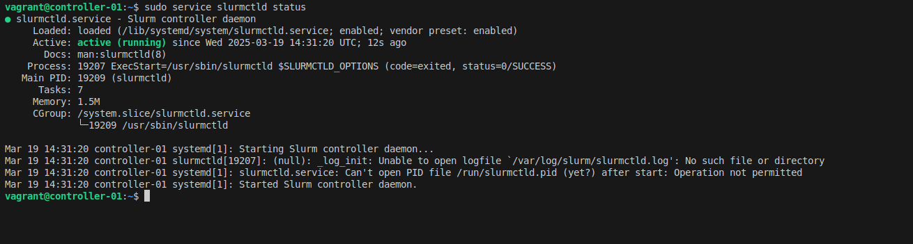
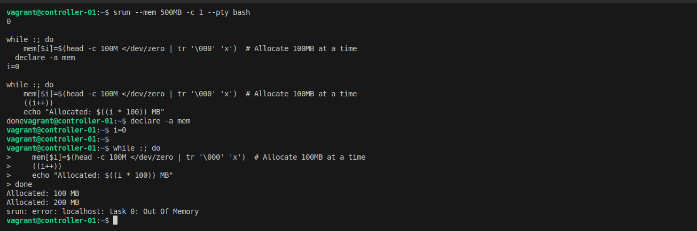
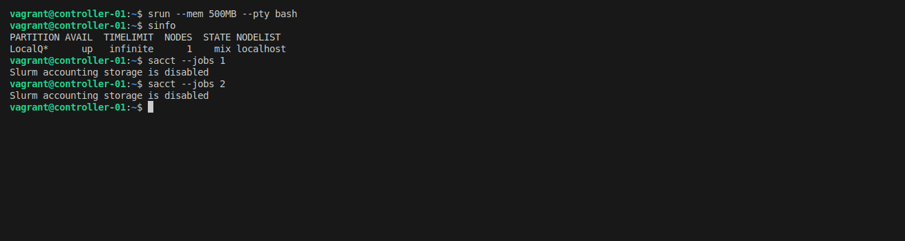
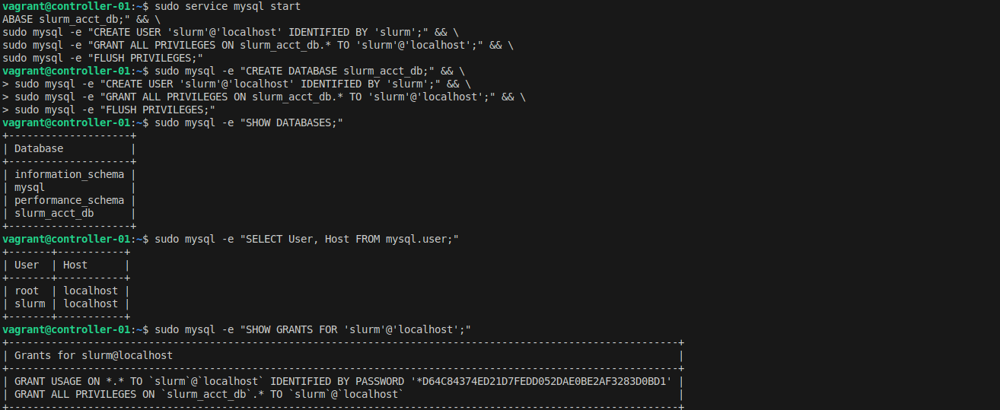
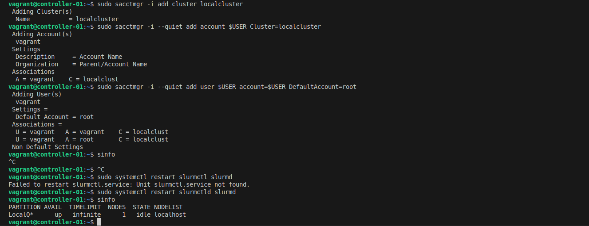

# Single node
<div align="center">
    <figure markdown="span">
        
    </figure>
</div>
:::info
+ This architect is designed for single node on the Ubuntu 20.04
+ Allow all of the standard features
+ Do it manually to help you understand how Slurm work. The user can use resource without submitting job, so should not used it for production
:::

## **Install slurmd, slurmctld**
Install base softwares
```bash
sudo apt-get update -y && sudo apt-get install -y slurmd slurmctld
```
Check required installed packages
```bash
# find where slurmd/slurmctld is installed
which slurmd
# /usr/sbin/slurmd
which slurmctld
# /usr/sbin/slurmctld
```

## **Prepare slurm.conf**
:::info
+ Config for all nodes.
:::
On your terminal create this file
```bash
cat <<EOF > slurm.conf
# slurm.conf for a single-node Slurm cluster with accounting
ClusterName=localcluster
SlurmctldHost=localhost
MpiDefault=none
ProctrackType=proctrack/linuxproc
ReturnToService=2
SlurmctldPidFile=/run/slurmctld.pid
SlurmctldPort=6817
SlurmdPidFile=/run/slurmd.pid
SlurmdPort=6818
SlurmdSpoolDir=/var/lib/slurm-llnl/slurmd
SlurmUser=slurm
StateSaveLocation=/var/lib/slurm-llnl/slurmctld
SwitchType=switch/none
TaskPlugin=task/none

# TIMERS
InactiveLimit=0
KillWait=30
MinJobAge=300
SlurmctldTimeout=120
SlurmdTimeout=300
Waittime=0

# SCHEDULING
SchedulerType=sched/backfill
SelectType=select/cons_tres
SelectTypeParameters=CR_Core

# ACCOUNTING (slurmdbd, not enable now)

AccountingStorageType=accounting_storage/none
JobAcctGatherType=jobacct_gather/none
JobAcctGatherFrequency=30

# LOGGING
SlurmctldDebug=info
SlurmctldLogFile=/var/log/slurm-llnl/slurmctld.log
SlurmdDebug=info
SlurmdLogFile=/var/log/slurm-llnl/slurmd.log
# COMPUTE NODES (Single-node configuration)
NodeName=localhost CPUs=2 Sockets=1 CoresPerSocket=2 ThreadsPerCore=1 RealMemory=1024 State=UNKNOWN

# PARTITION CONFIGURATION
PartitionName=LocalQ Nodes=ALL Default=YES MaxTime=INFINITE State=UP
EOF
```
Move file to correct location
```bash
sudo mv slurm.conf /etc/slurm-llnl/slurm.conf
```

## **Start basic slurm**
Start slurmd service
```bash
# start
sudo service slurmd start
# check status
sudo service slurmd status
```
<figure markdown="span">
    
</figure>

Start slurmctld service
```bash
# start
sudo service slurmctld start
# check status
sudo service slurmctld status
```
<figure markdown="span">
    
</figure>

Submit a small job, adjust the cpus and memory accordin to your resource
```bash
srun --mem 500MB -c 1 --pty bash
# checking detail on submitted job
squeue -o "%i %P %u %T %M %l %D %C %m %R %Z %N" | column -t
``` 
Before submitting job, it takes less than 200MB RAM
<figure markdown="span">
    
</figure>

Allocate the 100MB everytime to memory to array
```bash 
declare -a mem
i=0

while :; do
    mem[$i]=$(head -c 100M </dev/zero | tr '\000' 'x') 
    ((i++))
    echo "Allocated: $((i * 100)) MB"
done
```
Memory after loading 1GB, it is weird because of it should be out of memory. But the slurm seems to not to be killed. It is because this setup and similar setup on single node
forget to add the control group plugin to control the computing resources. It does not work as you expected. It this cluste
<figure markdown="span">
    
</figure>

## **Limit resource by cgroup**
Prepare cgroup config file, restrict on the swap region, if the process is out of memory, it will be 
```bash
cat <<EOF >cgroup.conf
CgroupAutomount=yes
CgroupMountpoint=/sys/fs/cgroup
ConstrainCores=yes
ConstrainRAMSpace=yes
ConstrainDevices=yes
ConstrainSwapSpace=yes
MaxSwapPercent=5
MemorySwappiness=0
EOF
```

Move to correct directory
```bash
sudo mv cgroup.conf /etc/slurm-llnl/cgroup.conf
```

Add your task plugin to slurm config
```bash
# sed to replace
sudo sed -i -e "s|ProctrackType=proctrack/linuxproc|ProctrackType=proctrack/cgroup|" -e "s|TaskPlugin=task/none|TaskPlugin=task/cgroup|" /etc/slurm-llnl/slurm.conf
# add cgroup to grub to enable it, reboot is required
sudo sed -i 's/^GRUB_CMDLINE_LINUX="/GRUB_CMDLINE_LINUX="cgroup_enable=memory swapaccount=1 /' /etc/default/grub
sudo update-grub
sudo reboot
# restart all services
sudo service slurmctld status
sudo service slurmd status
```

Rerun the small memory job, that will exeed the memory limit, you job will be killed as expected
```bash
srun --mem 500MB -c 1 --pty bash
declare -a mem
i=0

while :; do
    mem[$i]=$(head -c 100M </dev/zero | tr '\000' 'x')  # Allocate 100MB at a time
    ((i++))
    echo "Allocated: $((i * 100)) MB"
done
```
<figure markdown="span">
    
</figure>

## **Enable slurm accounting**
To monitor old job, to track the resource allocation, permissons to launch job. The accounting should be enable.
<figure markdown="span">
    
</figure>

### Install slurmdbd
```bash
sudo apt-get install slurmdbd mariadb-server -y
```

### Prepare slurmdbd.conf
:::info
+ Is is used to enable the accounting plugin. It allows to store the relative account informations.
+ Mapping the linux user to the relative accounts in slurm account database. Users can not submit job directly if they are not added
+ It is useful for monitor existed jobs to optimize the usage 
:::
Create slurmdbd.conf
```bash
cat <<EOF >slurmdbd.conf
PidFile=/run/slurmdbd.pid
LogFile=/var/log/slurm/slurmdbd.log
DebugLevel=error
DbdHost=localhost
DbdPort=6819

# DB connection data
StorageType=accounting_storage/mysql
StorageHost=localhost
StoragePort=3306
StorageUser=slurm
StoragePass=slurm
StorageLoc=slurm_acct_db
SlurmUser=slurm
EOF
```
Move the config file to the correct location
```bash
sudo mv slurmdbd.conf /etc/slurm-llnl/slurmdbd.conf
```

### Create an sql database
```bash
Create relative db with credentials specify in the slurmdbd.conf
```bash
sudo service mysql start
sudo mysql -e "CREATE DATABASE slurm_acct_db;" && \
sudo mysql -e "CREATE USER 'slurm'@'localhost' IDENTIFIED BY 'slurm';" && \
sudo mysql -e "GRANT ALL PRIVILEGES ON slurm_acct_db.* TO 'slurm'@'localhost';" && \
sudo mysql -e "FLUSH PRIVILEGES;"
```
Checking the database
```bash
# Verify the database and user creation
sudo mysql -e "SHOW DATABASES;" 
sudo mysql -e "SELECT User, Host FROM mysql.user;"
# Check privileges for the slurm user
sudo mysql -e "SHOW GRANTS FOR 'slurm'@'localhost';"
```
<figure markdown="span">
    
</figure>


### Start slurmdbd service
Start slurmdbd service to allow the slurmctl to interact with it
```bash
sudo service slurmdbd start
```

Enable in slurm.conf
```bash
sudo sed -i -e "s|AccountingStorageType=accounting_storage/none|AccountingStorageType=accounting_storage/slurmdbd\nAccountingStorageEnforce=associations,limits,qos\nAccountingStorageHost=localhost\nAccountingStoragePort=6819|" /etc/slurm-llnl/slurm.conf 
# gather acct from cgroup
sudo sed -i -e "s|JobAcctGatherType=jobacct_gather/none|JobAcctGatherType=jobacct_gather/cgroup|" /etc/slurm-llnl/slurm.conf
# restart service from slurmd, slurmctl
sudo systemctl restart slurmctl slurmd
```

Add the linux users to accounting-where the linux user will be granted to the relative permission to run job
```bash
# $USER will be the current users
sudo sacctmgr -i add cluster localcluster
sudo sacctmgr -i --quiet add account $USER Cluster=localcluster
sudo sacctmgr -i --quiet add user $USER account=$USER DefaultAccount=root
# restart again
sudo systemctl restart slurmctl slurmd
```
<figure markdown="span">
    
</figure>

### Submit new job and get the metrics
Get relative information
```bash
srun --mem 500MB -c 1 --pty bash
```

<figure markdown="span">
    
</figure>

## **Conclusion**
:::info
+ Slurm is a widely used orchestrator in both academic and industrial settings. It facilitates running distributed jobs across multiple computers and aggregating results to address real-world problems.
+ While Slurm is relatively easy to set up, some critical steps are often overlooked. For instance, resource requests and limits may not function as expected without proper configuration.
+ Slurm integrates seamlessly with various distributed computing frameworks such as Spark, Ray, Dask, and Flink enabling efficient and effective resource utilization for local development.
:::
