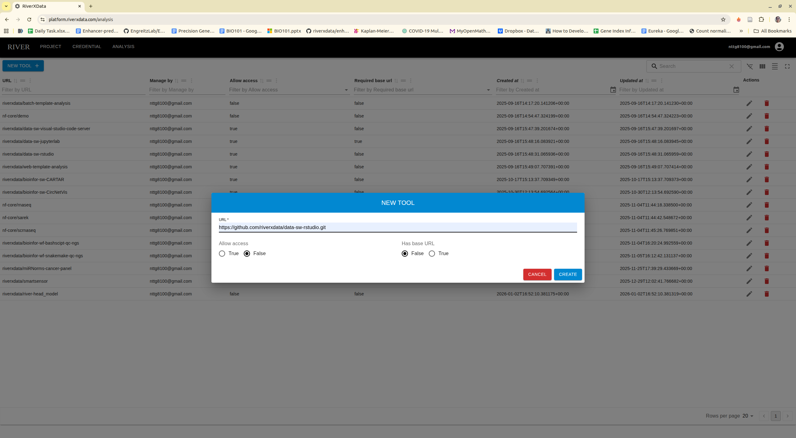

# Publish
The tools need to be configured on the platform. If it is a public repository, it can be added by anyone. After you login, select **Analysis**
Click create button

:::tip
+ Select `allow_access` if your tool is web application
+ Select `has_base_url` if your tool is web application and special base_url like Rstudio Server
:::

