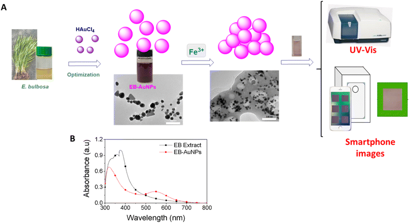
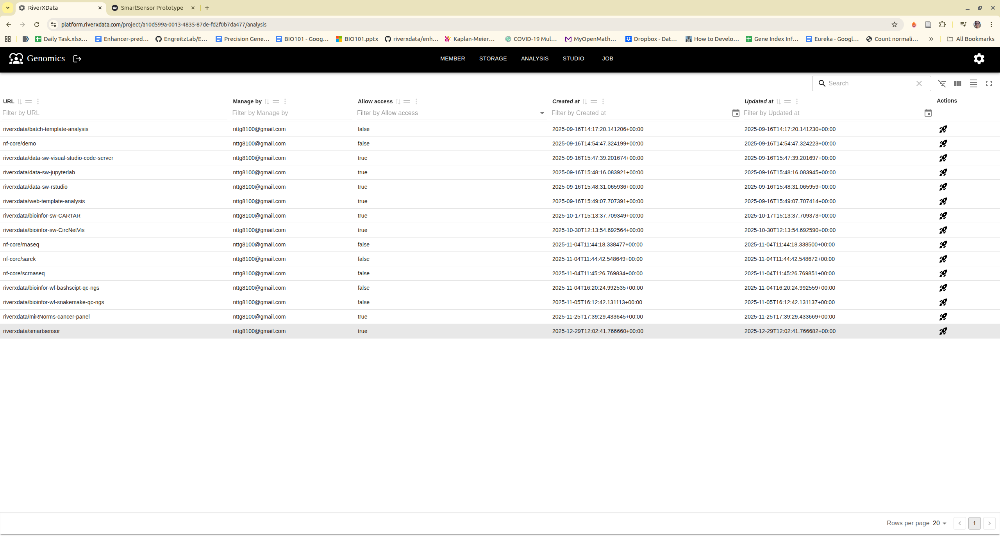
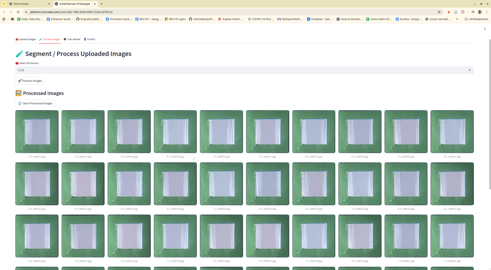
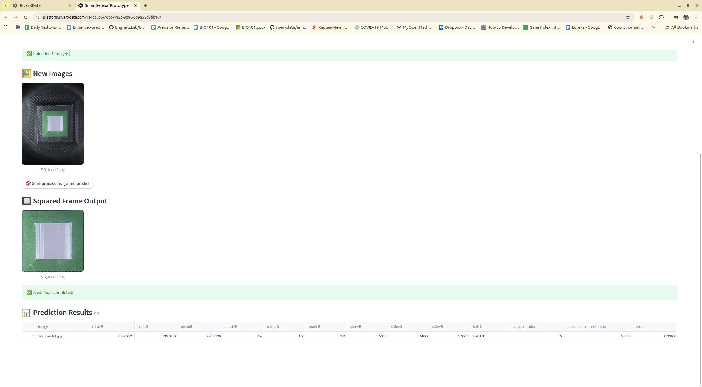

# Smartsensor
## Summary
This project utilizes a smartphone camera and machine learning techniques to analyze and characterize chemical compounds.
Simply, we capture the concentration on a isolated device to avoid negative impacts from the environment factors by using smartphone camera. Later, we extract the region of interested and use the border background to normalize the ROI color. Then, the raw and normalized ROI are used to train and predict. 



## Method
:::tip
+ "Raw" normalization is the original data without normalization approach. We keep this to compare with our normalization approach
+ On the latest version, we automatically define the RGB based values for the green square frame. For new data, you need to specify the processed folder of train data for using the same RGB based values
:::

The red – green – blue (RGB) colorimetry method for solution concentrations using smartphones often faces challenges from external factors like varying light intensity, camera resolution, and internal color adjustments. To overcome these obstacles, a novel approach was developed to detect the region of interest (ROI). This involved designing a lightbox as a closed system, incorporating an LED light system within a metal frame, as depicted in Fig. 1. The smartphone and cuvette were positioned at a fixed distance of 6 cm and held in specific orientations. A small green square frame, serving as a reference color value, was placed in front of the cuvette. The region inside this frame, known as the ROI, was identified based on the presence of the green border.


Figure above provides an overview of our proposed solution, wherein users were prompted to retake the image if the variance of ROI exceeded a predetermined threshold. Despite the apparent closure of the lightbox system for smartphone image capture, the RGB values of the ROI exhibited inconsistency when multiple images of a solution with identical concentrations were taken using the same smartphone. To rectify this inconsistency, we utilized the reference value of the green squared frame to adjust the overall color of the image. Two normalization methods were devised:

### Delta normalization
involved adjusting the mean RGB values of the ROI by adding the difference between the color value of the green squared frame and the RGB reference values (e.g., R = 40, G = 150, B = 90) to the measured mean RGB values in the region of color adjustment. The formula is expressed as eqn (1).

$$
\text{Mean\_RGB\_ROI} = \text{mean\_RGB\_ROI} + (\text{mean\_RGB\_squared\_frame} - \text{RGB\_predefined})
$$


### Ratio normalization
the mean RGB values of the ROI underwent adjustment by multiplying the ratio between the color value of the green squared frame and the RGB reference values (e.g., R = 40, G = 150, B = 90) by the mean RGB values measured in the region of color adjustment. The formula is expressed as eqn (2)

$$
\text{Mean\_RGB\_ROI} = \text{mean\_RGB\_ROI} \cdot \frac{\text{mean\_RGB\_squared\_frame}}{\text{RGB\_predefined}}
$$


## Publications and datasets
We create the datasets related to the publications for detection of Fe3+ and Cu2+ ions. User can download the dataset to re-analyze using both 
command line interface and web application on RIVER platform


### Fe3+/CuSO4
KIT: v1.0.0

Download [**Link**](https://drive.google.com/drive/folders/1tQyQl5mwpfAykSaXsfDMMOPpbCy_dPRA?fbclid=IwAR3-7442iYdZfW0O3MXQPqufT5_u9_0s1xYs3vAHIuyk_dKjOuZG4NrT1v0_aem_AeF_mb2biOu5oJelm1u5peqz0oXL0ksO1lMZvWwxyOsfDPpBAbHKMojdUisTh7OkG29XtC1BM2i8JD1tQNvoAxeh)

Citation:
```bibtex
@article{dang2024biogenic,
  title={Biogenic fabrication of a gold nanoparticle sensor for detection of Fe 3+ ions using a smartphone and machine learning},
  author={Dang, Kim-Phuong T and Nguyen, T Thanh-Giang and Cao, Tien-Dung and Le, Van-Dung and Dang, Chi-Hien and Duy, Nguyen Phuc Hoang and Phuong, Pham Thi Thuy and Huy, Do Manh and Chi, Tran Thi Kim and Nguyen, Thanh-Danh},
  journal={RSC advances},
  volume={14},
  number={29},
  pages={20466--20478},
  year={2024},
  publisher={Royal Society of Chemistry}
}
```
### Ampicillin
KIT: v1.1.0
Download [**Link**](https://drive.google.com/file/d/1b_yxZTaza7Remr_nD9S8LAWLSbV-x3Sb/view?usp=sharing)

Citation:
```bibtex
@article{NGUYEN2025120935,
title = {Colorimetric detection of ampicillin using a gold nanoparticle–aptamer sensor: Integrating portable readout and smartphone-based online machine learning},
journal = {Journal of Environmental Chemical Engineering},
pages = {120935},
year = {2025},
issn = {2213-3437},
doi = {https://doi.org/10.1016/j.jece.2025.120935},
url = {https://www.sciencedirect.com/science/article/pii/S2213343725056325},
author = {Le-Kim-Thuy Nguyen and Tan-Thanh-Giang Nguyen and Tien-Dung Cao and Nhat-Minh Phan and T. Kim-Chi Huynh and Minh-Tien Pham and Thanh-Hoang Nguyen and Cao-Hien Nguyen and Tran {Thi Huong Giang} and Tran {Thi Kim Chi} and Tran Nguyen Minh An and Dan-Quynh Pham and Thanh-Danh Nguyen},
keywords = {gold nanoparticles, aptamer, antibiotic, smartphone, portable sensor, machine learning, molecular docking},
abstract = {Rapid, low-cost, and on-site detection of antibiotic residues is a global priority for ensuring food safety and environmental monitoring. In this study, we developed a nanomaterial-based colorimetric aptasensor using gold nanoparticles (AuNPs) functionalized with ampicillin-specific aptamers. The sensing mechanism is based on aptamer–ampicillin binding, followed by NaCl-induced aggregation, leading to a distinct red-to-blue transition and a plasmon resonance shift. Spectroscopic and morphological analyses also confirmed adsorption of aptamer onto AuNPs surface and interaction between aptamer and ampicillin while molecular docking confirmed strong aptamer–ampicillin affinity through multiple hydrogen bonds, hydrophilic, sulfur, electrostatic, and hydrophobic interactions. To enable portable, field-ready application, we integrated a TCS34725-based Red/Green/Blue (RGB) device controlled by a NodeMCU-32 microcontroller. This handheld sensor achieved a detection limit of 0.221 ppm using the Green/Red ratio, which is nearly two times lower than the 0.43 ppm obtained by UV–Vis spectroscopy, demonstrating a substantial improvement in sensitivity. Furthermore, the platform was integrated with smartphone imaging and machine-learning–based data processing for online accessibility, with validation across 1–8 ppm ampicillin demonstrating robust predictive performance and normalization improving accuracy by up to 3.95%. This mobile-enabled strategy, combining AuNP-based sensing, portable RGB detection, and smartphone/cloud integration, offers a scalable and practical solution for on-site monitoring of antibiotic contamination, bridging laboratory precision with real-world applicability.}
}
```

## Installation
Clone the repository, add the relative version related to publication
```bash
git clone git@github.com:riverxdata/smartsensor.git -b <version>
```

Install and activate the environment

```bash
cd smartsensor
pixi shell
```

## Usage
### Command line

The datasets should be downloaded and put to the correct folder. The workflow consists of 3 main steps and 1 optional pre-processing step:

+ **heic2jpg** (optional): Convert HEIC image format to JPG if your images were captured in HEIC format
+ **process**: Extract and normalize the Region of Interest (ROI) from images
+ **model**: Train machine learning models based on the processed data to predict concentration
+ **predict** (optional): Use trained models to predict concentration on new validation data

:::warning
images naming: It has to be named with :
[**concentration**]-[**n-th of image capturing**]_[**n-th batch id**].jpg
:::

For example, on the Ampicilline datasets, we have
```bash
total 126104
-rw-rw-r-- 1 giangnguyen giangnguyen 1783190 Thg 8  25 20:56 1-1_batch1.jpg
-rw-rw-r-- 1 giangnguyen giangnguyen 1836949 Thg 8  25 20:56 1-1_batch2.jpg
-rw-rw-r-- 1 giangnguyen giangnguyen 1751822 Thg 8  25 20:56 1-1_batch3.jpg
-rw-rw-r-- 1 giangnguyen giangnguyen 1763781 Thg 8  25 20:56 1-2_batch1.jpg
-rw-rw-r-- 1 giangnguyen giangnguyen 1800070 Thg 8  25 20:56 1-2_batch2.jpg
-rw-rw-r-- 1 giangnguyen giangnguyen 1733056 Thg 8  25 20:56 1-2_batch3.jpg
-rw-rw-r-- 1 giangnguyen giangnguyen 1771039 Thg 8  25 20:56 1-3_batch1.jpg
-rw-rw-r-- 1 giangnguyen giangnguyen 1801924 Thg 8  25 20:56 1-3_batch2.jpg
-rw-rw-r-- 1 giangnguyen giangnguyen 1786710 Thg 8  25 20:56 1-3_batch3.jpg
```
:::tip
+ KIT is used for the color based threshold to get the region of interests (ROIs). KIT v1.1.0 and v1.0.0 are compatible, v1.1.0 is better for capturing ROIs
+ Checking at the orginal paper to select the best parameters that are turned to achive the best performance.
+ Machine learning models is used with polynomial regression, 1 degree usually shows the high performance and less overfitting
:::

```bash
# Define base paths
RAW_DATA=./train_test
VALIDATE_DATA=./validate
NORM_METHOD="delta" # there are 3 options: raw, delta and ratio
OUTDIR=./outdir
KIT="1.1.0"

# (OPTIONAL) Convert data to jpg if nessessary
smartsensor heic2jpg --data $RAW_DATA

# Processing images
smartsensor process \
    --data "$RAW_DATA" \
    --kit $KIT \
    --auto-lum \
    --outdir "$OUTDIR/processed"

# Modeling 1 degree
smartsensor model \
    --data "$OUTDIR/processed" \
    --features "meanR,meanG,meanB,modeR,modeG,modeB" \
    --skip-feature-selection \
    --prefix $NORM_METHOD \
    --out "$OUTDIR/model/$NORM_METHOD" \
    --kit $KIT \
    --norm $NORM_METHOD \
    --degree 1 \
    --replication 100  \
    --cv 5 \
    --test-size 0.3

# Predict, when you have new data, use this
# process image if needed, it will inhirit the configuration for normalization on training process
smartsensor process \
    --data "$VALIDATE_DATA" \
    --process-dir "$OUTDIR/processed" \
    --kit $KIT \
    --outdir "$OUTDIR/validate/processed"

# predict
smartsensor predict \
    --processed-dir "$OUTDIR/validate/processed" \
    --model-dir "$OUTDIR/model/$NORM_METHOD" \
    --outdir "$OUTDIR/validate/$NORM_METHOD"
```


## RIVER integration
It is written by RIVER team, so it can run directly on RIVER platform. The platform help to store the data, train data models and predict for the novel data for practical application.

:::tip
It does not have any parameters, you just need to adjust computing resource then run all
:::

### Step 1: Select tool on the tool list and run



### Step 2: Navigate to tool, upload images, or using existing example images


### Step 3: Process images



### Step 4: Training model


### Step 5: Predict new data
